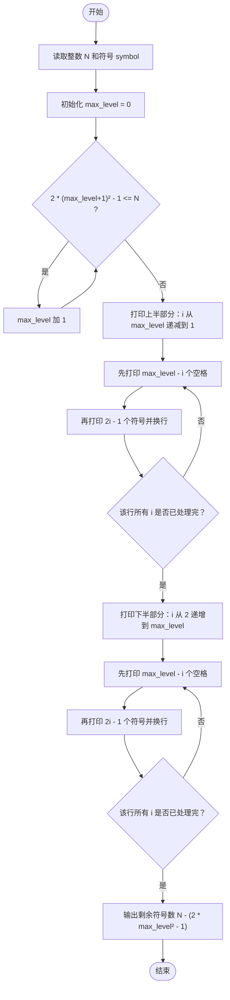
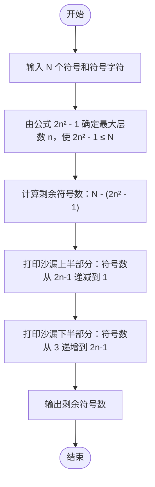

# L1-002 - 打印沙漏（20 分）

- **时间限制**: 400 ms
- **内存限制**: 65536 KB
- **代码长度限制**: 16 KB

---

## 题目描述

本题要求你写个程序把给定的符号打印成沙漏的形状。例如给定17个“*”，要求按下列格式打印
```
*****
 ***
  *
 ***
*****
```

所谓“沙漏形状”，是指每行输出奇数个符号；各行符号中心对齐；相邻两行符号数差2；符号数先从大到小顺序递减到1，再从小到大顺序递增；首尾符号数相等。

给定任意N个符号，不一定能正好组成一个沙漏。要求打印出的沙漏能用掉尽可能多的符号。

### 输入格式:

输入在一行给出1个正整数N（$$\le$$1000）和一个符号，中间以空格分隔。

### 输出格式:

首先打印出由给定符号组成的最大的沙漏形状，最后在一行中输出剩下没用掉的符号数。

### 输入样例:

```in
19 *
```

### 输出样例:

```out
*****
 ***
  *
 ***
*****
2
```

## 示例

### 示例 1

**输入:**
```
19 *
```

**输出:**
```
*****
 ***
  *
 ***
*****
2
```

---

## 题目详解

### 一、解题思路

本题的 R 实现采用以下方法：读取标准输入后建立题目所需的数据结构，按约束执行核心计算并输出结果。

### 二、代码流程说明

1. 读取并解析标准输入，转换为题目所需的数据结构。
2. 按题意执行核心算法，维护中间状态并处理边界情况。
3. 整理计算结果，按照输出格式生成答案。

### 三、代码实现

```r
# 实现原理：读取标准输入后建立题目所需的数据结构，按约束执行核心计算并输出结果。
# 处理流程：读取输入 -> 建立状态 -> 执行算法 -> 按题目格式输出。
# 关键变量和循环均直接对应题目中的数据、约束或操作。

# 读取并解析标准输入。
x <- scan(file = "stdin", quiet = TRUE, what = "")
n <- as.integer(x[1])
ch <- x[2]
k <- floor(sqrt((n + 1)/2))
# 按题目约束遍历当前数据，更新中间状态。
for (i in k:1) cat(strrep(" ", k - i), strrep(ch, 2 * i - 1),
    "\n", sep = "")
# 严格按照题目规定的输出格式输出答案。
if (k > 1) for (i in 2:k) cat(strrep(" ", k - i), strrep(ch,
    2 * i - 1), "\n", sep = "")
cat(n - (2 * k * k - 1), "\n", sep = "")
```

### 四、代码流程图



### 五、解题流程图



### 六、常见易错点

- 题目描述、输入格式、输出格式和输入输出样例必须保持原文不变。
- R 语言下标从 1 开始，注意编号转换和空输入边界。
- 输出时严格保留题目规定的空格、换行和小数位数。
