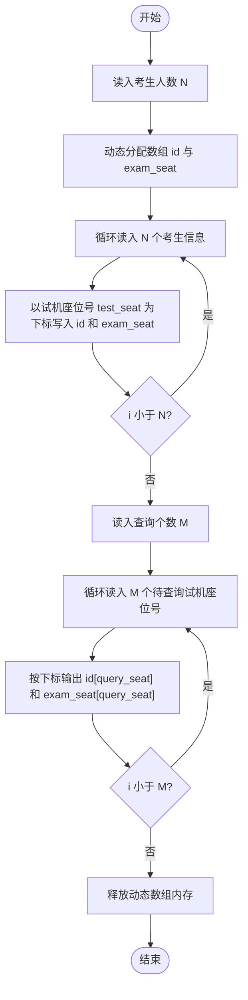
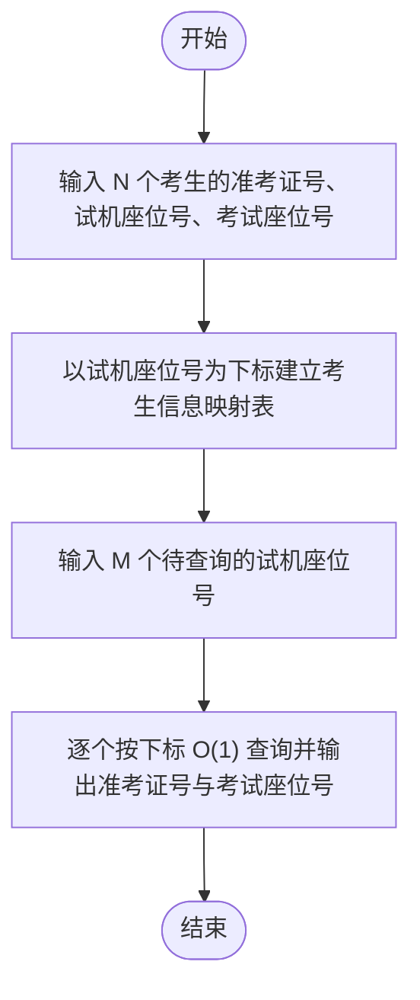

# L1-005 - 考试座位号（15 分）

- **时间限制**: 200 ms
- **内存限制**: 65536 KB
- **代码长度限制**: 16 KB

---

## 题目描述

每个 PAT 考生在参加考试时都会被分配两个座位号，一个是试机座位，一个是考试座位。正常情况下，考生在入场时先得到试机座位号码，入座进入试机状态后，系统会显示该考生的考试座位号码，考试时考生需要换到考试座位就座。但有些考生迟到了，试机已经结束，他们只能拿着领到的试机座位号码求助于你，从后台查出他们的考试座位号码。

### 输入格式:

输入第一行给出一个正整数 $$N$$（$$\le 1000$$），随后 $$N$$ 行，每行给出一个考生的信息：`准考证号 试机座位号 考试座位号`。其中`准考证号`由 16 位数字组成，座位从 1 到 $$N$$ 编号。输入保证每个人的准考证号都不同，并且任何时候都不会把两个人分配到同一个座位上。

考生信息之后，给出一个正整数 $$M$$（$$\le N$$），随后一行中给出 $$M$$ 个待查询的试机座位号码，以空格分隔。

### 输出格式:

对应每个需要查询的试机座位号码，在一行中输出对应考生的准考证号和考试座位号码，中间用 1 个空格分隔。

### 输入样例:

```in
4
3310120150912233 2 4
3310120150912119 4 1
3310120150912126 1 3
3310120150912002 3 2
2
3 4
```

### 输出样例:

```out
3310120150912002 2
3310120150912119 1
```

## 示例

### 示例 1

**输入:**
```
4
3310120150912233 2 4
3310120150912119 4 1
3310120150912126 1 3
3310120150912002 3 2
2
3 4
```

**输出:**
```
3310120150912002 2
3310120150912119 1
```

---

## 题目详解

### 一、解题思路

本题的 R 实现采用以下方法：读取标准输入后建立题目所需的数据结构，按约束执行核心计算并输出结果。

### 二、代码流程说明

1. 读取并解析标准输入，转换为题目所需的数据结构。
2. 按题意执行核心算法，维护中间状态并处理边界情况。
3. 整理计算结果，按照输出格式生成答案。

### 三、代码实现

```r
# 实现原理：读取标准输入后建立题目所需的数据结构，按约束执行核心计算并输出结果。
# 处理流程：读取输入 -> 建立状态 -> 执行算法 -> 按题目格式输出。
# 关键变量和循环均直接对应题目中的数据、约束或操作。

# 读取并解析标准输入。
x <- scan(file = "stdin", quiet = TRUE, what = "")
n <- as.integer(x[1])
p <- 2
by <- vector("list", n)
# 按题目约束遍历当前数据，更新中间状态。
for (i in seq_len(n)) {
    id <- x[p]
    t <- as.integer(x[p + 1])
    e <- x[p + 2]
    by[[t]] <- c(id, e)
    p <- p + 3
}
m <- as.integer(x[p])
p <- p + 1
for (i in seq_len(m)) {
    q <- by[[as.integer(x[p + i - 1])]]
# 严格按照题目规定的输出格式输出答案。
    cat(q[1], q[2], sep = " ")
    cat("\n")
}
```

### 四、代码流程图



### 五、解题流程图



### 六、常见易错点

- 题目描述、输入格式、输出格式和输入输出样例必须保持原文不变。
- R 语言下标从 1 开始，注意编号转换和空输入边界。
- 输出时严格保留题目规定的空格、换行和小数位数。
