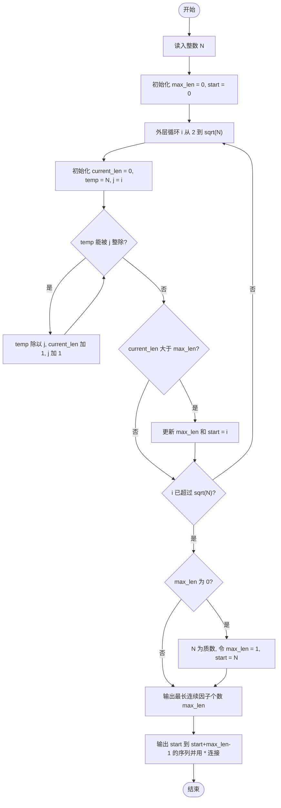
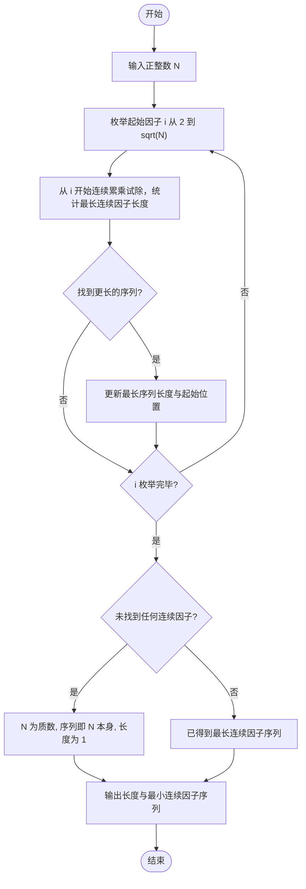

# L1-006 - 连续因子（20 分）

- **时间限制**: 400 ms
- **内存限制**: 65536 KB
- **代码长度限制**: 16 KB

---

## 题目描述

一个正整数 $$N$$ 的因子中可能存在若干连续的数字。例如 630 可以分解为 3$$\times$$5$$\times$$6$$\times$$7，其中 5、6、7 就是 3 个连续的数字。给定任一正整数 $$N$$，要求编写程序求出最长连续因子的个数，并输出最小的连续因子序列。

### 输入格式:

输入在一行中给出一个正整数 $$N$$（$$1<N<2^{31}$$）。

### 输出格式:

首先在第 1 行输出最长连续因子的个数；然后在第 2 行中按 `因子1*因子2*……*因子k` 的格式输出最小的连续因子序列，其中因子按递增顺序输出，1 不算在内。

### 输入样例:

```in
630

```

### 输出样例:

```out
3
5*6*7

```

**鸣谢用户 漏穿雪 补充数据！**

## 示例

### 示例 1

**输入:**
```
630

```

**输出:**
```
3
5*6*7

```

---

## 题目详解

### 一、解题思路

本题的 R 实现采用以下方法：枚举连续因子的起点，逐步扩展连续乘积；当乘积能整除输入数时，保留长度最长的一段。

### 二、代码流程说明

1. 读取并解析标准输入，转换为题目所需的数据结构。
2. 按题意执行核心算法，维护中间状态并处理边界情况。
3. 整理计算结果，按照输出格式生成答案。

### 三、代码实现

```r
# 实现原理：枚举连续因子的起点，逐步扩展连续乘积；当乘积能整除输入数时，保留长度最长的一段。
# 处理流程：读取输入 -> 建立状态 -> 执行算法 -> 按题目格式输出。
# 关键变量和循环均直接对应题目中的数据、约束或操作。

# 读取并解析标准输入。
n <- as.numeric(scan(file = "stdin", quiet = TRUE))
best <- c(n, n)
bestlen <- 1
# 按题目约束遍历当前数据，更新中间状态。
for (a in 2:floor(sqrt(n))) {
    prod <- 1
    b <- a
    while (prod * b <= n) {
        prod <- prod * b
        b <- b + 1
    }
    if (n%%prod == 0 && b - a > bestlen) {
        best <- c(a, b - 1)
        bestlen <- b - a
    }
}
# 严格按照题目规定的输出格式输出答案。
cat(bestlen, "\n", sep = "")
cat(paste(best[1]:best[2], collapse = "*"), "\n", sep = "")
```

### 四、代码流程图



### 五、解题流程图



### 六、常见易错点

- 题目描述、输入格式、输出格式和输入输出样例必须保持原文不变。
- R 语言下标从 1 开始，注意编号转换和空输入边界。
- 输出时严格保留题目规定的空格、换行和小数位数。
