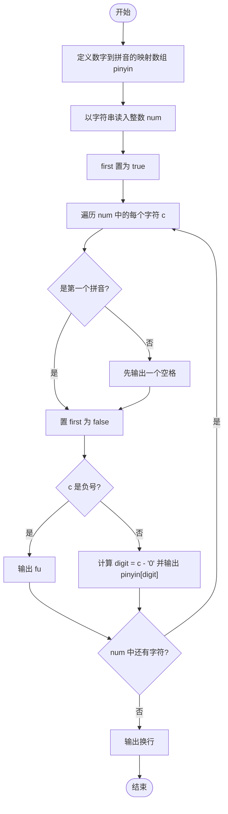
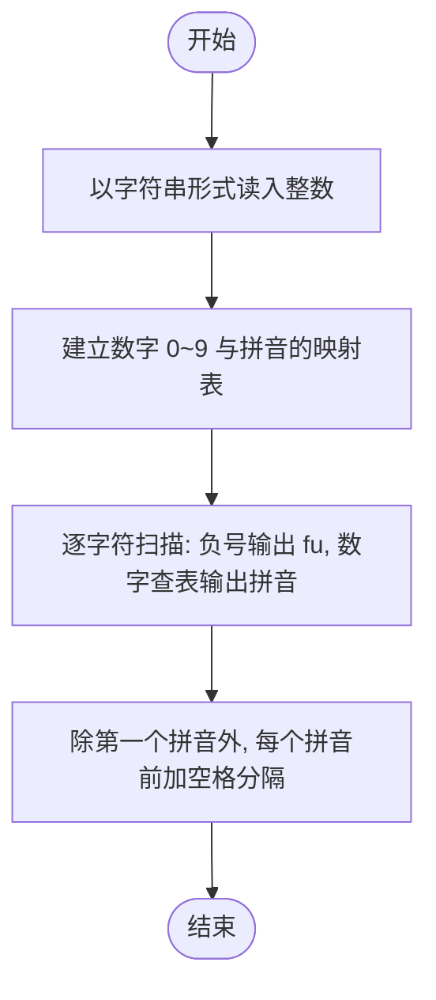

# L1-007 - 念数字（10 分）

- **时间限制**: 400 ms
- **内存限制**: 65536 KB
- **代码长度限制**: 16 KB

---

## 题目描述

输入一个整数，输出每个数字对应的拼音。当整数为负数时，先输出`fu`字。十个数字对应的拼音如下：
```
0: ling
1: yi
2: er
3: san
4: si
5: wu
6: liu
7: qi
8: ba
9: jiu
```

### 输入格式:

输入在一行中给出一个整数，如：`1234`。

<b>提示：整数包括负数、零和正数。</b>

### 输出格式:

在一行中输出这个整数对应的拼音，每个数字的拼音之间用空格分开，行末没有最后的空格。如
`yi er san si`。

### 输入样例:

```in
-600
```

### 输出样例:

```out
fu liu ling ling
```

## 示例

### 示例 1

**输入:**
```
-600
```

**输出:**
```
fu liu ling ling
```

---

## 题目详解

### 一、解题思路

本题的 R 实现采用以下方法：按行或按字段解析输入，使用字符串或序列操作完成题目要求的变换，并按格式输出。

### 二、代码流程说明

1. 读取并解析标准输入，转换为题目所需的数据结构。
2. 按题意执行核心算法，维护中间状态并处理边界情况。
3. 整理计算结果，按照输出格式生成答案。

### 三、代码实现

```r
# 实现原理：按行或按字段解析输入，使用字符串或序列操作完成题目要求的变换，并按格式输出。
# 处理流程：读取输入 -> 建立状态 -> 执行算法 -> 按题目格式输出。
# 关键变量和循环均直接对应题目中的数据、约束或操作。

# 读取并解析标准输入。
s <- trimws(readLines("stdin", n = 1, warn = FALSE))
w <- c("ling", "yi", "er", "san", "si", "wu", "liu", "qi", "ba",
    "jiu")
if (startsWith(s, "-")) {
# 严格按照题目规定的输出格式输出答案。
    cat("fu ")
    s <- substring(s, 2)
}
cat(paste(w[as.integer(strsplit(s, "", fixed = TRUE)[[1]]) +
    1], collapse = " "), "\n", sep = "")
```

### 四、代码流程图



### 五、解题流程图



### 六、常见易错点

- 题目描述、输入格式、输出格式和输入输出样例必须保持原文不变。
- R 语言下标从 1 开始，注意编号转换和空输入边界。
- 输出时严格保留题目规定的空格、换行和小数位数。
