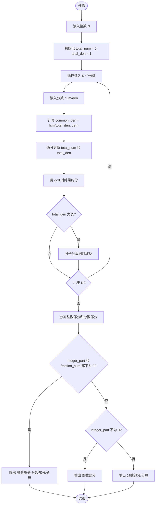
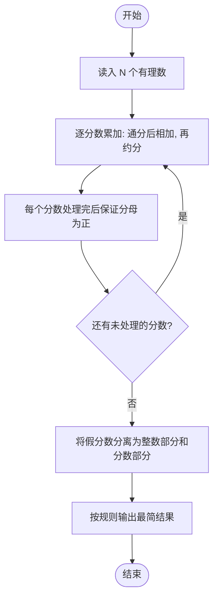

# L1-009 - N个数求和（20 分）

- **时间限制**: 400 ms
- **内存限制**: 65536 KB
- **代码长度限制**: 16 KB

---

## 题目描述

本题的要求很简单，就是求`N`个数字的和。麻烦的是，这些数字是以有理数`分子/分母`的形式给出的，你输出的和也必须是有理数的形式。

### 输入格式:

输入第一行给出一个正整数`N`（$$\le$$100）。随后一行按格式`a1/b1 a2/b2 ...`给出`N`个有理数。题目保证所有分子和分母都在长整型范围内。另外，负数的符号一定出现在分子前面。

### 输出格式:

输出上述数字和的最简形式 —— 即将结果写成`整数部分 分数部分`，其中分数部分写成`分子/分母`，要求分子小于分母，且它们没有公因子。如果结果的整数部分为0，则只输出分数部分。

### 输入样例 1:

```in
5
2/5 4/15 1/30 -2/60 8/3
```

### 输出样例 1:

```out
3 1/3
```

### 输入样例 2:

```in
2
4/3 2/3
```

### 输出样例 2:

```out
2
```

### 输入样例 3:

```in
3
1/3 -1/6 1/8
```

### 输出样例 3:

```out
7/24
```

## 示例

### 示例 1

**输入:**
```
5
2/5 4/15 1/30 -2/60 8/3
```

**输出:**
```
3 1/3
```

### 示例 2

**输入:**
```
2
4/3 2/3
```

**输出:**
```
2
```

### 示例 3

**输入:**
```
3
1/3 -1/6 1/8
```

**输出:**
```
7/24
```

---

## 题目详解

### 一、解题思路

本题的 R 实现采用以下方法：按行或按字段解析输入，使用字符串或序列操作完成题目要求的变换，并按格式输出。

### 二、代码流程说明

1. 读取并解析标准输入，转换为题目所需的数据结构。
2. 按题意执行核心算法，维护中间状态并处理边界情况。
3. 整理计算结果，按照输出格式生成答案。

### 三、代码实现

```r
# 实现原理：按行或按字段解析输入，使用字符串或序列操作完成题目要求的变换，并按格式输出。
# 处理流程：读取输入 -> 建立状态 -> 执行算法 -> 按题目格式输出。
# 关键变量和循环均直接对应题目中的数据、约束或操作。

# 读取并解析标准输入。
x <- scan(file = "stdin", quiet = TRUE, what = "")
n <- as.integer(x[1])
num <- 0
den <- 1
gcd <- function(a, b) if (b == 0) abs(a) else Recall(b, a%%b)
# 按题目约束遍历当前数据，更新中间状态。
for (s in x[2:(n + 1)]) {
    q <- as.numeric(strsplit(s, "/", fixed = TRUE)[[1]])
    num <- num * q[2] + q[1] * den
    den <- den * q[2]
    g <- gcd(num, den)
    num <- num/g
    den <- den/g
}
sg <- if (num < 0) "-" else ""
num <- abs(num)
w <- num%/%den
r <- num%%den
# 严格按照题目规定的输出格式输出答案。
if (r == 0) cat(sg, w, "\n", sep = "") else if (w == 0) cat(sg,
    r, "/", den, "\n", sep = "") else cat(sg, w, " ", r, "/",
    den, "\n", sep = "")
```

### 四、代码流程图



### 五、解题流程图



### 六、常见易错点

- 题目描述、输入格式、输出格式和输入输出样例必须保持原文不变。
- R 语言下标从 1 开始，注意编号转换和空输入边界。
- 输出时严格保留题目规定的空格、换行和小数位数。
