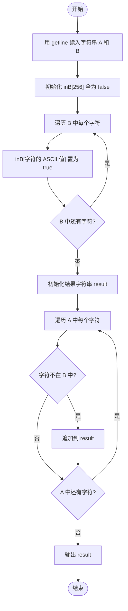
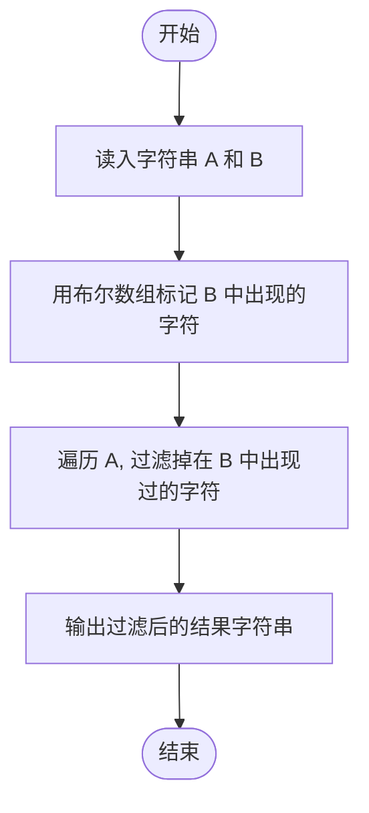

# L1-011 - A-B（20 分）

- **时间限制**: 150 ms
- **内存限制**: 65536 KB
- **代码长度限制**: 16 KB

---

## 题目描述

本题要求你计算$$A-B$$。不过麻烦的是，$$A$$和$$B$$都是字符串 —— 即从字符串$$A$$中把字符串$$B$$所包含的字符全删掉，剩下的字符组成的就是字符串$$A-B$$。

### 输入格式:

输入在2行中先后给出字符串$$A$$和$$B$$。两字符串的长度都不超过$$10^4$$，并且保证每个字符串都是由可见的ASCII码和空白字符组成，最后以换行符结束。

### 输出格式:

在一行中打印出$$A-B$$的结果字符串。

### 输入样例:

```in
I love GPLT!  It's a fun game!
aeiou
```

### 输出样例:

```out
I lv GPLT!  It's  fn gm!
```

## 示例

### 示例 1

**输入:**
```
I love GPLT!  It's a fun game!
aeiou
```

**输出:**
```
I lv GPLT!  It's  fn gm!
```

---

## 题目详解

### 一、解题思路

本题的 R 实现采用以下方法：按行或按字段解析输入，使用字符串或序列操作完成题目要求的变换，并按格式输出。

### 二、代码流程说明

1. 读取并解析标准输入，转换为题目所需的数据结构。
2. 按题意执行核心算法，维护中间状态并处理边界情况。
3. 整理计算结果，按照输出格式生成答案。

### 三、代码实现

```r
# 实现原理：按行或按字段解析输入，使用字符串或序列操作完成题目要求的变换，并按格式输出。
# 处理流程：读取输入 -> 建立状态 -> 执行算法 -> 按题目格式输出。
# 关键变量和循环均直接对应题目中的数据、约束或操作。

# 读取并解析标准输入。
a <- readLines("stdin", n = 2, warn = FALSE)
b <- unique(strsplit(a[2], "", fixed = TRUE)[[1]])
z <- strsplit(a[1], "", fixed = TRUE)[[1]]
# 严格按照题目规定的输出格式输出答案。
cat(paste(z[!z %in% b], collapse = ""), "\n", sep = "")
```

### 四、代码流程图



### 五、解题流程图



### 六、常见易错点

- 题目描述、输入格式、输出格式和输入输出样例必须保持原文不变。
- R 语言下标从 1 开始，注意编号转换和空输入边界。
- 输出时严格保留题目规定的空格、换行和小数位数。
