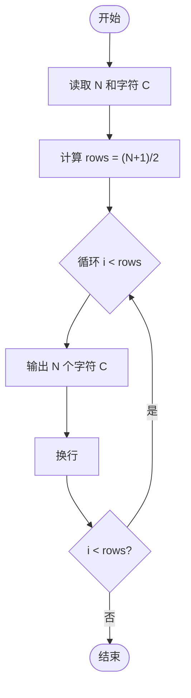
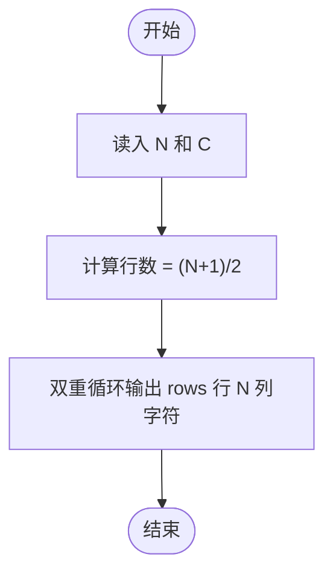

# L1-015 - 跟奥巴马一起画方块（15 分）

- **时间限制**: 400 ms
- **内存限制**: 65536 KB
- **代码长度限制**: 16 KB

---

## 题目描述

美国总统奥巴马不仅呼吁所有人都学习编程，甚至以身作则编写代码，成为美国历史上首位编写计算机代码的总统。2014年底，为庆祝“计算机科学教育周”正式启动，奥巴马编写了很简单的计算机代码：在屏幕上画一个正方形。现在你也跟他一起画吧！

### 输入格式:

输入在一行中给出正方形边长$$N$$（$$3\le N\le 21$$）和组成正方形边的某种字符`C`，间隔一个空格。

### 输出格式:

输出由给定字符`C`画出的正方形。但是注意到行间距比列间距大，所以为了让结果看上去更像正方形，我们输出的行数实际上是列数的50%（四舍五入取整）。

### 输入样例:

```in
10 a
```

### 输出样例:

```out
aaaaaaaaaa
aaaaaaaaaa
aaaaaaaaaa
aaaaaaaaaa
aaaaaaaaaa
```

## 示例

### 示例 1

**输入:**
```
10 a
```

**输出:**
```
aaaaaaaaaa
aaaaaaaaaa
aaaaaaaaaa
aaaaaaaaaa
aaaaaaaaaa
```

---

## 题目详解

### 一、解题思路

本题的 R 实现采用以下方法：读取标准输入后建立题目所需的数据结构，按约束执行核心计算并输出结果。

### 二、代码流程说明

1. 读取并解析标准输入，转换为题目所需的数据结构。
2. 按题意执行核心算法，维护中间状态并处理边界情况。
3. 整理计算结果，按照输出格式生成答案。

### 三、代码实现

```r
# 实现原理：读取标准输入后建立题目所需的数据结构，按约束执行核心计算并输出结果。
# 处理流程：读取输入 -> 建立状态 -> 执行算法 -> 按题目格式输出。
# 关键变量和循环均直接对应题目中的数据、约束或操作。

# 读取并解析标准输入。
x <- scan(file = "stdin", quiet = TRUE, what = "")
n <- as.integer(x[1])
ch <- x[2]
h <- round(n/2)
# 按题目约束遍历当前数据，更新中间状态。
for (i in seq_len(h)) cat(strrep(ch, n), "\n", sep = "")
# 严格按照题目规定的输出格式输出答案。
```

### 四、代码流程图



### 五、解题流程图



### 六、常见易错点

- 题目描述、输入格式、输出格式和输入输出样例必须保持原文不变。
- R 语言下标从 1 开始，注意编号转换和空输入边界。
- 输出时严格保留题目规定的空格、换行和小数位数。
