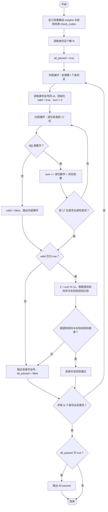
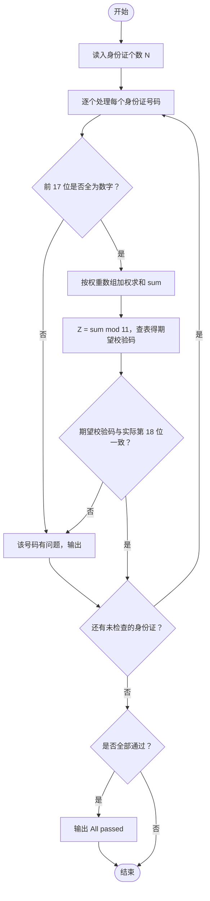

# L1-016 - 查验身份证（15 分）

- **时间限制**: 400 ms
- **内存限制**: 65536 KB
- **代码长度限制**: 16 KB

---

## 题目描述

一个合法的身份证号码由17位地区、日期编号和顺序编号加1位校验码组成。校验码的计算规则如下：

首先对前17位数字加权求和，权重分配为：{7，9，10，5，8，4，2，1，6，3，7，9，10，5，8，4，2}；然后将计算的和对11取模得到值`Z`；最后按照以下关系对应`Z`值与校验码`M`的值：
```
Z：0 1 2 3 4 5 6 7 8 9 10
M：1 0 X 9 8 7 6 5 4 3 2
```
现在给定一些身份证号码，请你验证校验码的有效性，并输出有问题的号码。

### 输入格式:

输入第一行给出正整数$$N$$（$$\le 100$$）是输入的身份证号码的个数。随后$$N$$行，每行给出1个18位身份证号码。

### 输出格式:

按照输入的顺序每行输出1个有问题的身份证号码。这里并不检验前17位是否合理，只检查前17位是否全为数字且最后1位校验码计算准确。如果所有号码都正常，则输出`All passed`。

### 输入样例 1:

```in
4
320124198808240056
12010X198901011234
110108196711301866
37070419881216001X
```

### 输出样例 1:

```out
12010X198901011234
110108196711301866
37070419881216001X
```

### 输入样例 2:

```in
2
320124198808240056
110108196711301862
```

### 输出样例 2:

```out
All passed
```

## 示例

### 示例 1

**输入:**
```
4
320124198808240056
12010X198901011234
110108196711301866
37070419881216001X
```

**输出:**
```
12010X198901011234
110108196711301866
37070419881216001X
```

### 示例 2

**输入:**
```
2
320124198808240056
110108196711301862
```

**输出:**
```
All passed
```

---

## 题目详解

### 一、解题思路

本题的 R 实现采用以下方法：按行或按字段解析输入，使用字符串或序列操作完成题目要求的变换，并按格式输出。

### 二、代码流程说明

1. 读取并解析标准输入，转换为题目所需的数据结构。
2. 按题意执行核心算法，维护中间状态并处理边界情况。
3. 整理计算结果，按照输出格式生成答案。

### 三、代码实现

```r
# 实现原理：按行或按字段解析输入，使用字符串或序列操作完成题目要求的变换，并按格式输出。
# 处理流程：读取输入 -> 建立状态 -> 执行算法 -> 按题目格式输出。
# 关键变量和循环均直接对应题目中的数据、约束或操作。

# 读取并解析标准输入。
x <- scan(file = "stdin", quiet = TRUE, what = "")
n <- as.integer(x[1])
w <- c(7, 9, 10, 5, 8, 4, 2, 1, 6, 3, 7, 9, 10, 5, 8, 4, 2)
m <- c("1", "0", "X", "9", "8", "7", "6", "5", "4", "3", "2")
bad <- character()
# 按题目约束遍历当前数据，更新中间状态。
for (i in seq_len(n)) {
    s <- x[i + 1]
    d <- suppressWarnings(as.integer(strsplit(substr(s, 1, 17),
        "", fixed = TRUE)[[1]]))
    ok <- !anyNA(d) && m[sum(d * w)%%11 + 1] == toupper(substr(s,
        18, 18))
    if (!ok)
        bad <- c(bad, s)
}
# 严格按照题目规定的输出格式输出答案。
if (length(bad)) cat(paste(bad, collapse = "\n"), "\n", sep = "") else cat("All passed\n")
```

### 四、代码流程图



### 五、解题流程图



### 六、常见易错点

- 题目描述、输入格式、输出格式和输入输出样例必须保持原文不变。
- R 语言下标从 1 开始，注意编号转换和空输入边界。
- 输出时严格保留题目规定的空格、换行和小数位数。
