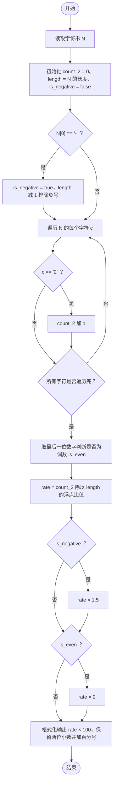
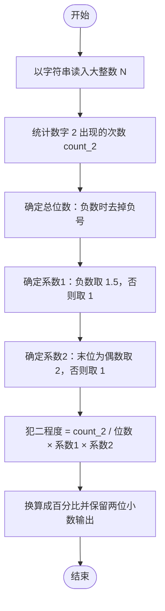

# L1-017 - 到底有多二（15 分）

- **时间限制**: 400 ms
- **内存限制**: 65536 KB
- **代码长度限制**: 16 KB

---

## 题目描述

一个整数“**犯二的程度**”定义为该数字中包含2的个数与其位数的比值。如果这个数是负数，则程度增加0.5倍；如果还是个偶数，则再增加1倍。例如数字`-13142223336`是个11位数，其中有3个2，并且是负数，也是偶数，则它的犯二程度计算为：$$3/11\times 1.5\times 2\times 100\%$$，约为81.82%。本题就请你计算一个给定整数到底有多二。

### 输入格式:

输入第一行给出一个不超过50位的整数`N`。

### 输出格式:

在一行中输出`N`犯二的程度，保留小数点后两位。

### 输入样例:

```in
-13142223336
```

### 输出样例:

```out
81.82%
```

**鸣谢安阳师范学院段晓云老师和软件工程五班李富龙同学补充测试数据！**

## 示例

### 示例 1

**输入:**
```
-13142223336
```

**输出:**
```
81.82%
```

---

## 题目详解

### 一、解题思路

本题的 R 实现采用以下方法：按行或按字段解析输入，使用字符串或序列操作完成题目要求的变换，并按格式输出。

### 二、代码流程说明

1. 读取并解析标准输入，转换为题目所需的数据结构。
2. 按题意执行核心算法，维护中间状态并处理边界情况。
3. 整理计算结果，按照输出格式生成答案。

### 三、代码实现

```r
# 实现原理：按行或按字段解析输入，使用字符串或序列操作完成题目要求的变换，并按格式输出。
# 处理流程：读取输入 -> 建立状态 -> 执行算法 -> 按题目格式输出。
# 关键变量和循环均直接对应题目中的数据、约束或操作。

# 读取并解析标准输入。
s <- trimws(readLines("stdin", n = 1, warn = FALSE))
neg <- startsWith(s, "-")
d <- if (neg) substring(s, 2) else s
r <- sum(strsplit(d, "", fixed = TRUE)[[1]] == "2")/nchar(d)
if (neg) r <- r * 1.5
if (as.integer(substr(d, nchar(d), nchar(d)))%%2 == 0) r <- r *
    2
# 严格按照题目规定的输出格式输出答案。
cat(sprintf("%.2f%%\n", 100 * r))
```

### 四、代码流程图



### 五、解题流程图



### 六、常见易错点

- 题目描述、输入格式、输出格式和输入输出样例必须保持原文不变。
- R 语言下标从 1 开始，注意编号转换和空输入边界。
- 输出时严格保留题目规定的空格、换行和小数位数。
