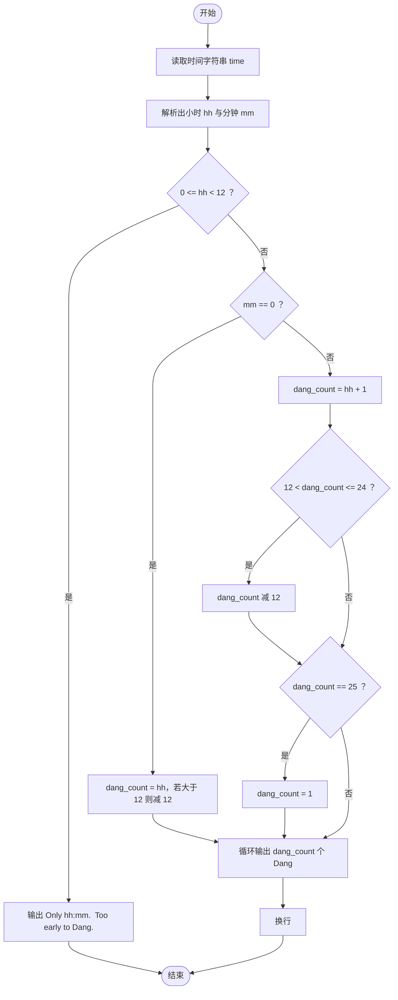
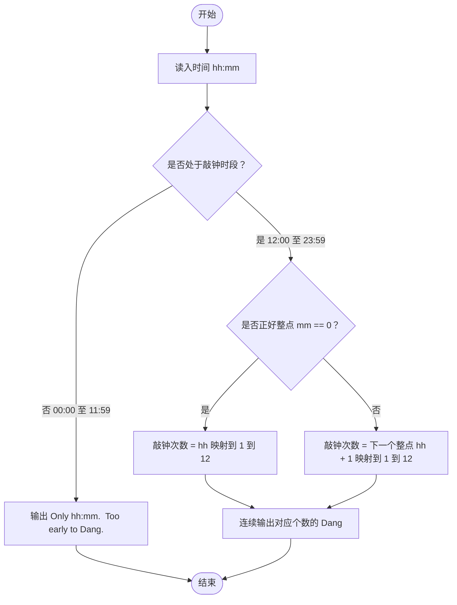

# L1-018 - 大笨钟（10 分）

- **时间限制**: 400 ms
- **内存限制**: 65536 KB
- **代码长度限制**: 16 KB

---

## 题目描述

微博上有个自称“大笨钟V”的家伙，每天敲钟催促码农们爱惜身体早点睡觉。不过由于笨钟自己作息也不是很规律，所以敲钟并不定时。一般敲钟的点数是根据敲钟时间而定的，如果正好在某个整点敲，那么“当”数就等于那个整点数；如果过了整点，就敲下一个整点数。另外，虽然一天有24小时，钟却是只在后半天敲1~12下。例如在23:00敲钟，就是“当当当当当当当当当当当”，而到了23:01就会是“当当当当当当当当当当当当”。在午夜00:00到中午12:00期间（端点时间包括在内），笨钟是不敲的。

下面就请你写个程序，根据当前时间替大笨钟敲钟。

### 输入格式:

输入第一行按照`hh:mm`的格式给出当前时间。其中`hh`是小时，在00到23之间；`mm`是分钟，在00到59之间。

### 输出格式:

根据当前时间替大笨钟敲钟，即在一行中输出相应数量个`Dang`。如果不是敲钟期，则输出：

```
Only hh:mm.  Too early to Dang.
```

其中`hh:mm`是输入的时间。

### 输入样例 1:

```in
19:05
```

### 输出样例 1:

```out
DangDangDangDangDangDangDangDang
```

### 输入样例 2:

```in
07:05
```

### 输出样例 2:

```out
Only 07:05.  Too early to Dang.
```

## 示例

### 示例 1

**输入:**
```
19:05
```

**输出:**
```
DangDangDangDangDangDangDangDang
```

### 示例 2

**输入:**
```
07:05
```

**输出:**
```
Only 07:05.  Too early to Dang.
```

---

## 题目详解

### 一、解题思路

本题的 R 实现采用以下方法：按行或按字段解析输入，使用字符串或序列操作完成题目要求的变换，并按格式输出。

### 二、代码流程说明

1. 读取并解析标准输入，转换为题目所需的数据结构。
2. 按题意执行核心算法，维护中间状态并处理边界情况。
3. 整理计算结果，按照输出格式生成答案。

### 三、代码实现

```r
# 实现原理：按行或按字段解析输入，使用字符串或序列操作完成题目要求的变换，并按格式输出。
# 处理流程：读取输入 -> 建立状态 -> 执行算法 -> 按题目格式输出。
# 关键变量和循环均直接对应题目中的数据、约束或操作。

# 读取并解析标准输入。
s <- trimws(readLines("stdin", n = 1, warn = FALSE))
p <- as.integer(strsplit(s, ":", fixed = TRUE)[[1]])
if (p[1] > 12 || (p[1] == 12 && p[2] > 0)) {
    k <- if (p[1] == 12)
        1
    else p[1] - 11
# 严格按照题目规定的输出格式输出答案。
    cat(strrep("Dang", k), "\n", sep = "")
} else cat("Only ", s, ".  Too early to Dang.\n", sep = "")
```

### 四、代码流程图



### 五、解题流程图



### 六、常见易错点

- 题目描述、输入格式、输出格式和输入输出样例必须保持原文不变。
- R 语言下标从 1 开始，注意编号转换和空输入边界。
- 输出时严格保留题目规定的空格、换行和小数位数。
