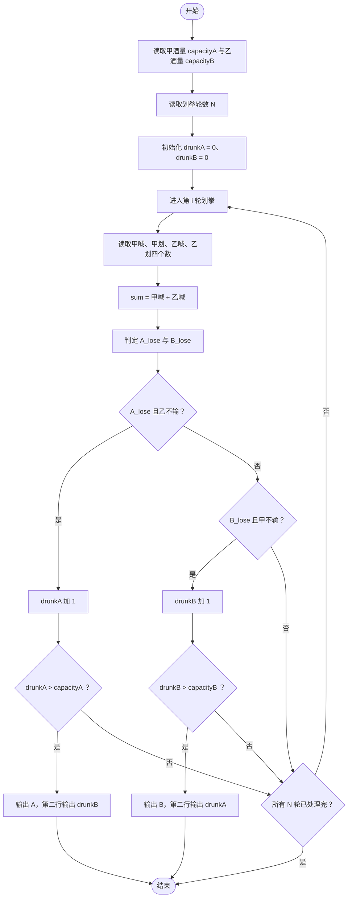
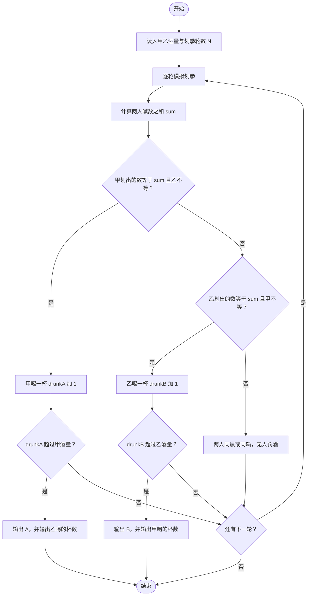

# L1-019 - 谁先倒（15 分）

- **时间限制**: 400 ms
- **内存限制**: 65536 KB
- **代码长度限制**: 16 KB

---

## 题目描述

划拳是古老中国酒文化的一个有趣的组成部分。酒桌上两人划拳的方法为：每人口中喊出一个数字，同时用手比划出一个数字。如果谁比划出的数字正好等于两人喊出的数字之和，谁就输了，输家罚一杯酒。两人同赢或两人同输则继续下一轮，直到唯一的赢家出现。

下面给出甲、乙两人的酒量（最多能喝多少杯不倒）和划拳记录，请你判断两个人谁先倒。

### 输入格式:

输入第一行先后给出甲、乙两人的酒量（不超过100的非负整数），以空格分隔。下一行给出一个正整数`N`（$$\le 100$$），随后`N`行，每行给出一轮划拳的记录，格式为：

```
甲喊 甲划 乙喊 乙划
```

其中`喊`是喊出的数字，`划`是划出的数字，均为不超过100的正整数（两只手一起划）。

### 输出格式:

在第一行中输出先倒下的那个人：`A`代表甲，`B`代表乙。第二行中输出没倒的那个人喝了多少杯。题目保证有一个人倒下。注意程序处理到有人倒下就终止，后面的数据不必处理。

### 输入样例:

```in
1 1
6
8 10 9 12
5 10 5 10
3 8 5 12
12 18 1 13
4 16 12 15
15 1 1 16
```

### 输出样例:

```out
A
1
```

## 示例

### 示例 1

**输入:**
```
1 1
6
8 10 9 12
5 10 5 10
3 8 5 12
12 18 1 13
4 16 12 15
15 1 1 16
```

**输出:**
```
A
1
```

---

## 题目详解

### 一、解题思路

本题的 R 实现采用以下方法：读取标准输入后建立题目所需的数据结构，按约束执行核心计算并输出结果。

### 二、代码流程说明

1. 读取并解析标准输入，转换为题目所需的数据结构。
2. 按题意执行核心算法，维护中间状态并处理边界情况。
3. 整理计算结果，按照输出格式生成答案。

### 三、代码实现

```r
# 实现原理：读取标准输入后建立题目所需的数据结构，按约束执行核心计算并输出结果。
# 处理流程：读取输入 -> 建立状态 -> 执行算法 -> 按题目格式输出。
# 关键变量和循环均直接对应题目中的数据、约束或操作。

# 读取并解析标准输入。
x <- scan(file = "stdin", quiet = TRUE)
a <- x[1]
b <- x[2]
n <- x[3]
la <- lb <- 0
p <- 4
# 按题目约束遍历当前数据，更新中间状态。
for (i in seq_len(n)) {
    q <- x[p:(p + 3)]
    p <- p + 4
    sumv <- q[1] + q[3]
    if (q[2] == sumv)
        la <- la + 1
    if (q[4] == sumv)
        lb <- lb + 1
    if (la > a || lb > b)
        break
}
# 严格按照题目规定的输出格式输出答案。
if (la > a) cat("A\n", lb, "\n", sep = "") else cat("B\n", la,
    "\n", sep = "")
```

### 四、代码流程图



### 五、解题流程图



### 六、常见易错点

- 题目描述、输入格式、输出格式和输入输出样例必须保持原文不变。
- R 语言下标从 1 开始，注意编号转换和空输入边界。
- 输出时严格保留题目规定的空格、换行和小数位数。
