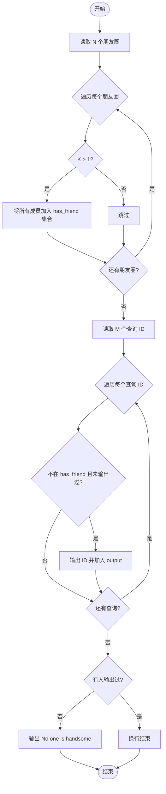
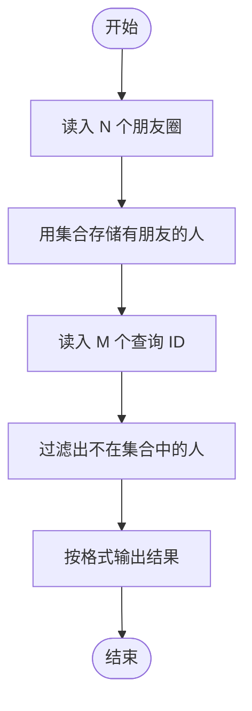

# L1-020 - 帅到没朋友（20 分）

- **时间限制**: 200 ms
- **内存限制**: 65536 KB
- **代码长度限制**: 16 KB

---

## 题目描述

当芸芸众生忙着在朋友圈中发照片的时候，总有一些人因为太帅而没有朋友。本题就要求你找出那些帅到没有朋友的人。

### 输入格式:

输入第一行给出一个正整数`N`（$$\le 100$$），是已知朋友圈的个数；随后`N`行，每行首先给出一个正整数`K`（$$\le 1000$$），为朋友圈中的人数，然后列出一个朋友圈内的所有人——为方便起见，每人对应一个ID号，为5位数字（从00000到99999），ID间以空格分隔；之后给出一个正整数`M`（$$\le 10000$$），为待查询的人数；随后一行中列出`M`个待查询的ID，以空格分隔。

注意：没有朋友的人可以是根本没安装“朋友圈”，也可以是只有自己一个人在朋友圈的人。虽然有个别自恋狂会自己把自己反复加进朋友圈，但题目保证所有`K`超过1的朋友圈里都至少有2个不同的人。

### 输出格式:

按输入的顺序输出那些帅到没朋友的人。ID间用1个空格分隔，行的首尾不得有多余空格。如果没有人太帅，则输出`No one is handsome`。

注意：同一个人可以被查询多次，但只输出一次。

### 输入样例 1:

```in
3
3 11111 22222 55555
2 33333 44444
4 55555 66666 99999 77777
8
55555 44444 10000 88888 22222 11111 23333 88888
```

### 输出样例 1:

```out
10000 88888 23333
```

### 输入样例 2:

```in
3
3 11111 22222 55555
2 33333 44444
4 55555 66666 99999 77777
4
55555 44444 22222 11111
```

### 输出样例 2:

```out
No one is handsome
```

## 示例

### 示例 1

**输入:**
```
3
3 11111 22222 55555
2 33333 44444
4 55555 66666 99999 77777
8
55555 44444 10000 88888 22222 11111 23333 88888
```

**输出:**
```
10000 88888 23333
```

### 示例 2

**输入:**
```
3
3 11111 22222 55555
2 33333 44444
4 55555 66666 99999 77777
4
55555 44444 22222 11111
```

**输出:**
```
No one is handsome
```

---

## 题目详解

### 一、解题思路

本题的 R 实现采用以下方法：读取标准输入后建立题目所需的数据结构，按约束执行核心计算并输出结果。

### 二、代码流程说明

1. 读取并解析标准输入，转换为题目所需的数据结构。
2. 按题意执行核心算法，维护中间状态并处理边界情况。
3. 整理计算结果，按照输出格式生成答案。

### 三、代码实现

```r
# 实现原理：读取标准输入后建立题目所需的数据结构，按约束执行核心计算并输出结果。
# 处理流程：读取输入 -> 建立状态 -> 执行算法 -> 按题目格式输出。
# 关键变量和循环均直接对应题目中的数据、约束或操作。

# 读取并解析标准输入。
x <- scan(file = "stdin", quiet = TRUE, what = "")
n <- as.integer(x[1])
p <- 2
friends <- character()
# 按题目约束遍历当前数据，更新中间状态。
for (i in seq_len(n)) {
    k <- as.integer(x[p])
    friends <- c(friends, x[(p + 1):(p + k)])
    p <- p + k + 1
}
m <- as.integer(x[p])
q <- x[(p + 1):(p + m)]
r <- q[!q %in% friends]
r <- r[!duplicated(r)]
# 严格按照题目规定的输出格式输出答案。
if (length(r)) cat(paste(r, collapse = " "), "\n", sep = "") else cat("No one is handsome\n")
```

### 四、代码流程图



### 五、解题流程图



### 六、常见易错点

- 题目描述、输入格式、输出格式和输入输出样例必须保持原文不变。
- R 语言下标从 1 开始，注意编号转换和空输入边界。
- 输出时严格保留题目规定的空格、换行和小数位数。
