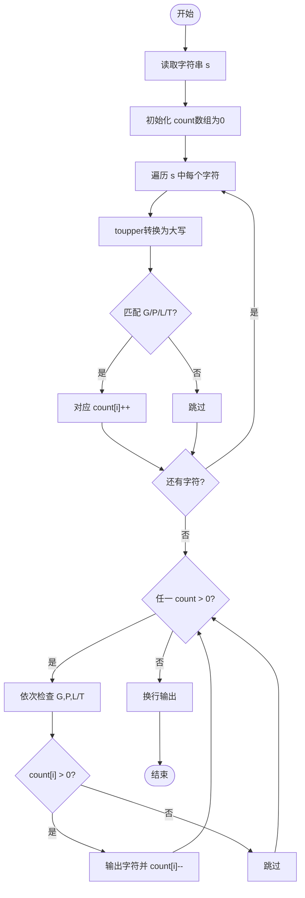
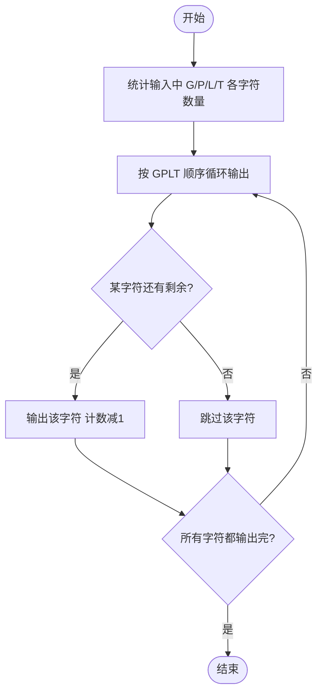

# L1-023 - 输出GPLT（20 分）

- **时间限制**: 150 ms
- **内存限制**: 65536 KB
- **代码长度限制**: 16 KB

---

## 题目描述

给定一个长度不超过10000的、仅由英文字母构成的字符串。请将字符重新调整顺序，按`GPLTGPLT....`这样的顺序输出，并忽略其它字符。当然，四种字符（不区分大小写）的个数不一定是一样多的，若某种字符已经输出完，则余下的字符仍按`GPLT`的顺序打印，直到所有字符都被输出。

### 输入格式:

输入在一行中给出一个长度不超过10000的、仅由英文字母构成的非空字符串。

### 输出格式:

在一行中按题目要求输出排序后的字符串。题目保证输出非空。

### 输入样例:

```in
pcTclnGloRgLrtLhgljkLhGFauPewSKgt
```

### 输出样例:

```out
GPLTGPLTGLTGLGLL
```

## 示例

### 示例 1

**输入:**
```
pcTclnGloRgLrtLhgljkLhGFauPewSKgt
```

**输出:**
```
GPLTGPLTGLTGLGLL
```

---

## 题目详解

### 一、解题思路

本题的 R 实现采用以下方法：按行或按字段解析输入，使用字符串或序列操作完成题目要求的变换，并按格式输出。

### 二、代码流程说明

1. 读取并解析标准输入，转换为题目所需的数据结构。
2. 按题意执行核心算法，维护中间状态并处理边界情况。
3. 整理计算结果，按照输出格式生成答案。

### 三、代码实现

```r
# 实现原理：按行或按字段解析输入，使用字符串或序列操作完成题目要求的变换，并按格式输出。
# 处理流程：读取输入 -> 建立状态 -> 执行算法 -> 按题目格式输出。
# 关键变量和循环均直接对应题目中的数据、约束或操作。

# 读取并解析标准输入。
s <- toupper(trimws(readLines("stdin", n = 1, warn = FALSE)))
cnt <- setNames(integer(4), strsplit("GPLT", "", fixed = TRUE)[[1]])
# 按题目约束遍历当前数据，更新中间状态。
for (c in strsplit(s, "", fixed = TRUE)[[1]]) if (c %in% names(cnt)) cnt[c] <- cnt[c] +
    1
out <- character()
while (sum(cnt) > 0) for (c in names(cnt)) if (cnt[c] > 0) {
    out <- c(out, c)
    cnt[c] <- cnt[c] - 1
}
# 严格按照题目规定的输出格式输出答案。
cat(paste(out, collapse = ""), "\n", sep = "")
```

### 四、代码流程图



### 五、解题流程图



### 六、常见易错点

- 题目描述、输入格式、输出格式和输入输出样例必须保持原文不变。
- R 语言下标从 1 开始，注意编号转换和空输入边界。
- 输出时严格保留题目规定的空格、换行和小数位数。
