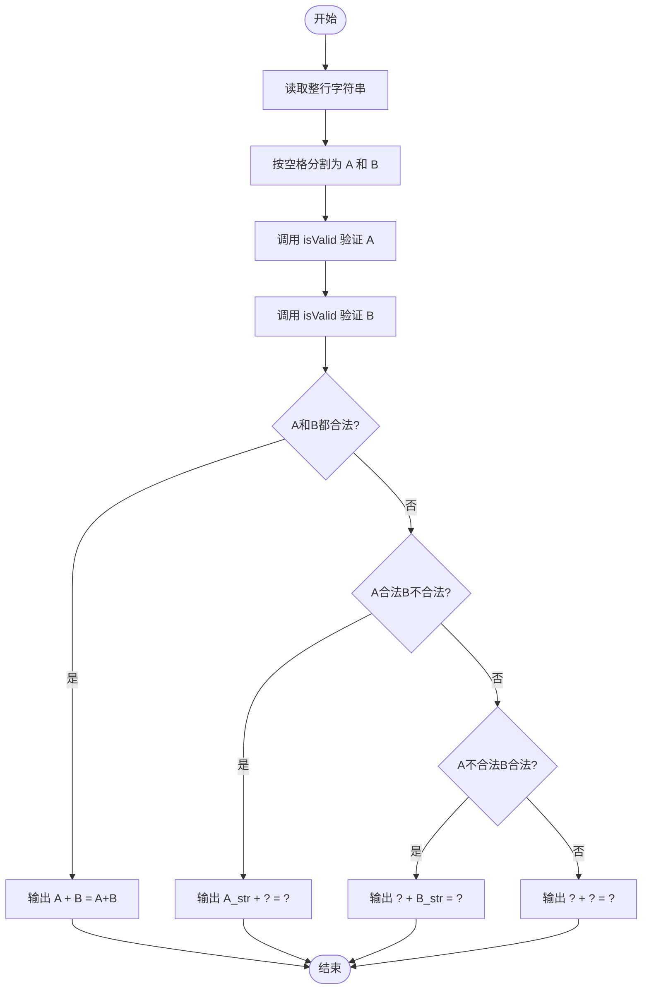
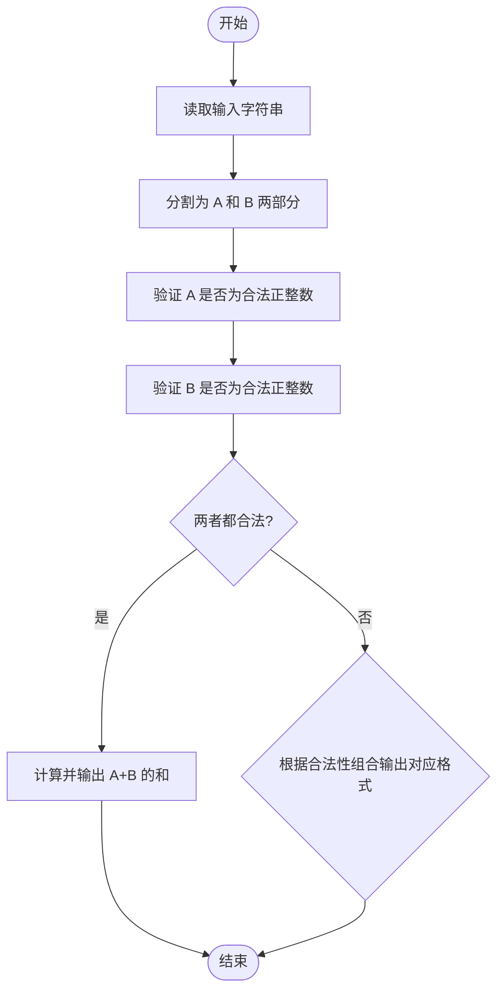

# L1-025 - 正整数A+B（15 分）

- **时间限制**: 400 ms
- **内存限制**: 65536 KB
- **代码长度限制**: 16 KB

---

## 题目描述

题的目标很简单，就是求两个正整数`A`和`B`的和，其中`A`和`B`都在区间[1,1000]。稍微有点麻烦的是，输入并不保证是两个正整数。

### 输入格式:

输入在一行给出`A`和`B`，其间以空格分开。问题是`A`和`B`不一定是满足要求的正整数，有时候可能是超出范围的数字、负数、带小数点的实数、甚至是一堆乱码。

注意：我们把输入中出现的第1个空格认为是`A`和`B`的分隔。题目保证至少存在一个空格，并且`B`不是一个空字符串。

### 输出格式:

如果输入的确是两个正整数，则按格式`A + B = 和`输出。如果某个输入不合要求，则在相应位置输出`?`，显然此时和也是`?`。

### 输入样例 1:

```in
123 456
```

### 输出样例 1:

```out
123 + 456 = 579
```

### 输入样例 2:

```in
22. 18
```

### 输出样例 2:

```out
? + 18 = ?
```

### 输入样例 3:

```in
-100 blabla bla...33
```

### 输出样例 3:

```out
? + ? = ?
```

## 示例

### 示例 1

**输入:**
```
123 456
```

**输出:**
```
123 + 456 = 579
```

### 示例 2

**输入:**
```
22. 18
```

**输出:**
```
? + 18 = ?
```

### 示例 3

**输入:**
```
-100 blabla bla...33
```

**输出:**
```
? + ? = ?
```

---

## 题目详解

### 一、解题思路

本题的 R 实现采用以下方法：按行或按字段解析输入，使用字符串或序列操作完成题目要求的变换，并按格式输出。

### 二、代码流程说明

1. 读取并解析标准输入，转换为题目所需的数据结构。
2. 按题意执行核心算法，维护中间状态并处理边界情况。
3. 整理计算结果，按照输出格式生成答案。

### 三、代码实现

```r
# 实现原理：按行或按字段解析输入，使用字符串或序列操作完成题目要求的变换，并按格式输出。
# 处理流程：读取输入 -> 建立状态 -> 执行算法 -> 按题目格式输出。
# 关键变量和循环均直接对应题目中的数据、约束或操作。

# 读取并解析标准输入。
s <- readLines("stdin", n = 1, warn = FALSE)
q <- strsplit(s, " ", fixed = TRUE)[[1]]
ok <- function(z) grepl("^[1-9][0-9]{0,2}$", z) && as.integer(z) >=
    1 && as.integer(z) <= 1000
a <- ok(q[1])
b <- ok(q[2])
# 严格按照题目规定的输出格式输出答案。
cat(if (a) q[1] else "?", " + ", if (b) q[2] else "?", " = ",
    if (a && b) as.integer(q[1]) + as.integer(q[2]) else "?",
    "\n", sep = "")
```

### 四、代码流程图



### 五、解题流程图



### 六、常见易错点

- 题目描述、输入格式、输出格式和输入输出样例必须保持原文不变。
- R 语言下标从 1 开始，注意编号转换和空输入边界。
- 输出时严格保留题目规定的空格、换行和小数位数。
