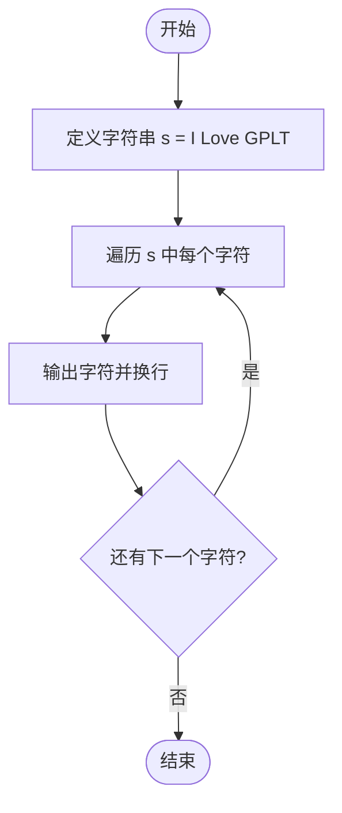
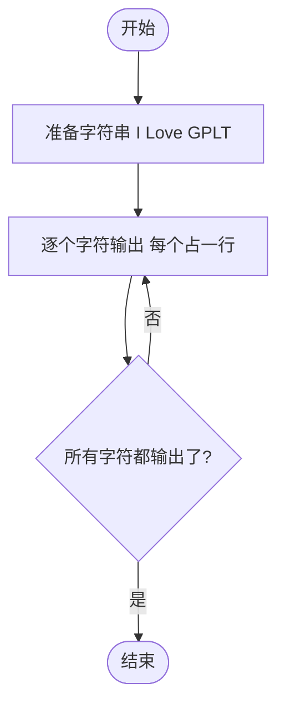

# L1-026 - I Love GPLT（5 分）

- **时间限制**: 400 ms
- **内存限制**: 65536 KB
- **代码长度限制**: 16 KB

---

## 题目描述

这道超级简单的题目没有任何输入。

你只需要把这句很重要的话 —— “I Love GPLT”——竖着输出就可以了。

所谓“竖着输出”，是指每个字符占一行（包括空格），即每行只能有1个字符和回车。

### 输入样例:

```in
无
```

### 输出样例:

```out
I
 
L
o
v
e
 
G
P
L
T
```

**注意：输出的两个空行中各有一个空格。**

## 示例

### 示例 1

**输入:**
```
无
```

**输出:**
```
I
 
L
o
v
e
 
G
P
L
T
```

---

## 题目详解

### 一、解题思路

本题的 R 实现采用以下方法：按行或按字段解析输入，使用字符串或序列操作完成题目要求的变换，并按格式输出。

### 二、代码流程说明

1. 读取并解析标准输入，转换为题目所需的数据结构。
2. 按题意执行核心算法，维护中间状态并处理边界情况。
3. 整理计算结果，按照输出格式生成答案。

### 三、代码实现

```r
# 实现原理：按行或按字段解析输入，使用字符串或序列操作完成题目要求的变换，并按格式输出。
# 处理流程：读取输入 -> 建立状态 -> 执行算法 -> 按题目格式输出。
# 关键变量和循环均直接对应题目中的数据、约束或操作。

# 本题无输入，直接输出题目规定的固定文本。
# 严格按照题目规定的输出格式输出答案。
cat(paste(strsplit("I Love GPLT", "", fixed = TRUE)[[1]], collapse = "\n"),
    "\n", sep = "")
```

### 四、代码流程图



### 五、解题流程图



### 六、常见易错点

- 题目描述、输入格式、输出格式和输入输出样例必须保持原文不变。
- R 语言下标从 1 开始，注意编号转换和空输入边界。
- 输出时严格保留题目规定的空格、换行和小数位数。
