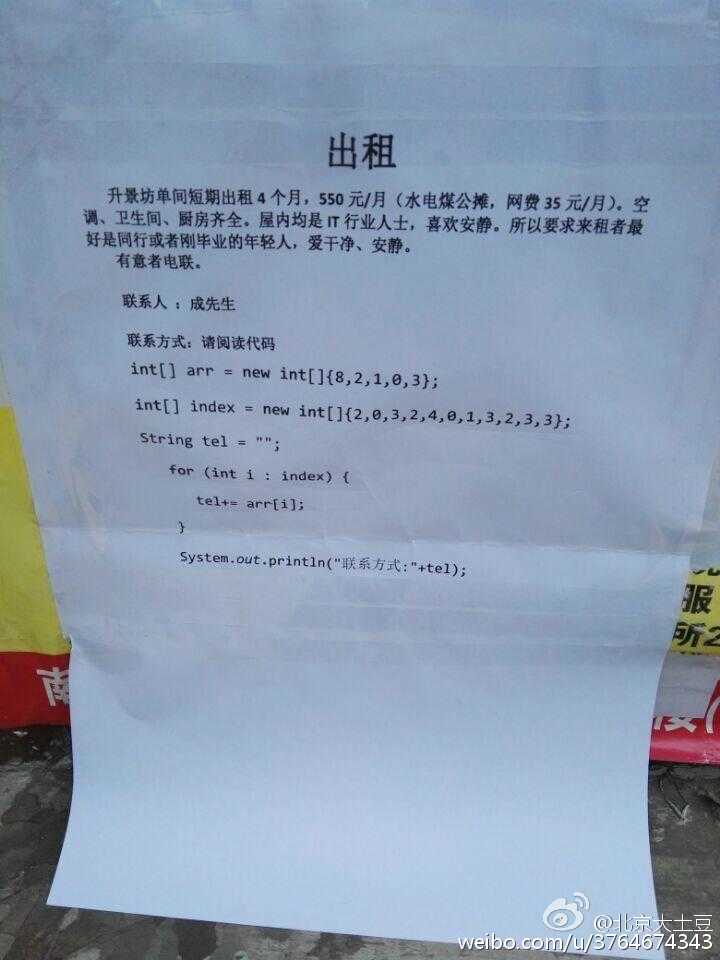
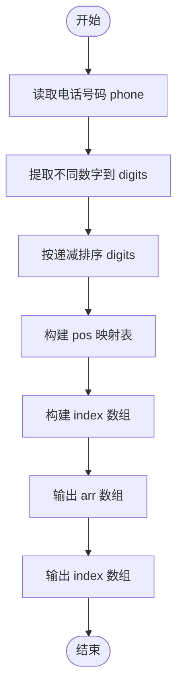
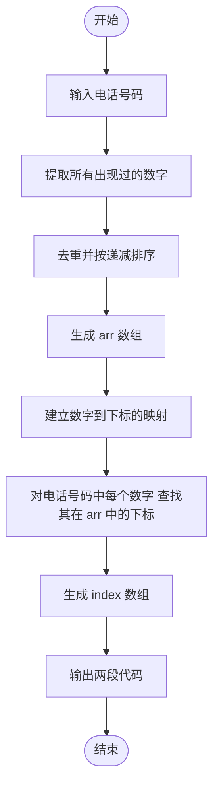

# L1-027 - 出租（20 分）

- **时间限制**: 400 ms
- **内存限制**: 65536 KB
- **代码长度限制**: 16 KB

---

## 题目描述

下面是新浪微博上曾经很火的一张图：



一时间网上一片求救声，急问这个怎么破。其实这段代码很简单，`index`数组就是`arr`数组的下标，`index[0]=2` 对应 `arr[2]=1`，`index[1]=0` 对应 `arr[0]=8`，`index[2]=3` 对应 `arr[3]=0`，以此类推…… 很容易得到电话号码是`18013820100`。

本题要求你编写一个程序，为任何一个电话号码生成这段代码 —— 事实上，只要生成最前面两行就可以了，后面内容是不变的。

### 输入格式:

输入在一行中给出一个由11位数字组成的手机号码。

### 输出格式:

为输入的号码生成代码的前两行，其中`arr`中的数字必须按递减顺序给出。

### 输入样例:

```in
18013820100
```

### 输出样例:

```out
int[] arr = new int[]{8,3,2,1,0};
int[] index = new int[]{3,0,4,3,1,0,2,4,3,4,4};
```

## 示例

### 示例 1

**输入:**
```
18013820100
```

**输出:**
```
int[] arr = new int[]{8,3,2,1,0};
int[] index = new int[]{3,0,4,3,1,0,2,4,3,4,4};
```

---

## 题目详解

### 一、解题思路

本题的 R 实现采用以下方法：先解析数据并按题目规定的关键字排序，再进行顺序处理和格式化输出。

### 二、代码流程说明

1. 读取并解析标准输入，转换为题目所需的数据结构。
2. 按题意执行核心算法，维护中间状态并处理边界情况。
3. 整理计算结果，按照输出格式生成答案。

### 三、代码实现

```r
# 实现原理：先解析数据并按题目规定的关键字排序，再进行顺序处理和格式化输出。
# 处理流程：读取输入 -> 建立状态 -> 执行算法 -> 按题目格式输出。
# 关键变量和循环均直接对应题目中的数据、约束或操作。

# 读取并解析标准输入。
s <- trimws(readLines("stdin", n = 1, warn = FALSE))
# 执行核心排序、状态转移或选择逻辑。
ds <- sort(unique(strsplit(s, "", fixed = TRUE)[[1]]), decreasing = TRUE)
p <- match(strsplit(s, "", fixed = TRUE)[[1]], ds) - 1
# 严格按照题目规定的输出格式输出答案。
cat("int[] arr = new int[]{", paste(ds, collapse = ","), "};\n",
    sep = "")
cat("int[] index = new int[]{", paste(p, collapse = ","), "};\n",
    sep = "")
```

### 四、代码流程图



### 五、解题流程图



### 六、常见易错点

- 题目描述、输入格式、输出格式和输入输出样例必须保持原文不变。
- R 语言下标从 1 开始，注意编号转换和空输入边界。
- 输出时严格保留题目规定的空格、换行和小数位数。
