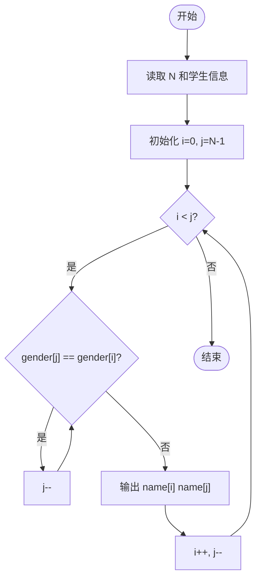
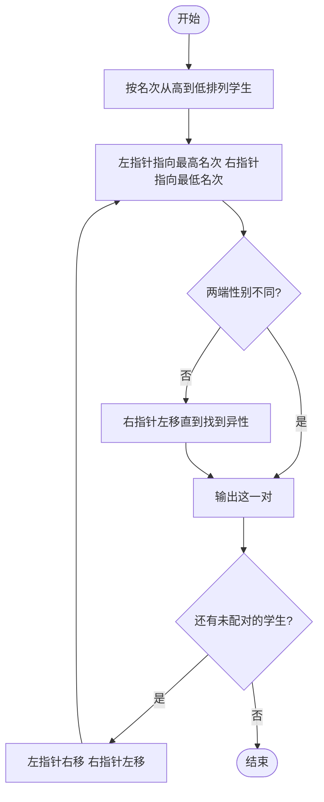

# L1-030 - 一帮一（15 分）

- **时间限制**: 400 ms
- **内存限制**: 65536 KB
- **代码长度限制**: 16 KB

---

## 题目描述

“一帮一学习小组”是中小学中常见的学习组织方式，老师把学习成绩靠前的学生跟学习成绩靠后的学生排在一组。本题就请你编写程序帮助老师自动完成这个分配工作，即在得到全班学生的排名后，在当前尚未分组的学生中，将名次最靠前的学生与名次最靠后的**异性**学生分为一组。

### 输入格式:

输入第一行给出正偶数`N`（$$\le$$50），即全班学生的人数。此后`N`行，按照名次从高到低的顺序给出每个学生的性别（0代表女生，1代表男生）和姓名（不超过8个英文字母的非空字符串），其间以1个空格分隔。这里保证本班男女比例是1:1，并且没有并列名次。

### 输出格式:

每行输出一组两个学生的姓名，其间以1个空格分隔。名次高的学生在前，名次低的学生在后。小组的输出顺序按照前面学生的名次从高到低排列。

### 输入样例:

```in
8
0 Amy
1 Tom
1 Bill
0 Cindy
0 Maya
1 John
1 Jack
0 Linda
```

### 输出样例:

```out
Amy Jack
Tom Linda
Bill Maya
Cindy John
```

## 示例

### 示例 1

**输入:**
```
8
0 Amy
1 Tom
1 Bill
0 Cindy
0 Maya
1 John
1 Jack
0 Linda
```

**输出:**
```
Amy Jack
Tom Linda
Bill Maya
Cindy John
```

---

## 题目详解

### 一、解题思路

本题的 R 实现采用以下方法：读取标准输入后建立题目所需的数据结构，按约束执行核心计算并输出结果。

### 二、代码流程说明

1. 读取并解析标准输入，转换为题目所需的数据结构。
2. 按题意执行核心算法，维护中间状态并处理边界情况。
3. 整理计算结果，按照输出格式生成答案。

### 三、代码实现

```r
# 实现原理：读取标准输入后建立题目所需的数据结构，按约束执行核心计算并输出结果。
# 处理流程：读取输入 -> 建立状态 -> 执行算法 -> 按题目格式输出。
# 关键变量和循环均直接对应题目中的数据、约束或操作。

# 读取并解析标准输入。
x <- scan(file = "stdin", quiet = TRUE, what = "")
n <- as.integer(x[1])
g <- x[seq(2, 2 * n, 2)]
nm <- x[seq(3, 2 * n + 1, 2)]
used <- rep(FALSE, n)
# 按题目约束遍历当前数据，更新中间状态。
for (i in seq_len(n)) {
    if (used[i])
        next
    j <- max(which(!used & g != g[i]))
# 严格按照题目规定的输出格式输出答案。
    cat(paste(nm[i], nm[j]), "\n", sep = "")
    used[c(i, j)] <- TRUE
}
```

### 四、代码流程图



### 五、解题流程图



### 六、常见易错点

- 题目描述、输入格式、输出格式和输入输出样例必须保持原文不变。
- R 语言下标从 1 开始，注意编号转换和空输入边界。
- 输出时严格保留题目规定的空格、换行和小数位数。
