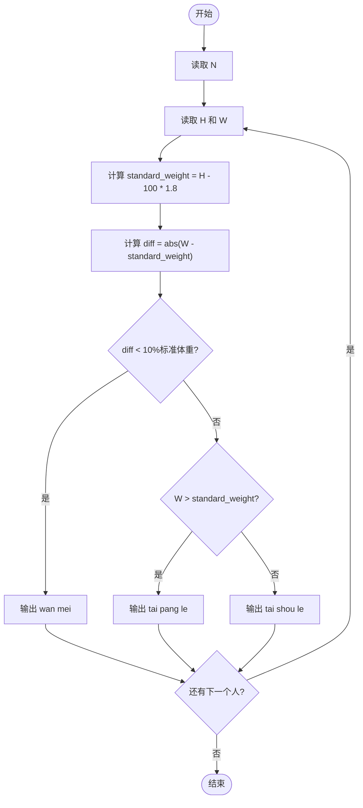
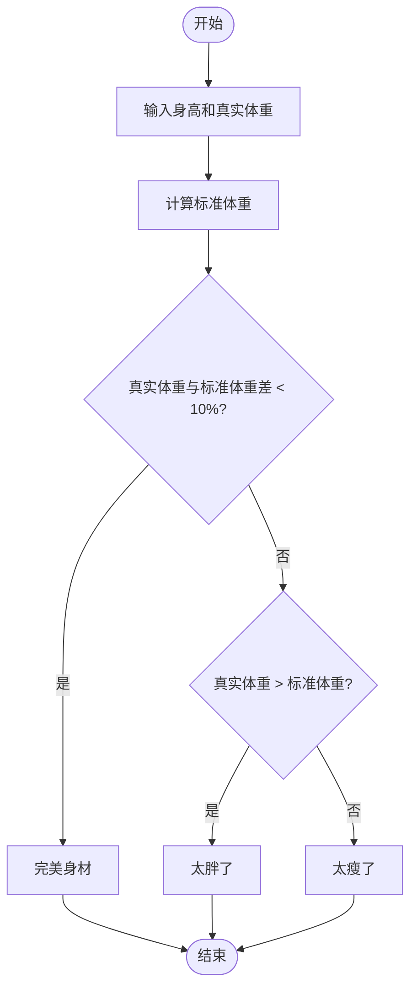

# L1-031 - 到底是不是太胖了（10 分）

- **时间限制**: 400 ms
- **内存限制**: 65536 KB
- **代码长度限制**: 16 KB

---

## 题目描述

据说一个人的标准体重应该是其身高（单位：厘米）减去100、再乘以0.9所得到的公斤数。真实体重与标准体重误差在10%以内都是完美身材（即 | 真实体重 $$-$$ 标准体重 | $$<$$ 标准体重$$\times 10\%$$）。已知 1 公斤等于 2 市斤。现给定一群人的身高和实际体重，请你告诉他们是否太胖或太瘦了。

### 输入格式:

输入第一行给出一个正整数`N`（$$\le$$ 20）。随后`N`行，每行给出两个整数，分别是一个人的身高`H`（120 $$<$$ `H` $$<$$ 200；单位：厘米）和真实体重`W`（50 $$<$$ `W` $$\le$$ 300；单位：市斤），其间以空格分隔。

### 输出格式:

为每个人输出一行结论：如果是完美身材，输出`You are wan mei!`；如果太胖了，输出`You are tai pang le!`；否则输出`You are tai shou le!`。

### 输入样例:

```in
3
169 136
150 81
178 155
```

### 输出样例:

```out
You are wan mei!
You are tai shou le!
You are tai pang le!
```

## 示例

### 示例 1

**输入:**
```
3
169 136
150 81
178 155
```

**输出:**
```
You are wan mei!
You are tai shou le!
You are tai pang le!
```

---

## 题目详解

### 一、解题思路

本题的 R 实现采用以下方法：读取标准输入后建立题目所需的数据结构，按约束执行核心计算并输出结果。

### 二、代码流程说明

1. 读取并解析标准输入，转换为题目所需的数据结构。
2. 按题意执行核心算法，维护中间状态并处理边界情况。
3. 整理计算结果，按照输出格式生成答案。

### 三、代码实现

```r
# 实现原理：读取标准输入后建立题目所需的数据结构，按约束执行核心计算并输出结果。
# 处理流程：读取输入 -> 建立状态 -> 执行算法 -> 按题目格式输出。
# 关键变量和循环均直接对应题目中的数据、约束或操作。

# 读取并解析标准输入。
x <- scan(file = "stdin", quiet = TRUE)
n <- x[1]
p <- 2
# 按题目约束遍历当前数据，更新中间状态。
for (i in seq_len(n)) {
    h <- x[p]
    w <- x[p + 1]
    p <- p + 2
    std <- (h - 100) * 1.8
# 严格按照题目规定的输出格式输出答案。
    cat(if (abs(w - std) < 0.1 * std)
        "You are wan mei!\n"
    else if (w > std)
        "You are tai pang le!\n"
    else "You are tai shou le!\n")
}
```

### 四、代码流程图



### 五、解题流程图



### 六、常见易错点

- 题目描述、输入格式、输出格式和输入输出样例必须保持原文不变。
- R 语言下标从 1 开始，注意编号转换和空输入边界。
- 输出时严格保留题目规定的空格、换行和小数位数。
