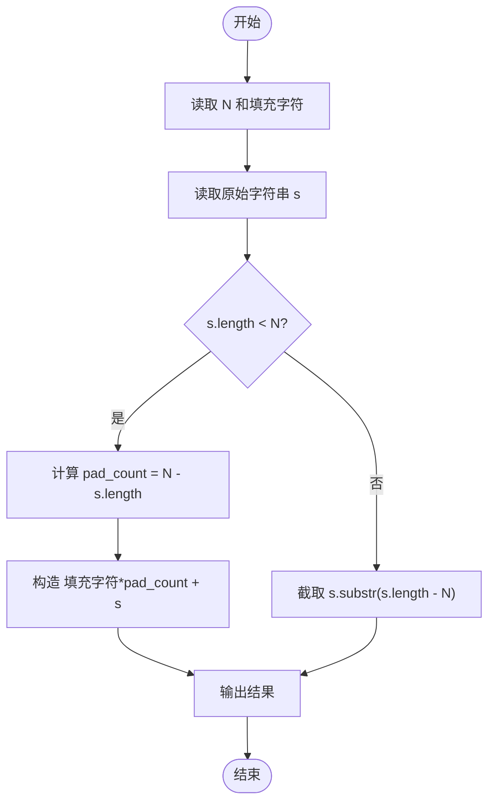
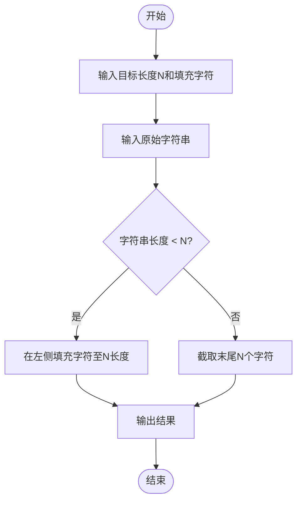

# L1-032 - Left-pad（20 分）

- **时间限制**: 400 ms
- **内存限制**: 65536 KB
- **代码长度限制**: 16 KB

---

## 题目描述

根据新浪微博上的消息，有一位开发者不满NPM（Node Package Manager）的做法，收回了自己的开源代码，其中包括一个叫left-pad的模块，就是这个模块把javascript里面的React/Babel干瘫痪了。这是个什么样的模块？就是在字符串前填充一些东西到一定的长度。例如用`*`去填充字符串`GPLT`，使之长度为10，调用left-pad的结果就应该是`******GPLT`。Node社区曾经对left-pad紧急发布了一个替代，被严重吐槽。下面就请你来实现一下这个模块。

### 输入格式:

输入在第一行给出一个正整数`N`（$$\le 10^4$$）和一个字符，分别是填充结果字符串的长度和用于填充的字符，中间以1个空格分开。第二行给出原始的非空字符串，以回车结束。

### 输出格式:

在一行中输出结果字符串。

### 输入样例 1:

```in
15 _
I love GPLT
```

### 输出样例 1:

```out
____I love GPLT
```

### 输入样例 2:

```in
4 *
this is a sample for cut
```

### 输出样例 2:

```out
 cut
```

## 示例

### 示例 1

**输入:**
```
15 _
I love GPLT
```

**输出:**
```
____I love GPLT
```

### 示例 2

**输入:**
```
4 *
this is a sample for cut
```

**输出:**
```
 cut
```

---

## 题目详解

### 一、解题思路

本题的 R 实现采用以下方法：按行或按字段解析输入，使用字符串或序列操作完成题目要求的变换，并按格式输出。

### 二、代码流程说明

1. 读取并解析标准输入，转换为题目所需的数据结构。
2. 按题意执行核心算法，维护中间状态并处理边界情况。
3. 整理计算结果，按照输出格式生成答案。

### 三、代码实现

```r
# 实现原理：按行或按字段解析输入，使用字符串或序列操作完成题目要求的变换，并按格式输出。
# 处理流程：读取输入 -> 建立状态 -> 执行算法 -> 按题目格式输出。
# 关键变量和循环均直接对应题目中的数据、约束或操作。

# 读取并解析标准输入。
x <- readLines("stdin", warn = FALSE)
q <- strsplit(x[1], " ", fixed = TRUE)[[1]]
target <- as.integer(q[1])
text <- x[2]
need <- target - nchar(text)
# 严格按照题目规定的输出格式输出答案。
if (need >= 0) {
    cat(strrep(q[2], need), text, "\n", sep = "")
} else {
    cat(substr(text, nchar(text) - target + 1, nchar(text)), "\n", sep = "")
}
```

### 四、代码流程图



### 五、解题流程图



### 六、常见易错点

- 题目描述、输入格式、输出格式和输入输出样例必须保持原文不变。
- R 语言下标从 1 开始，注意编号转换和空输入边界。
- 输出时严格保留题目规定的空格、换行和小数位数。
