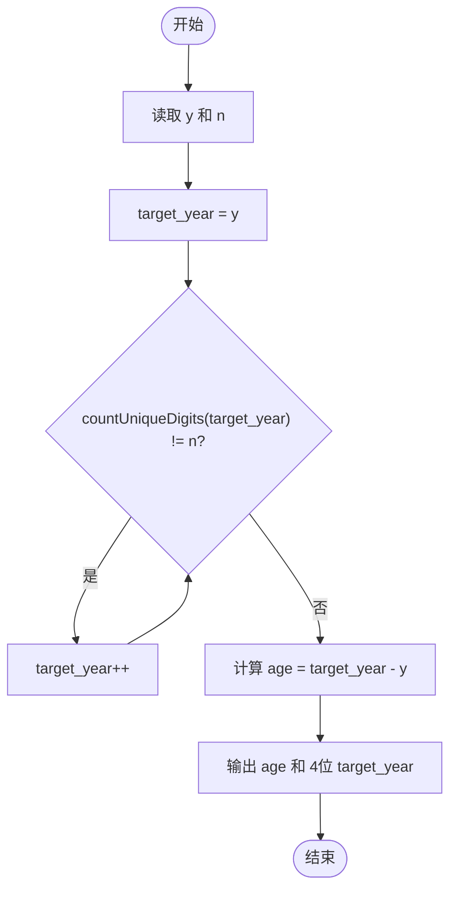
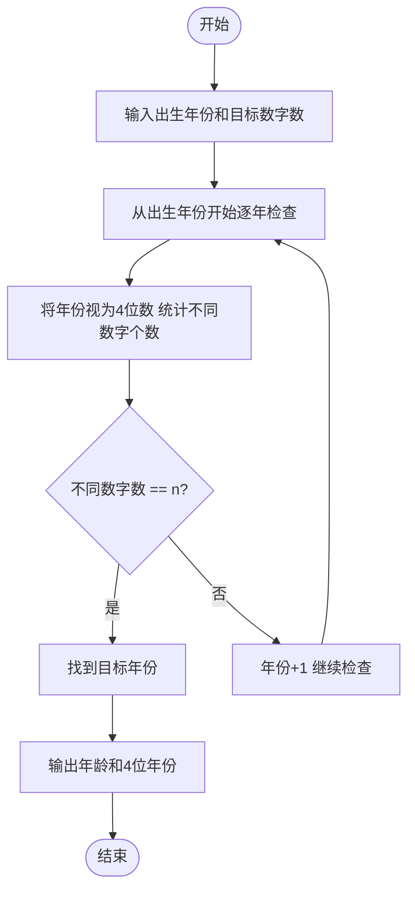

# L1-033 - 出生年（15 分）

- **时间限制**: 400 ms
- **内存限制**: 65536 KB
- **代码长度限制**: 16 KB

---

## 题目描述


以上是新浪微博中一奇葩贴：“我出生于1988年，直到25岁才遇到4个数字都不相同的年份。”也就是说，直到2013年才达到“4个数字都不相同”的要求。本题请你根据要求，自动填充“我出生于`y`年，直到`x`岁才遇到`n`个数字都不相同的年份”这句话。

### 输入格式:

输入在一行中给出出生年份`y`和目标年份中不同数字的个数`n`，其中`y`在[1, 3000]之间，`n`可以是2、或3、或4。注意不足4位的年份要在前面补零，例如公元1年被认为是0001年，有2个不同的数字0和1。

### 输出格式:

根据输入，输出`x`和能达到要求的年份。数字间以1个空格分隔，行首尾不得有多余空格。年份要按4位输出。注意：所谓“`n`个数字都不相同”是指不同的数字正好是`n`个。如“2013”被视为满足“4位数字都不同”的条件，但不被视为满足2位或3位数字不同的条件。

### 输入样例 1:

```in
1988 4
```

### 输出样例 1:

```out
25 2013
```

### 输入样例 2:

```in
1 2
```

### 输出样例 2:

```out
0 0001
```

## 示例

### 示例 1

**输入:**
```
1988 4
```

**输出:**
```
25 2013
```

### 示例 2

**输入:**
```
1 2
```

**输出:**
```
0 0001
```

---

## 题目详解

### 一、解题思路

本题的 R 实现采用以下方法：按行或按字段解析输入，使用字符串或序列操作完成题目要求的变换，并按格式输出。

### 二、代码流程说明

1. 读取并解析标准输入，转换为题目所需的数据结构。
2. 按题意执行核心算法，维护中间状态并处理边界情况。
3. 整理计算结果，按照输出格式生成答案。

### 三、代码实现

```r
# 实现原理：按行或按字段解析输入，使用字符串或序列操作完成题目要求的变换，并按格式输出。
# 处理流程：读取输入 -> 建立状态 -> 执行算法 -> 按题目格式输出。
# 关键变量和循环均直接对应题目中的数据、约束或操作。

# 读取并解析标准输入。
x <- scan(file = "stdin", quiet = TRUE)
start <- x[1]
y <- start
# 按题目约束遍历当前数据，更新中间状态。
repeat {
    z <- sprintf("%04d", y)
    if (length(unique(strsplit(z, "", fixed = TRUE)[[1]])) ==
        x[2])
        break
    y <- y + 1
}
# 严格按照题目规定的输出格式输出答案。
cat(paste(y - start, z), "\n", sep = "")
```

### 四、代码流程图



### 五、解题流程图



### 六、常见易错点

- 题目描述、输入格式、输出格式和输入输出样例必须保持原文不变。
- R 语言下标从 1 开始，注意编号转换和空输入边界。
- 输出时严格保留题目规定的空格、换行和小数位数。
