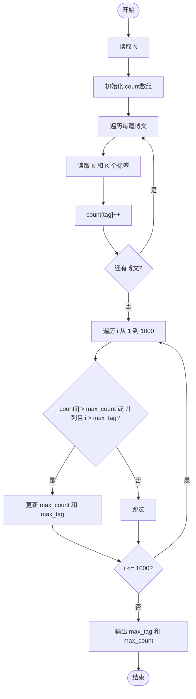
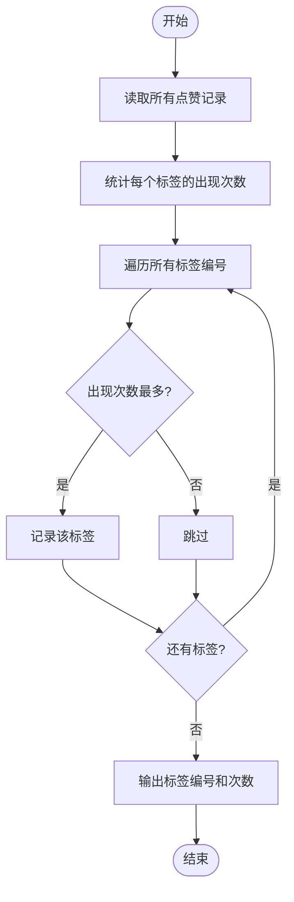

# L1-034 - 点赞（20 分）

- **时间限制**: 200 ms
- **内存限制**: 65536 KB
- **代码长度限制**: 16 KB

---

## 题目描述

微博上有个“点赞”功能，你可以为你喜欢的博文点个赞表示支持。每篇博文都有一些刻画其特性的标签，而你点赞的博文的类型，也间接刻画了你的特性。本题就要求你写个程序，通过统计一个人点赞的纪录，分析这个人的特性。

### 输入格式:

输入在第一行给出一个正整数$$N$$（$$\le 1000$$），是该用户点赞的博文数量。随后$$N$$行，每行给出一篇被其点赞的博文的特性描述，格式为“$$K$$ $$F_1\cdots F_K$$”，其中$$1\le K\le 10$$，$$F_i$$（$$i=1, \cdots , K$$）是特性标签的编号，我们将所有特性标签从1到1000编号。数字间以空格分隔。

### 输出格式:

统计所有被点赞的博文中最常出现的那个特性标签，在一行中输出它的编号和出现次数，数字间隔1个空格。如果有并列，则输出编号最大的那个。

### 输入样例:

```in
4
3 889 233 2
5 100 3 233 2 73
4 3 73 889 2
2 233 123
```

### 输出样例:

```out
233 3
```

## 示例

### 示例 1

**输入:**
```
4
3 889 233 2
5 100 3 233 2 73
4 3 73 889 2
2 233 123
```

**输出:**
```
233 3
```

---

## 题目详解

### 一、解题思路

本题的 R 实现采用以下方法：读取标准输入后建立题目所需的数据结构，按约束执行核心计算并输出结果。

### 二、代码流程说明

1. 读取并解析标准输入，转换为题目所需的数据结构。
2. 按题意执行核心算法，维护中间状态并处理边界情况。
3. 整理计算结果，按照输出格式生成答案。

### 三、代码实现

```r
# 实现原理：读取标准输入后建立题目所需的数据结构，按约束执行核心计算并输出结果。
# 处理流程：读取输入 -> 建立状态 -> 执行算法 -> 按题目格式输出。
# 关键变量和循环均直接对应题目中的数据、约束或操作。

# 读取并解析标准输入。
x <- scan(file = "stdin", quiet = TRUE)
n <- x[1]
p <- 2
c <- integer(1001)
# 按题目约束遍历当前数据，更新中间状态。
for (i in seq_len(n)) {
    k <- x[p]
    p <- p + 1
    for (j in seq_len(k)) {
        c[x[p]] <- c[x[p]] + 1
        p <- p + 1
    }
}
id <- max(which(c == max(c)))
# 严格按照题目规定的输出格式输出答案。
cat(paste(id, c[id]), "\n", sep = "")
```

### 四、代码流程图



### 五、解题流程图



### 六、常见易错点

- 题目描述、输入格式、输出格式和输入输出样例必须保持原文不变。
- R 语言下标从 1 开始，注意编号转换和空输入边界。
- 输出时严格保留题目规定的空格、换行和小数位数。
