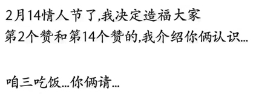
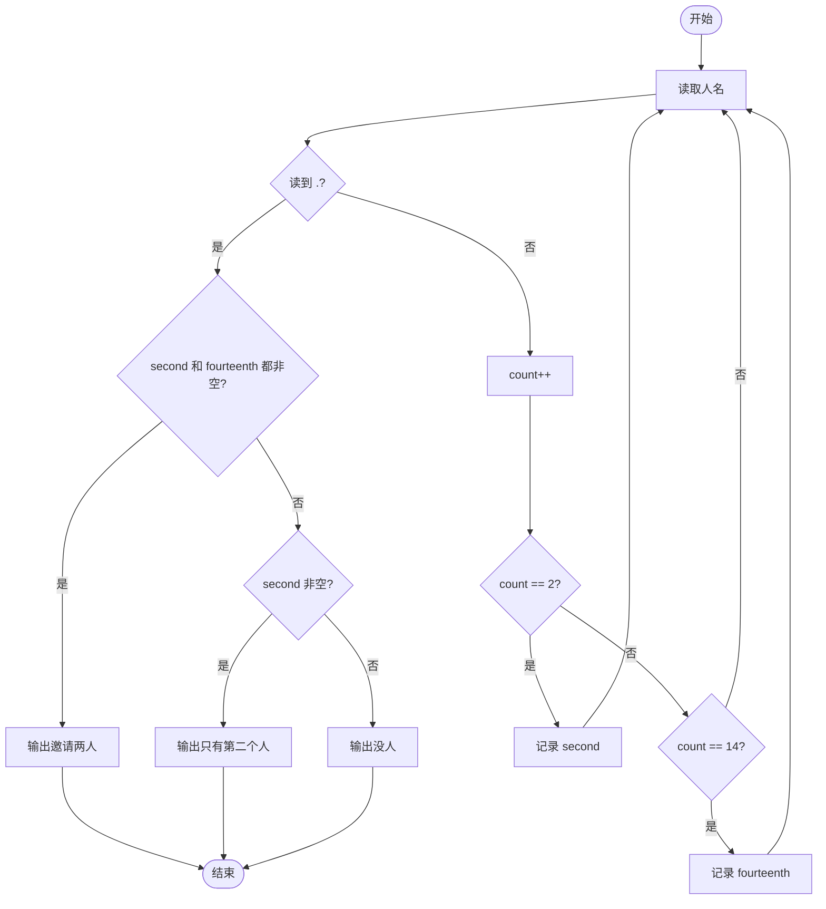
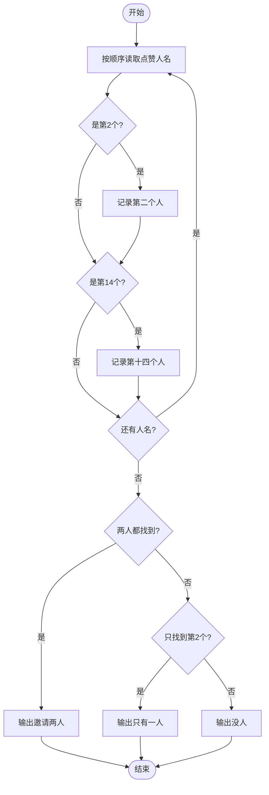

# L1-035 - 情人节（15 分）

- **时间限制**: 400 ms
- **内存限制**: 65536 KB
- **代码长度限制**: 16 KB

---

## 题目描述



以上是朋友圈中一奇葩贴：“2月14情人节了，我决定造福大家。第2个赞和第14个赞的，我介绍你俩认识…………咱三吃饭…你俩请…”。现给出此贴下点赞的朋友名单，请你找出那两位要请客的倒霉蛋。

### 输入格式:

输入按照点赞的先后顺序给出不知道多少个点赞的人名，每个人名占一行，为不超过10个英文字母的非空单词，以回车结束。一个英文句点`.`标志输入的结束，这个符号不算在点赞名单里。

### 输出格式:

根据点赞情况在一行中输出结论：若存在第2个人A和第14个人B，则输出“A and B are inviting you to dinner...”；若只有A没有B，则输出“A is the only one for you...”；若连A都没有，则输出“Momo... No one is for you ...”。

### 输入样例 1:

```in
GaoXZh
Magi
Einst
Quark
LaoLao
FatMouse
ZhaShen
fantacy
latesum
SenSen
QuanQuan
whatever
whenever
Potaty
hahaha
.
```

### 输出样例 1:

```out
Magi and Potaty are inviting you to dinner...
```

### 输入样例 2:

```in
LaoLao
FatMouse
whoever
.
```

### 输出样例 2:

```out
FatMouse is the only one for you...
```

### 输入样例 3:

```in
LaoLao
.
```

### 输出样例 3:

```out
Momo... No one is for you ...
```

## 示例

### 示例 1

**输入:**
```
GaoXZh
Magi
Einst
Quark
LaoLao
FatMouse
ZhaShen
fantacy
latesum
SenSen
QuanQuan
whatever
whenever
Potaty
hahaha
.
```

**输出:**
```
Magi and Potaty are inviting you to dinner...
```

### 示例 2

**输入:**
```
LaoLao
FatMouse
whoever
.
```

**输出:**
```
FatMouse is the only one for you...
```

### 示例 3

**输入:**
```
LaoLao
.
```

**输出:**
```
Momo... No one is for you ...
```

---

## 题目详解

### 一、解题思路

本题的 R 实现采用以下方法：按行或按字段解析输入，使用字符串或序列操作完成题目要求的变换，并按格式输出。

### 二、代码流程说明

1. 读取并解析标准输入，转换为题目所需的数据结构。
2. 按题意执行核心算法，维护中间状态并处理边界情况。
3. 整理计算结果，按照输出格式生成答案。

### 三、代码实现

```r
# 实现原理：按行或按字段解析输入，使用字符串或序列操作完成题目要求的变换，并按格式输出。
# 处理流程：读取输入 -> 建立状态 -> 执行算法 -> 按题目格式输出。
# 关键变量和循环均直接对应题目中的数据、约束或操作。

# 读取并解析标准输入。
x <- readLines("stdin", warn = FALSE)
x <- x[x != "."]
# 严格按照题目规定的输出格式输出答案。
if (length(x) >= 14) cat(x[2], "and", x[14], "are inviting you to dinner...\n",
    sep = " ") else if (length(x) >= 2) cat(x[2], "is the only one for you...\n",
    sep = " ") else cat("Momo... No one is for you ...\n")
```

### 四、代码流程图



### 五、解题流程图



### 六、常见易错点

- 题目描述、输入格式、输出格式和输入输出样例必须保持原文不变。
- R 语言下标从 1 开始，注意编号转换和空输入边界。
- 输出时严格保留题目规定的空格、换行和小数位数。
