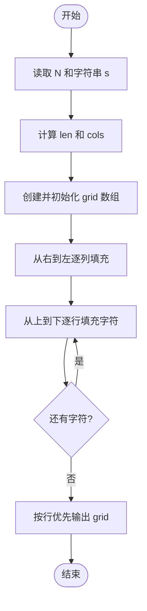
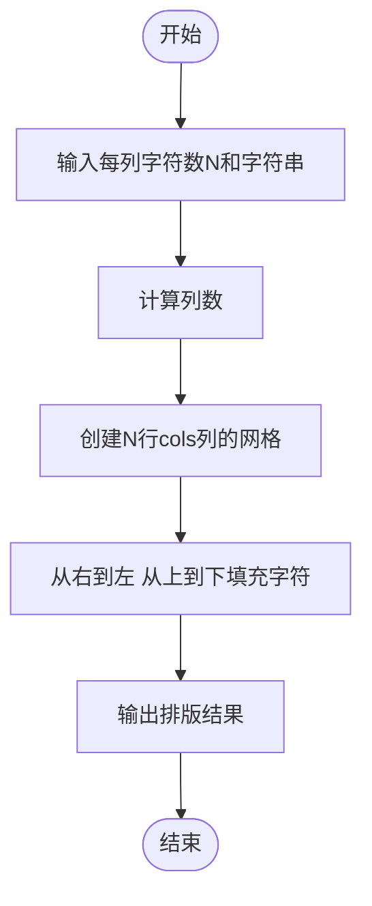

# L1-039 - 古风排版（20 分）

- **时间限制**: 400 ms
- **内存限制**: 65536 KB
- **代码长度限制**: 16 KB

---

## 题目描述

中国的古人写文字，是从右向左竖向排版的。本题就请你编写程序，把一段文字按古风排版。

### 输入格式:

输入在第一行给出一个正整数$$N$$（$$<100$$），是每一列的字符数。第二行给出一个长度不超过1000的非空字符串，以回车结束。

### 输出格式:

按古风格式排版给定的字符串，每列$$N$$个字符（除了最后一列可能不足$$N$$个）。

### 输入样例:

```in
4
This is a test case
```

### 输出样例:

```out
asa T
st ih
e tsi
 ce s
```

## 示例

### 示例 1

**输入:**
```
4
This is a test case
```

**输出:**
```
asa T
st ih
e tsi
 ce s
```

---

## 题目详解

### 一、解题思路

本题的 R 实现采用以下方法：将输入组织为矩阵或表格，按题目定义的行、列和状态关系完成计算。

### 二、代码流程说明

1. 读取并解析标准输入，转换为题目所需的数据结构。
2. 按题意执行核心算法，维护中间状态并处理边界情况。
3. 整理计算结果，按照输出格式生成答案。

### 三、代码实现

```r
# 实现原理：将输入组织为矩阵或表格，按题目定义的行、列和状态关系完成计算。
# 处理流程：读取输入 -> 建立状态 -> 执行算法 -> 按题目格式输出。
# 关键变量和循环均直接对应题目中的数据、约束或操作。

# 读取并解析标准输入。
x <- readLines("stdin", warn = FALSE)
n <- as.integer(trimws(x[1]))
z <- strsplit(x[2], "", fixed = TRUE)[[1]]
parts <- split(z, ceiling(seq_along(z)/n))
parts <- lapply(parts, function(v) {
    length(v) <- n
    v[is.na(v)] <- " "
    v
})
# 按题目约束遍历当前数据，更新中间状态。
for (i in seq_len(n)) cat(paste(vapply(rev(parts), `[`, "", i),
    collapse = ""), "\n", sep = "")
# 严格按照题目规定的输出格式输出答案。
```

### 四、代码流程图



### 五、解题流程图



### 六、常见易错点

- 题目描述、输入格式、输出格式和输入输出样例必须保持原文不变。
- R 语言下标从 1 开始，注意编号转换和空输入边界。
- 输出时严格保留题目规定的空格、换行和小数位数。
