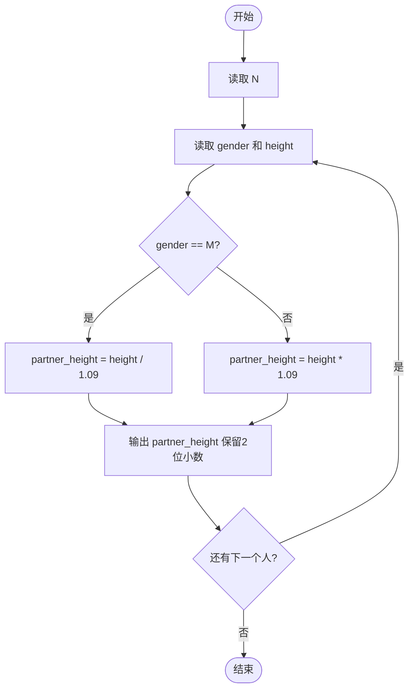
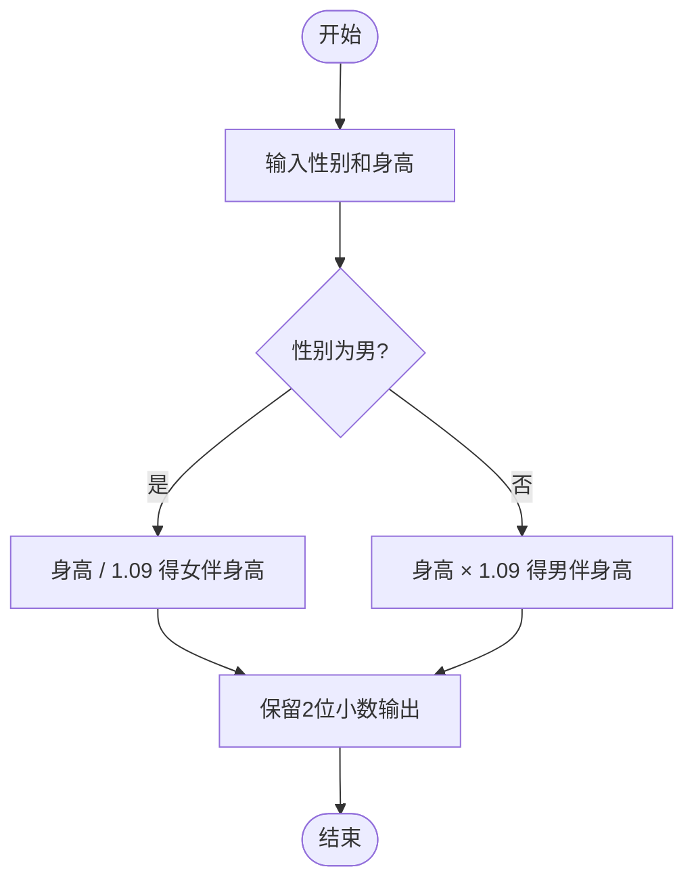

# L1-040 - 最佳情侣身高差（10 分）

- **时间限制**: 400 ms
- **内存限制**: 65536 KB
- **代码长度限制**: 16 KB

---

## 题目描述

专家通过多组情侣研究数据发现，最佳的情侣身高差遵循着一个公式：（女方的身高）$$\times$$1.09 =（男方的身高）。如果符合，你俩的身高差不管是牵手、拥抱、接吻，都是最和谐的差度。

下面就请你写个程序，为任意一位用户计算他/她的情侣的最佳身高。

### 输入格式:

输入第一行给出正整数$$N$$（$$\le 10$$），为前来查询的用户数。随后$$N$$行，每行按照“性别 身高”的格式给出前来查询的用户的性别和身高，其中“性别”为“F”表示女性、“M”表示男性；“身高”为区间 [1.0, 3.0] 之间的实数。

### 输出格式:

对每一个查询，在一行中为该用户计算出其情侣的最佳身高，保留小数点后2位。

### 输入样例:

```in
2
M 1.75
F 1.8
```

### 输出样例:

```out
1.61
1.96
```

## 示例

### 示例 1

**输入:**
```
2
M 1.75
F 1.8
```

**输出:**
```
1.61
1.96
```

---

## 题目详解

### 一、解题思路

本题的 R 实现采用以下方法：读取标准输入后建立题目所需的数据结构，按约束执行核心计算并输出结果。

### 二、代码流程说明

1. 读取并解析标准输入，转换为题目所需的数据结构。
2. 按题意执行核心算法，维护中间状态并处理边界情况。
3. 整理计算结果，按照输出格式生成答案。

### 三、代码实现

```r
# 实现原理：读取标准输入后建立题目所需的数据结构，按约束执行核心计算并输出结果。
# 处理流程：读取输入 -> 建立状态 -> 执行算法 -> 按题目格式输出。
# 关键变量和循环均直接对应题目中的数据、约束或操作。

# 读取并解析标准输入。
x <- scan(file = "stdin", quiet = TRUE, what = "")
n <- as.integer(x[1])
p <- 2
# 按题目约束遍历当前数据，更新中间状态。
for (i in seq_len(n)) {
    g <- x[p]
    h <- as.numeric(x[p + 1])
    p <- p + 2
# 严格按照题目规定的输出格式输出答案。
    cat(sprintf("%.2f\n", if (g == "F")
        h * 1.09
    else h/1.09))
}
```

### 四、代码流程图



### 五、解题流程图



### 六、常见易错点

- 题目描述、输入格式、输出格式和输入输出样例必须保持原文不变。
- R 语言下标从 1 开始，注意编号转换和空输入边界。
- 输出时严格保留题目规定的空格、换行和小数位数。
