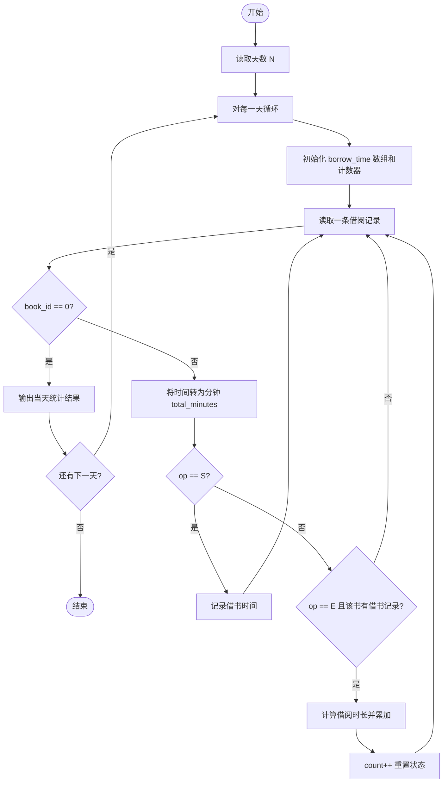
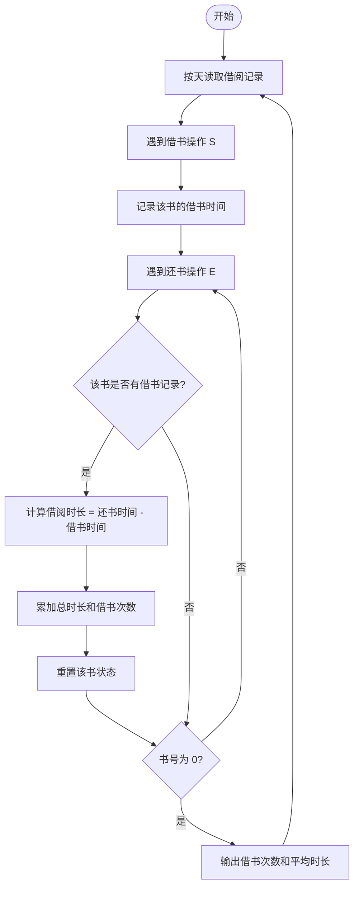

# L1-043 - 阅览室（20 分）

- **时间限制**: 400 ms
- **内存限制**: 65536 KB
- **代码长度限制**: 16 KB

---

## 题目描述

天梯图书阅览室请你编写一个简单的图书借阅统计程序。当读者借书时，管理员输入书号并按下`S`键，程序开始计时；当读者还书时，管理员输入书号并按下`E`键，程序结束计时。书号为不超过1000的正整数。当管理员将0作为书号输入时，表示一天工作结束，你的程序应输出当天的读者借书次数和平均阅读时间。

注意：由于线路偶尔会有故障，可能出现不完整的纪录，即只有`S`没有`E`，或者只有`E`没有`S`的纪录，系统应能自动忽略这种无效纪录。另外，题目保证书号是书的唯一标识，同一本书在任何时间区间内只可能被一位读者借阅。

### 输入格式:

输入在第一行给出一个正整数$$N$$（$$\le 10$$），随后给出$$N$$天的纪录。每天的纪录由若干次借阅操作组成，每次操作占一行，格式为：

`书号`（[1, 1000]内的整数） `键值`（`S`或`E`） `发生时间`（`hh:mm`，其中`hh`是[0,23]内的整数，`mm`是[0, 59]内整数）

每一天的纪录保证按时间递增的顺序给出。

### 输出格式:

对每天的纪录，在一行中输出当天的读者借书次数和平均阅读时间（以分钟为单位的精确到个位的整数时间）。

### 输入样例:

```in
3
1 S 08:10
2 S 08:35
1 E 10:00
2 E 13:16
0 S 17:00
0 S 17:00
3 E 08:10
1 S 08:20
2 S 09:00
1 E 09:20
0 E 17:00
```

### 输出样例:

```out
2 196
0 0
1 60
```

## 示例

### 示例 1

**输入:**
```
3
1 S 08:10
2 S 08:35
1 E 10:00
2 E 13:16
0 S 17:00
0 S 17:00
3 E 08:10
1 S 08:20
2 S 09:00
1 E 09:20
0 E 17:00
```

**输出:**
```
2 196
0 0
1 60
```

---

## 题目详解

### 一、解题思路

本题的 R 实现采用以下方法：按行或按字段解析输入，使用字符串或序列操作完成题目要求的变换，并按格式输出。

### 二、代码流程说明

1. 读取并解析标准输入，转换为题目所需的数据结构。
2. 按题意执行核心算法，维护中间状态并处理边界情况。
3. 整理计算结果，按照输出格式生成答案。

### 三、代码实现

```r
# 实现原理：按行或按字段解析输入，使用字符串或序列操作完成题目要求的变换，并按格式输出。
# 处理流程：读取输入 -> 建立状态 -> 执行算法 -> 按题目格式输出。
# 关键变量和循环均直接对应题目中的数据、约束或操作。

# 读取并解析标准输入。
x <- readLines("stdin", warn = FALSE)
d <- as.integer(x[1])
p <- 2
# 按题目约束遍历当前数据，更新中间状态。
for (k in seq_len(d)) {
    open <- list()
    cnt <- 0
    tot <- 0
    repeat {
        q <- strsplit(trimws(x[p]), " ", fixed = TRUE)[[1]]
        if (q[1] == "0") {
            p <- p + 1
            break
        }
        t <- as.integer(strsplit(q[3], ":", fixed = TRUE)[[1]])
        v <- 60 * t[1] + t[2]
        if (q[2] == "S")
            open[[q[1]]] <- v
        else if (!is.null(open[[q[1]]])) {
            cnt <- cnt + 1
            tot <- tot + v - open[[q[1]]]
            open[[q[1]]] <- NULL
        }
        p <- p + 1
    }
# 严格按照题目规定的输出格式输出答案。
    cat(paste(cnt, if (cnt)
        round(tot/cnt)
    else 0), "\n", sep = "")
}
```

### 四、代码流程图



### 五、解题流程图



### 六、常见易错点

- 题目描述、输入格式、输出格式和输入输出样例必须保持原文不变。
- R 语言下标从 1 开始，注意编号转换和空输入边界。
- 输出时严格保留题目规定的空格、换行和小数位数。
