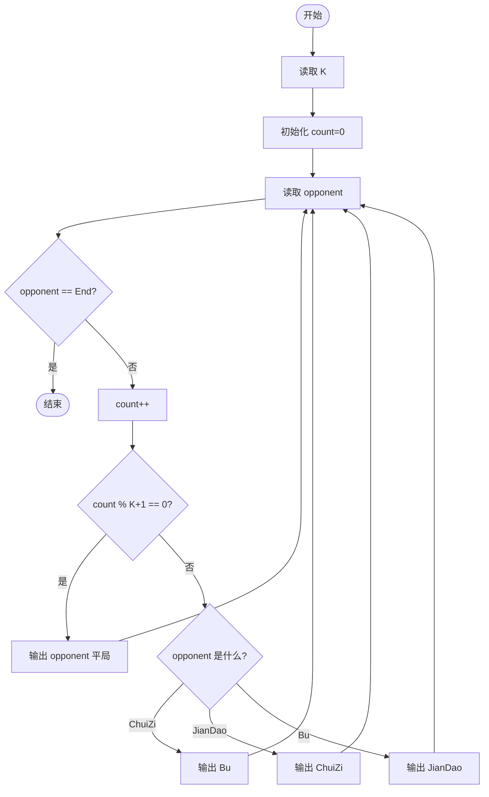
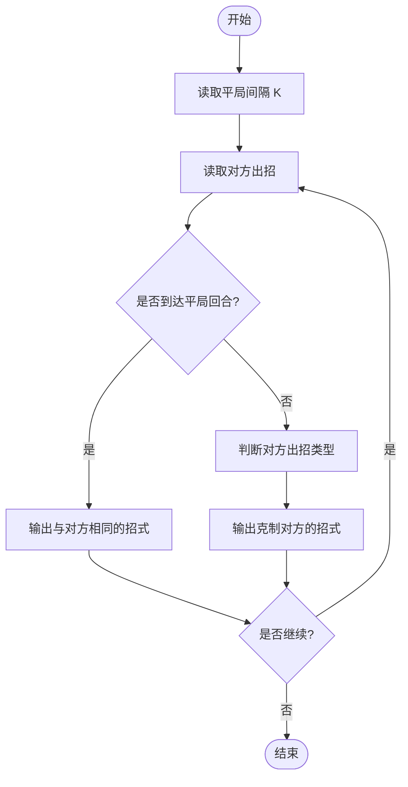

# L1-044 - 稳赢（15 分）

- **时间限制**: 400 ms
- **内存限制**: 65536 KB
- **代码长度限制**: 16 KB

---

## 题目描述

大家应该都会玩“锤子剪刀布”的游戏：两人同时给出手势，胜负规则如图所示：


现要求你编写一个稳赢不输的程序，根据对方的出招，给出对应的赢招。但是！为了不让对方输得太惨，你需要每隔$$K$$次就让一个平局。

### 输入格式:

输入首先在第一行给出正整数$$K$$（$$\le 10$$），即平局间隔的次数。随后每行给出对方的一次出招：`ChuiZi`代表“锤子”、`JianDao`代表“剪刀”、`Bu`代表“布”。`End`代表输入结束，这一行不要作为出招处理。

### 输出格式:

对每一个输入的出招，按要求输出稳赢或平局的招式。每招占一行。

### 输入样例:

```in
2
ChuiZi
JianDao
Bu
JianDao
Bu
ChuiZi
ChuiZi
End
```

### 输出样例:

```out
Bu
ChuiZi
Bu
ChuiZi
JianDao
ChuiZi
Bu
```

## 示例

### 示例 1

**输入:**
```
2
ChuiZi
JianDao
Bu
JianDao
Bu
ChuiZi
ChuiZi
End
```

**输出:**
```
Bu
ChuiZi
Bu
ChuiZi
JianDao
ChuiZi
Bu
```

---

## 题目详解

### 一、解题思路

本题的 R 实现采用以下方法：按行或按字段解析输入，使用字符串或序列操作完成题目要求的变换，并按格式输出。

### 二、代码流程说明

1. 读取并解析标准输入，转换为题目所需的数据结构。
2. 按题意执行核心算法，维护中间状态并处理边界情况。
3. 整理计算结果，按照输出格式生成答案。

### 三、代码实现

```r
# 实现原理：按行或按字段解析输入，使用字符串或序列操作完成题目要求的变换，并按格式输出。
# 处理流程：读取输入 -> 建立状态 -> 执行算法 -> 按题目格式输出。
# 关键变量和循环均直接对应题目中的数据、约束或操作。

# 读取并解析标准输入。
x <- readLines("stdin", warn = FALSE)
k <- as.integer(x[1])
a <- x[-1]
a <- a[a != "End"]
win <- c(ChuiZi = "Bu", JianDao = "ChuiZi", Bu = "JianDao")
# 按题目约束遍历当前数据，更新中间状态。
for (i in seq_along(a)) cat(if (i%%(k + 1) == 0) a[i] else win[a[i]],
    "\n", sep = "")
# 严格按照题目规定的输出格式输出答案。
```

### 四、代码流程图



### 五、解题流程图



### 六、常见易错点

- 题目描述、输入格式、输出格式和输入输出样例必须保持原文不变。
- R 语言下标从 1 开始，注意编号转换和空输入边界。
- 输出时严格保留题目规定的空格、换行和小数位数。
