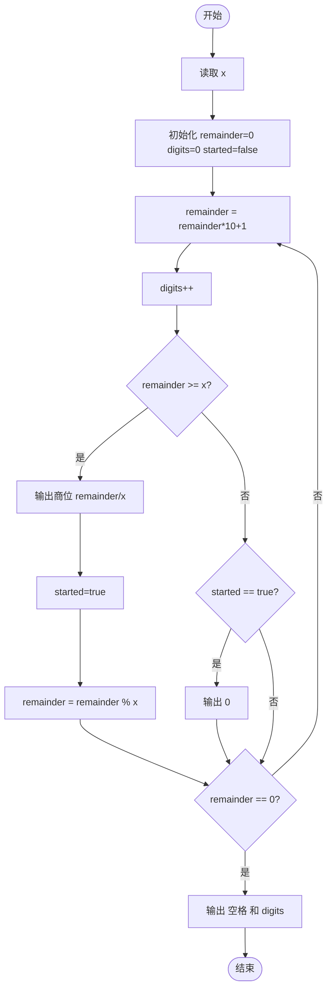
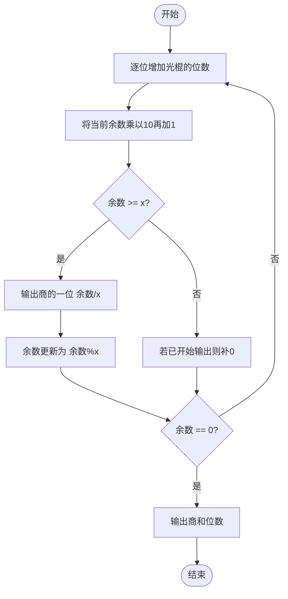

# L1-046 - 整除光棍（20 分）

- **时间限制**: 400 ms
- **内存限制**: 65536 KB
- **代码长度限制**: 16 KB

---

## 题目描述

这里所谓的“光棍”，并不是指单身汪啦~ 说的是全部由1组成的数字，比如1、11、111、1111等。传说任何一个光棍都能被一个不以5结尾的奇数整除。比如，111111就可以被13整除。 现在，你的程序要读入一个整数`x`，这个整数一定是奇数并且不以5结尾。然后，经过计算，输出两个数字：第一个数字`s`，表示`x`乘以`s`是一个光棍，第二个数字`n`是这个光棍的位数。这样的解当然不是唯一的,题目要求你输出最小的解。

提示：一个显然的办法是逐渐增加光棍的位数，直到可以整除`x`为止。但难点在于，`s`可能是个非常大的数 —— 比如，程序输入31，那么就输出3584229390681和15，因为31乘以3584229390681的结果是111111111111111，一共15个1。

### 输入格式:

输入在一行中给出一个不以5结尾的正奇数`x`（$$< 1000$$）。

### 输出格式:

在一行中输出相应的最小的`s`和`n`，其间以1个空格分隔。

### 输入样例:

```in
31
```

### 输出样例:

```out
3584229390681 15
```

## 示例

### 示例 1

**输入:**
```
31
```

**输出:**
```
3584229390681 15
```

---

## 题目详解

### 一、解题思路

本题的 R 实现采用以下方法：读取标准输入后建立题目所需的数据结构，按约束执行核心计算并输出结果。

### 二、代码流程说明

1. 读取并解析标准输入，转换为题目所需的数据结构。
2. 按题意执行核心算法，维护中间状态并处理边界情况。
3. 整理计算结果，按照输出格式生成答案。

### 三、代码实现

```r
# 实现原理：读取标准输入后建立题目所需的数据结构，按约束执行核心计算并输出结果。
# 处理流程：读取输入 -> 建立状态 -> 执行算法 -> 按题目格式输出。
# 关键变量和循环均直接对应题目中的数据、约束或操作。

# 读取并解析标准输入。
d <- as.integer(scan(file = "stdin", quiet = TRUE))
r <- 0
q <- ""
k <- 0
# 按题目约束遍历当前数据，更新中间状态。
repeat {
    r <- r * 10 + 1
    digit <- r%/%d
    r <- r%%d
    k <- k + 1
    if (digit > 0 || nchar(q) > 0)
        q <- paste0(q, digit)
    if (r == 0)
        break
}
# 严格按照题目规定的输出格式输出答案。
cat(paste(q, k), "\n", sep = "")
```

### 四、代码流程图



### 五、解题流程图



### 六、常见易错点

- 题目描述、输入格式、输出格式和输入输出样例必须保持原文不变。
- R 语言下标从 1 开始，注意编号转换和空输入边界。
- 输出时严格保留题目规定的空格、换行和小数位数。
