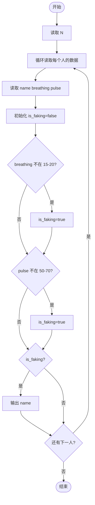
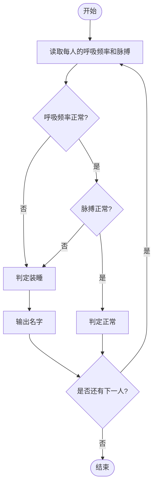

# L1-047 - 装睡（10 分）

- **时间限制**: 400 ms
- **内存限制**: 65536 KB
- **代码长度限制**: 16 KB

---

## 题目描述

你永远叫不醒一个装睡的人 —— 但是通过分析一个人的呼吸频率和脉搏，你可以发现谁在装睡！医生告诉我们，正常人睡眠时的呼吸频率是每分钟15-20次，脉搏是每分钟50-70次。下面给定一系列人的呼吸频率与脉搏，请你找出他们中间有可能在装睡的人，即至少一项指标不在正常范围内的人。

### 输入格式:

输入在第一行给出一个正整数$$N$$（$$\le 10$$）。随后$$N$$行，每行给出一个人的名字（仅由英文字母组成的、长度不超过3个字符的串）、其呼吸频率和脉搏（均为不超过100的正整数）。

### 输出格式:

按照输入顺序检查每个人，如果其至少一项指标不在正常范围内，则输出其名字，每个名字占一行。

### 输入样例:

```in
4
Amy 15 70
Tom 14 60
Joe 18 50
Zoe 21 71
```

### 输出样例:

```out
Tom
Zoe
```

## 示例

### 示例 1

**输入:**
```
4
Amy 15 70
Tom 14 60
Joe 18 50
Zoe 21 71
```

**输出:**
```
Tom
Zoe
```

---

## 题目详解

### 一、解题思路

本题的 R 实现采用以下方法：读取标准输入后建立题目所需的数据结构，按约束执行核心计算并输出结果。

### 二、代码流程说明

1. 读取并解析标准输入，转换为题目所需的数据结构。
2. 按题意执行核心算法，维护中间状态并处理边界情况。
3. 整理计算结果，按照输出格式生成答案。

### 三、代码实现

```r
# 实现原理：读取标准输入后建立题目所需的数据结构，按约束执行核心计算并输出结果。
# 处理流程：读取输入 -> 建立状态 -> 执行算法 -> 按题目格式输出。
# 关键变量和循环均直接对应题目中的数据、约束或操作。

# 读取并解析标准输入。
x <- scan(file = "stdin", quiet = TRUE, what = "")
n <- as.integer(x[1])
p <- 2
# 按题目约束遍历当前数据，更新中间状态。
for (i in seq_len(n)) {
    name <- x[p]
    breath <- as.integer(x[p + 1])
    pulse <- as.integer(x[p + 2])
    p <- p + 3
    if (breath < 15 || breath > 20 || pulse < 50 || pulse > 70)
# 严格按照题目规定的输出格式输出答案。
        cat(name, "\n", sep = "")
}
```

### 四、代码流程图



### 五、解题流程图



### 六、常见易错点

- 题目描述、输入格式、输出格式和输入输出样例必须保持原文不变。
- R 语言下标从 1 开始，注意编号转换和空输入边界。
- 输出时严格保留题目规定的空格、换行和小数位数。
