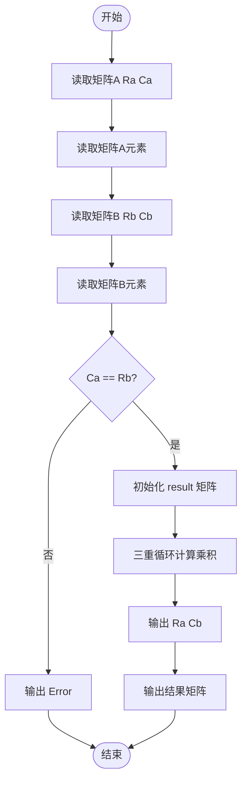
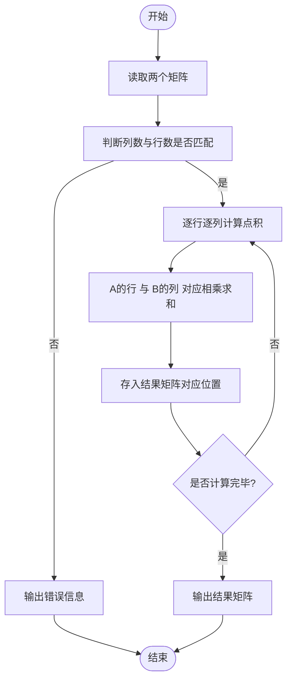

# L1-048 - 矩阵A乘以B（15 分）

- **时间限制**: 400 ms
- **内存限制**: 65536 KB
- **代码长度限制**: 16 KB

---

## 题目描述

给定两个矩阵$$A$$和$$B$$，要求你计算它们的乘积矩阵$$AB$$。需要注意的是，只有规模匹配的矩阵才可以相乘。即若$$A$$有$$R_a$$行、$$C_a$$列，$$B$$有$$R_b$$行、$$C_b$$列，则只有$$C_a$$与$$R_b$$相等时，两个矩阵才能相乘。

### 输入格式:

输入先后给出两个矩阵$$A$$和$$B$$。对于每个矩阵，首先在一行中给出其行数$$R$$和列数$$C$$，随后$$R$$行，每行给出$$C$$个整数，以1个空格分隔，且行首尾没有多余的空格。输入保证两个矩阵的$$R$$和$$C$$都是正数，并且所有整数的绝对值不超过100。

### 输出格式:

若输入的两个矩阵的规模是匹配的，则按照输入的格式输出乘积矩阵$$AB$$，否则输出`Error: Ca != Rb`，其中`Ca`是$$A$$的列数，`Rb`是$$B$$的行数。

### 输入样例 1:

```in
2 3
1 2 3
4 5 6
3 4
7 8 9 0
-1 -2 -3 -4
5 6 7 8
```

### 输出样例 1:

```out
2 4
20 22 24 16
53 58 63 28
```

### 输入样例 2:

```in
3 2
38 26
43 -5
0 17
3 2
-11 57
99 68
81 72
```

### 输出样例 2:

```out
Error: 2 != 3
```

## 示例

### 示例 1

**输入:**
```
2 3
1 2 3
4 5 6
3 4
7 8 9 0
-1 -2 -3 -4
5 6 7 8
```

**输出:**
```
2 4
20 22 24 16
53 58 63 28
```

### 示例 2

**输入:**
```
3 2
38 26
43 -5
0 17
3 2
-11 57
99 68
81 72
```

**输出:**
```
Error: 2 != 3
```

---

## 题目详解

### 一、解题思路

本题的 R 实现采用以下方法：将输入组织为矩阵或表格，按题目定义的行、列和状态关系完成计算。

### 二、代码流程说明

1. 读取并解析标准输入，转换为题目所需的数据结构。
2. 按题意执行核心算法，维护中间状态并处理边界情况。
3. 整理计算结果，按照输出格式生成答案。

### 三、代码实现

```r
# 实现原理：将输入组织为矩阵或表格，按题目定义的行、列和状态关系完成计算。
# 处理流程：读取输入 -> 建立状态 -> 执行算法 -> 按题目格式输出。
# 关键变量和循环均直接对应题目中的数据、约束或操作。

# 读取并解析标准输入。
x <- scan(file = "stdin", quiet = TRUE)
p <- 1
ra <- x[p]
ca <- x[p + 1]
p <- p + 2
A <- matrix(x[p:(p + ra * ca - 1)], ra, ca, byrow = TRUE)
p <- p + ra * ca
rb <- x[p]
cb <- x[p + 1]
p <- p + 2
# 严格按照题目规定的输出格式输出答案。
if (ca != rb) cat("Error: ", ca, " != ", rb, "\n", sep = "") else {
    B <- matrix(x[p:(p + rb * cb - 1)], rb, cb, byrow = TRUE)
    C <- A %*% B
    cat(paste(ra, cb), "\n", sep = "")
# 按题目约束遍历当前数据，更新中间状态。
    for (i in seq_len(ra)) cat(paste(C[i, ], collapse = " "),
        "\n", sep = "")
}
```

### 四、代码流程图



### 五、解题流程图



### 六、常见易错点

- 题目描述、输入格式、输出格式和输入输出样例必须保持原文不变。
- R 语言下标从 1 开始，注意编号转换和空输入边界。
- 输出时严格保留题目规定的空格、换行和小数位数。
