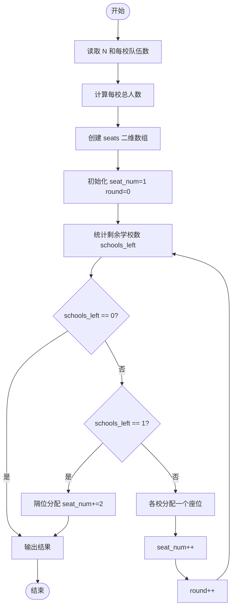
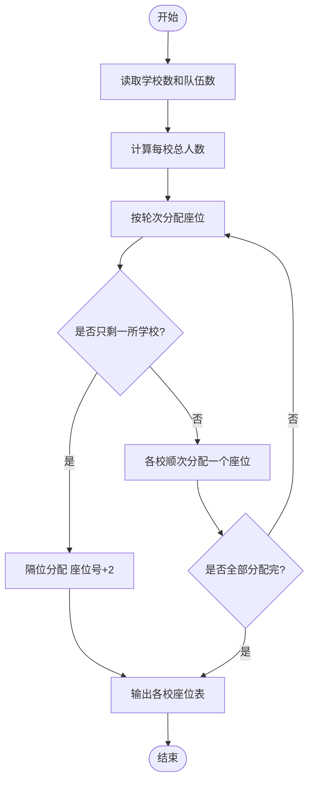

# L1-049 - 天梯赛座位分配（20 分）

- **时间限制**: 400 ms
- **内存限制**: 65536 KB
- **代码长度限制**: 16 KB

---

## 题目描述

天梯赛每年有大量参赛队员，要保证同一所学校的所有队员都不能相邻，分配座位就成为一件比较麻烦的事情。为此我们制定如下策略：假设某赛场有 N 所学校参赛，第 i 所学校有 M[i] 支队伍，每队 10 位参赛选手。令每校选手排成一列纵队，第 i+1 队的选手排在第 i 队选手之后。从第 1 所学校开始，各校的第 1 位队员顺次入座，然后是各校的第 2 位队员…… 以此类推。如果最后只剩下 1 所学校的队伍还没有分配座位，则需要安排他们的队员隔位就坐。本题就要求你编写程序，自动为各校生成队员的座位号，从 1 开始编号。

### 输入格式:

输入在一行中给出参赛的高校数 N （不超过100的正整数）；第二行给出 N 个不超过10的正整数，其中第 i 个数对应第 i 所高校的参赛队伍数，数字间以空格分隔。

### 输出格式:

从第 1 所高校的第 1 支队伍开始，顺次输出队员的座位号。每队占一行，座位号间以 1 个空格分隔，行首尾不得有多余空格。另外，每所高校的第一行按“#X”输出该校的编号X，从 1 开始。

### 输入样例:

```in
3
3 4 2
```

### 输出样例:

```out
#1
1 4 7 10 13 16 19 22 25 28
31 34 37 40 43 46 49 52 55 58
61 63 65 67 69 71 73 75 77 79
#2
2 5 8 11 14 17 20 23 26 29
32 35 38 41 44 47 50 53 56 59
62 64 66 68 70 72 74 76 78 80
82 84 86 88 90 92 94 96 98 100
#3
3 6 9 12 15 18 21 24 27 30
33 36 39 42 45 48 51 54 57 60
```

## 示例

### 示例 1

**输入:**
```
3
3 4 2
```

**输出:**
```
#1
1 4 7 10 13 16 19 22 25 28
31 34 37 40 43 46 49 52 55 58
61 63 65 67 69 71 73 75 77 79
#2
2 5 8 11 14 17 20 23 26 29
32 35 38 41 44 47 50 53 56 59
62 64 66 68 70 72 74 76 78 80
82 84 86 88 90 92 94 96 98 100
#3
3 6 9 12 15 18 21 24 27 30
33 36 39 42 45 48 51 54 57 60
```

---

## 题目详解

### 一、解题思路

本题的 R 实现采用以下方法：读取标准输入后建立题目所需的数据结构，按约束执行核心计算并输出结果。

### 二、代码流程说明

1. 读取并解析标准输入，转换为题目所需的数据结构。
2. 按题意执行核心算法，维护中间状态并处理边界情况。
3. 整理计算结果，按照输出格式生成答案。

### 三、代码实现

```r
# 实现原理：读取标准输入后建立题目所需的数据结构，按约束执行核心计算并输出结果。
# 处理流程：读取输入 -> 建立状态 -> 执行算法 -> 按题目格式输出。
# 关键变量和循环均直接对应题目中的数据、约束或操作。

# 读取并解析标准输入。
x <- scan(file = "stdin", quiet = TRUE)
n <- x[1]
total <- x[2:(n + 1)] * 10
got <- vector("list", n)
p <- integer(n)
seat <- 1
last <- -1
# 按题目约束遍历当前数据，更新中间状态。
while (sum(p < total) > 1) {
    for (i in seq_len(n)) if (p[i] < total[i]) {
        got[[i]] <- c(got[[i]], seat)
        p[i] <- p[i] + 1
        seat <- seat + 1
        last <- i - 1
    }
}
left <- which(p < total)
if (length(left)) {
    i <- left[1]
    if (last == i - 1)
        seat <- seat + 1
    while (p[i] < total[i]) {
        got[[i]] <- c(got[[i]], seat)
        p[i] <- p[i] + 1
        seat <- seat + 2
    }
}
for (i in seq_len(n)) {
# 严格按照题目规定的输出格式输出答案。
    cat("#", i, "\n", sep = "")
    a <- got[[i]]
    for (j in seq(1, length(a), by = 10)) cat(paste(a[j:min(j +
        9, length(a))], collapse = " "), "\n", sep = "")
}
```

### 四、代码流程图



### 五、解题流程图



### 六、常见易错点

- 题目描述、输入格式、输出格式和输入输出样例必须保持原文不变。
- R 语言下标从 1 开始，注意编号转换和空输入边界。
- 输出时严格保留题目规定的空格、换行和小数位数。
