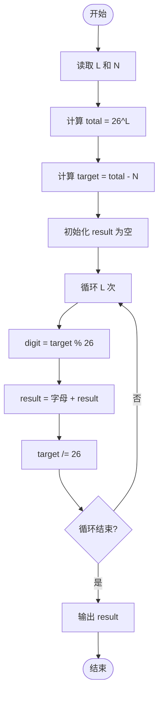
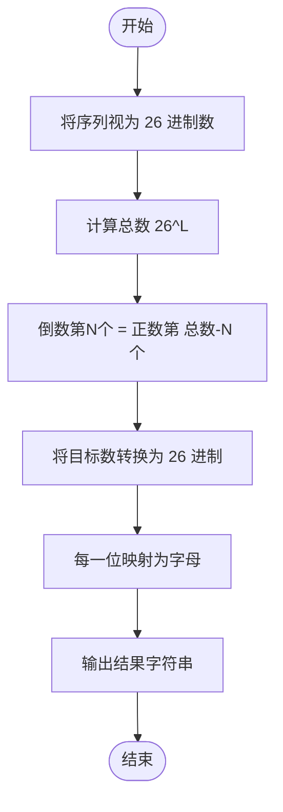

# L1-050 - 倒数第N个字符串（15 分）

- **时间限制**: 400 ms
- **内存限制**: 65536 KB
- **代码长度限制**: 16 KB

---

## 题目描述

给定一个完全由小写英文字母组成的字符串等差递增序列，该序列中的每个字符串的长度固定为 L，从 L 个 a 开始，以 1 为步长递增。例如当 L 为 3 时，序列为 { aaa, aab, aac, ..., aaz, aba, abb, ..., abz, ..., zzz }。这个序列的倒数第27个字符串就是 zyz。对于任意给定的 L，本题要求你给出对应序列倒数第 N 个字符串。

### 输入格式:

输入在一行中给出两个正整数 L（2 $$\le$$ L $$\le$$ 6）和 N（$$\le 10^5$$）。

### 输出格式:

在一行中输出对应序列倒数第 N 个字符串。题目保证这个字符串是存在的。

### 输入样例:

```in
3 7417
```

### 输出样例:

```out
pat
```

## 示例

### 示例 1

**输入:**
```
3 7417
```

**输出:**
```
pat
```

---

## 题目详解

### 一、解题思路

本题的 R 实现采用以下方法：读取标准输入后建立题目所需的数据结构，按约束执行核心计算并输出结果。

### 二、代码流程说明

1. 读取并解析标准输入，转换为题目所需的数据结构。
2. 按题意执行核心算法，维护中间状态并处理边界情况。
3. 整理计算结果，按照输出格式生成答案。

### 三、代码实现

```r
# 实现原理：读取标准输入后建立题目所需的数据结构，按约束执行核心计算并输出结果。
# 处理流程：读取输入 -> 建立状态 -> 执行算法 -> 按题目格式输出。
# 关键变量和循环均直接对应题目中的数据、约束或操作。

# 读取并解析标准输入。
x <- scan(file = "stdin", quiet = TRUE)
L <- x[1]
v <- 26^L - x[2]
ans <- character(L)
# 按题目约束遍历当前数据，更新中间状态。
for (i in L:1) {
    ans[i] <- letters[v%%26 + 1]
    v <- v%/%26
}
# 严格按照题目规定的输出格式输出答案。
cat(paste(ans, collapse = ""), "\n", sep = "")
```

### 四、代码流程图



### 五、解题流程图



### 六、常见易错点

- 题目描述、输入格式、输出格式和输入输出样例必须保持原文不变。
- R 语言下标从 1 开始，注意编号转换和空输入边界。
- 输出时严格保留题目规定的空格、换行和小数位数。
