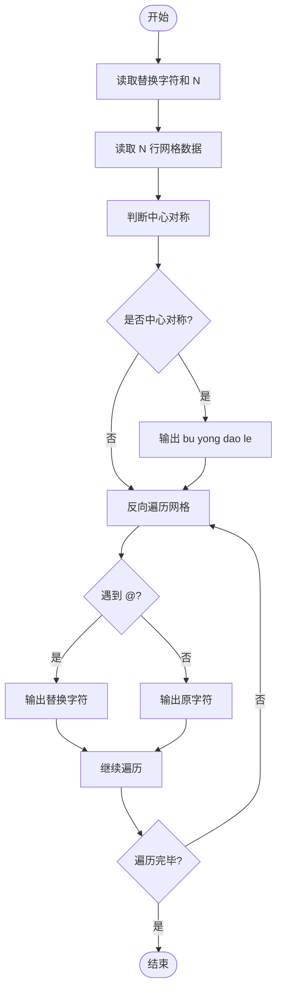
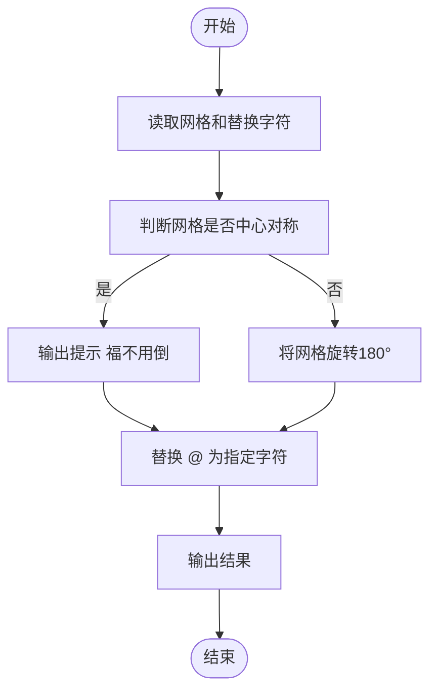

# L1-054 - 福到了（15 分）

- **时间限制**: 400 ms
- **内存限制**: 65536 KB
- **代码长度限制**: 16 KB

---

## 题目描述

“福”字倒着贴，寓意“福到”。不论到底算不算民俗，本题且请你编写程序，把各种汉字倒过来输出。这里要处理的每个汉字是由一个 N $$\times$$ N 的网格组成的，网格中的元素或者为字符 `@` 或者为空格。而倒过来的汉字所用的字符由裁判指定。

### 输入格式:

输入在第一行中给出倒过来的汉字所用的字符、以及网格的规模 N （不超过100的正整数），其间以 1 个空格分隔；随后 N 行，每行给出 N 个字符，或者为 `@` 或者为空格。

### 输出格式:

输出倒置的网格，如样例所示。但是，如果这个字正过来倒过去是一样的，就先输出`bu yong dao le`，然后再用输入指定的字符将其输出。

### 输入样例 1:

```in
$ 9
 @  @@@@@
@@@  @@@ 
 @   @ @ 
@@@  @@@ 
@@@ @@@@@
@@@ @ @ @
@@@ @@@@@
 @  @ @ @
 @  @@@@@
```

### 输出样例 1:

```out
$$$$$  $ 
$ $ $  $ 
$$$$$ $$$
$ $ $ $$$
$$$$$ $$$
 $$$  $$$
 $ $   $ 
 $$$  $$$
$$$$$  $ 
```

### 输入样例 2:

```in
& 3
@@@
 @ 
@@@
```

### 输出样例 2:

```out
bu yong dao le
&&&
 & 
&&&
```

## 示例

### 示例 1

**输入:**
```
$ 9
 @  @@@@@
@@@  @@@ 
 @   @ @ 
@@@  @@@ 
@@@ @@@@@
@@@ @ @ @
@@@ @@@@@
 @  @ @ @
 @  @@@@@
```

**输出:**
```
$$$$$  $ 
$ $ $  $ 
$$$$$ $$$
$ $ $ $$$
$$$$$ $$$
 $$$  $$$
 $ $   $ 
 $$$  $$$
$$$$$  $ 
```

### 示例 2

**输入:**
```
& 3
@@@
 @ 
@@@
```

**输出:**
```
bu yong dao le
&&&
 & 
&&&
```

---

## 题目详解

### 一、解题思路

本题的 R 实现采用以下方法：将输入组织为矩阵或表格，按题目定义的行、列和状态关系完成计算。

### 二、代码流程说明

1. 读取并解析标准输入，转换为题目所需的数据结构。
2. 按题意执行核心算法，维护中间状态并处理边界情况。
3. 整理计算结果，按照输出格式生成答案。

### 三、代码实现

```r
# 实现原理：将输入组织为矩阵或表格，按题目定义的行、列和状态关系完成计算。
# 处理流程：读取输入 -> 建立状态 -> 执行算法 -> 按题目格式输出。
# 关键变量和循环均直接对应题目中的数据、约束或操作。

# 读取并解析标准输入。
x <- readLines("stdin", warn = FALSE)
q <- strsplit(x[1], " ", fixed = TRUE)[[1]]
ch <- q[1]
n <- as.integer(q[2])
a <- do.call(rbind, lapply(x[2:(n + 1)], function(s) {
    z <- strsplit(s, "", fixed = TRUE)[[1]]
    length(z) <- n
    z[is.na(z)] <- " "
    z
}))
b <- a[n:1, n:1]
same <- all(a == b)
# 严格按照题目规定的输出格式输出答案。
if (same) cat("bu yong dao le\n")
# 按题目约束遍历当前数据，更新中间状态。
for (i in seq_len(n)) {
    z <- b[i, ]
    z[z == "@"] <- ch
    cat(paste(z, collapse = ""), "\n", sep = "")
}
```

### 四、代码流程图



### 五、解题流程图



### 六、常见易错点

- 题目描述、输入格式、输出格式和输入输出样例必须保持原文不变。
- R 语言下标从 1 开始，注意编号转换和空输入边界。
- 输出时严格保留题目规定的空格、换行和小数位数。
