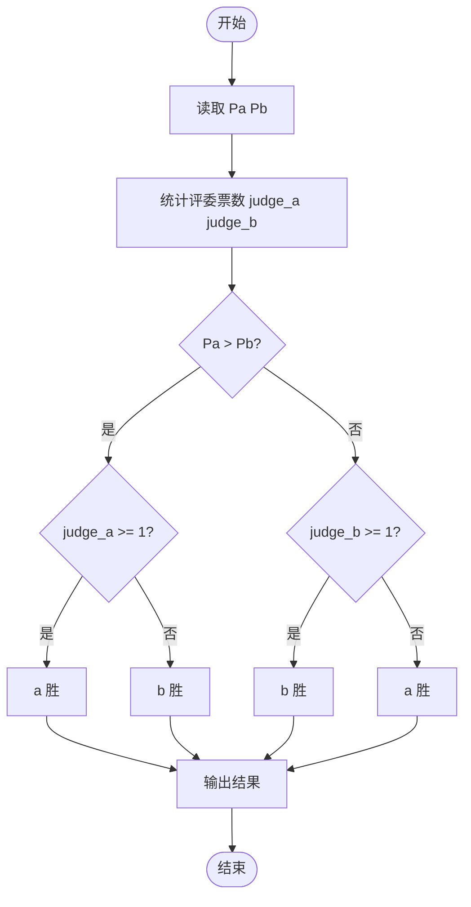
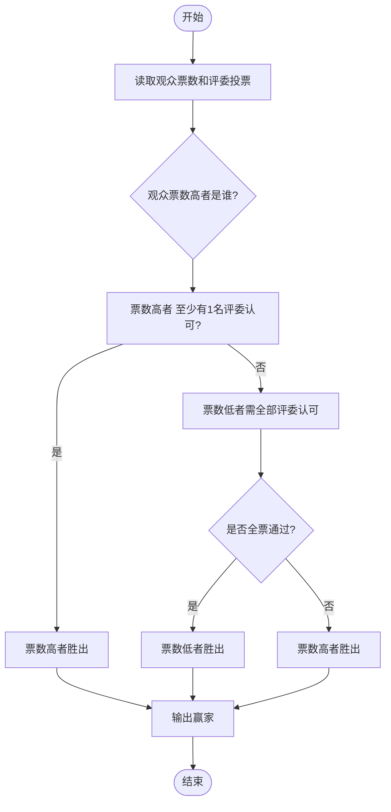

# L1-055 - 谁是赢家（10 分）

- **时间限制**: 400 ms
- **内存限制**: 65536 KB
- **代码长度限制**: 16 KB

---

## 题目描述

某电视台的娱乐节目有个表演评审环节，每次安排两位艺人表演，他们的胜负由观众投票和 3 名评委投票两部分共同决定。规则为：如果一位艺人的观众票数高，且得到至少 1 名评委的认可，该艺人就胜出；或艺人的观众票数低，但得到全部评委的认可，也可以胜出。节目保证投票的观众人数为奇数，所以不存在平票的情况。本题就请你用程序判断谁是赢家。

### 输入格式:

输入第一行给出 2 个不超过 1000 的正整数 Pa 和 Pb，分别是艺人 a 和艺人 b 得到的观众票数。题目保证这两个数字不相等。随后第二行给出 3 名评委的投票结果。数字 0 代表投票给 a，数字 1 代表投票给 b，其间以一个空格分隔。

### 输出格式:

按以下格式输出赢家：

```
The winner is x: P1 + P2
```

其中 `x` 是代表赢家的字母，`P1` 是赢家得到的观众票数，`P2` 是赢家得到的评委票数。

### 输入样例:

```in
327 129
1 0 1
```

### 输出样例:

```out
The winner is a: 327 + 1
```

**鸣谢安阳师范学院软件学院李栋同学完善测试数据。**

## 示例

### 示例 1

**输入:**
```
327 129
1 0 1
```

**输出:**
```
The winner is a: 327 + 1
```

---

## 题目详解

### 一、解题思路

本题的 R 实现采用以下方法：读取标准输入后建立题目所需的数据结构，按约束执行核心计算并输出结果。

### 二、代码流程说明

1. 读取并解析标准输入，转换为题目所需的数据结构。
2. 按题意执行核心算法，维护中间状态并处理边界情况。
3. 整理计算结果，按照输出格式生成答案。

### 三、代码实现

```r
# 实现原理：读取标准输入后建立题目所需的数据结构，按约束执行核心计算并输出结果。
# 处理流程：读取输入 -> 建立状态 -> 执行算法 -> 按题目格式输出。
# 关键变量和循环均直接对应题目中的数据、约束或操作。

# 读取并解析标准输入。
x <- scan(file = "stdin", quiet = TRUE)
pa <- x[1]
pb <- x[2]
votes <- x[3:5]
va <- sum(votes == 0)
vb <- sum(votes == 1)
win_a <- (pa > pb && va >= 1) || (pa < pb && va == 3)
# 严格按照题目规定的输出格式输出答案。
if (win_a) cat("The winner is a: ", pa, " + ", va, "\n", sep = "") else cat("The winner is b: ",
    pb, " + ", vb, "\n", sep = "")
```

### 四、代码流程图



### 五、解题流程图



### 六、常见易错点

- 题目描述、输入格式、输出格式和输入输出样例必须保持原文不变。
- R 语言下标从 1 开始，注意编号转换和空输入边界。
- 输出时严格保留题目规定的空格、换行和小数位数。
