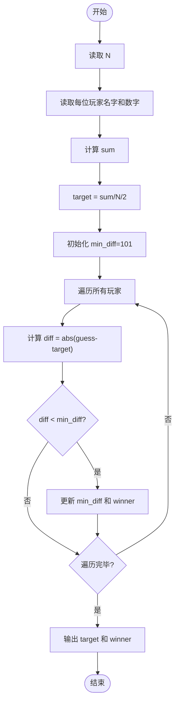
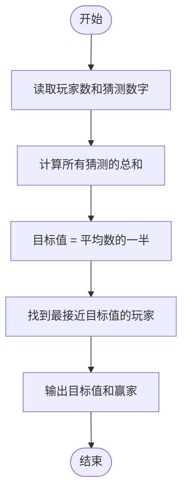

# L1-056 - 猜数字（20 分）

- **时间限制**: 400 ms
- **内存限制**: 65536 KB
- **代码长度限制**: 16 KB

---

## 题目描述

一群人坐在一起，每人猜一个 100 以内的数，谁的数字最接近大家平均数的一半就赢。本题就要求你找出其中的赢家。

### 输入格式:

输入在第一行给出一个正整数N（$$\le 10^4$$）。随后 N 行，每行给出一个玩家的名字（由不超过8个英文字母组成的字符串）和其猜的正整数（$$\le$$ 100）。

### 输出格式:

在一行中顺序输出：大家平均数的一半（只输出整数部分）、赢家的名字，其间以空格分隔。题目保证赢家是唯一的。

### 输入样例:

```in
7
Bob 35
Amy 28
James 98
Alice 11
Jack 45
Smith 33
Chris 62
```

### 输出样例:

```out
22 Amy
```

## 示例

### 示例 1

**输入:**
```
7
Bob 35
Amy 28
James 98
Alice 11
Jack 45
Smith 33
Chris 62
```

**输出:**
```
22 Amy
```

---

## 题目详解

### 一、解题思路

本题的 R 实现采用以下方法：读取标准输入后建立题目所需的数据结构，按约束执行核心计算并输出结果。

### 二、代码流程说明

1. 读取并解析标准输入，转换为题目所需的数据结构。
2. 按题意执行核心算法，维护中间状态并处理边界情况。
3. 整理计算结果，按照输出格式生成答案。

### 三、代码实现

```r
# 实现原理：读取标准输入后建立题目所需的数据结构，按约束执行核心计算并输出结果。
# 处理流程：读取输入 -> 建立状态 -> 执行算法 -> 按题目格式输出。
# 关键变量和循环均直接对应题目中的数据、约束或操作。

# 读取并解析标准输入。
x <- scan(file = "stdin", quiet = TRUE, what = "")
n <- as.integer(x[1])
names <- x[seq(2, 2 * n, 2)]
g <- as.numeric(x[seq(3, 2 * n + 1, 2)])
target <- floor(sum(g)/n/2)
i <- which.min(abs(g - target))
# 严格按照题目规定的输出格式输出答案。
cat(paste(target, names[i]), "\n", sep = "")
```

### 四、代码流程图



### 五、解题流程图



### 六、常见易错点

- 题目描述、输入格式、输出格式和输入输出样例必须保持原文不变。
- R 语言下标从 1 开始，注意编号转换和空输入边界。
- 输出时严格保留题目规定的空格、换行和小数位数。
