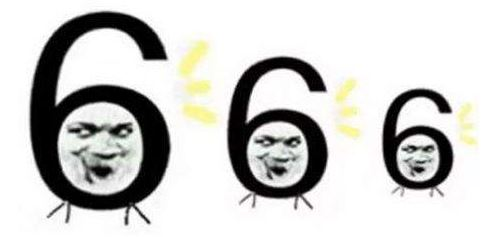
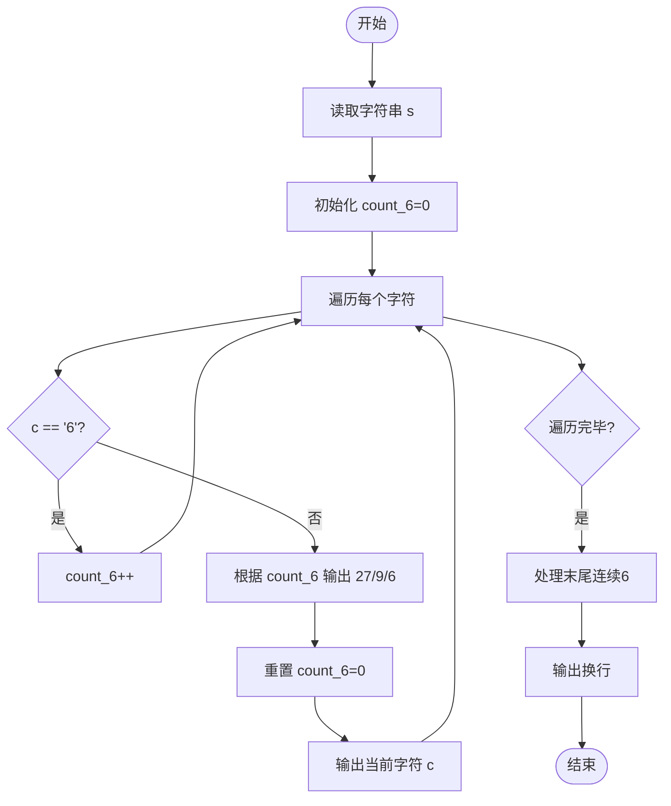
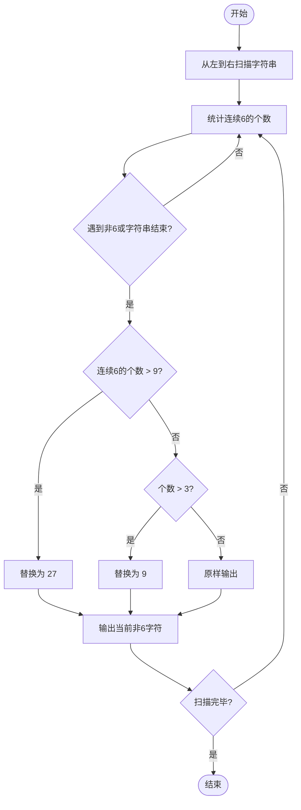

# L1-058 - 6翻了（15 分）

- **时间限制**: 400 ms
- **内存限制**: 65536 KB
- **代码长度限制**: 16 KB

---

## 题目描述



“666”是一种网络用语，大概是表示某人很厉害、我们很佩服的意思。最近又衍生出另一个数字“9”，意思是“6翻了”，实在太厉害的意思。如果你以为这就是厉害的最高境界，那就错啦 —— 目前的最高境界是数字“27”，因为这是 3 个 “9”！

本题就请你编写程序，将那些过时的、只会用一连串“6666……6”表达仰慕的句子，翻译成最新的高级表达。

### 输入格式:

输入在一行中给出一句话，即一个非空字符串，由不超过 1000 个英文字母、数字和空格组成，以回车结束。

### 输出格式:

从左到右扫描输入的句子：如果句子中有超过 3 个连续的 6，则将这串连续的 6 替换成 9；但如果有超过 9 个连续的 6，则将这串连续的 6 替换成 27。其他内容不受影响，原样输出。

### 输入样例:

```in
it is so 666 really 6666 what else can I say 6666666666
```

### 输出样例:

```out
it is so 666 really 9 what else can I say 27
```

## 示例

### 示例 1

**输入:**
```
it is so 666 really 6666 what else can I say 6666666666
```

**输出:**
```
it is so 666 really 9 what else can I say 27
```

---

## 题目详解

### 一、解题思路

本题的 R 实现采用以下方法：按行或按字段解析输入，使用字符串或序列操作完成题目要求的变换，并按格式输出。

### 二、代码流程说明

1. 读取并解析标准输入，转换为题目所需的数据结构。
2. 按题意执行核心算法，维护中间状态并处理边界情况。
3. 整理计算结果，按照输出格式生成答案。

### 三、代码实现

```r
# 实现原理：按行或按字段解析输入，使用字符串或序列操作完成题目要求的变换，并按格式输出。
# 处理流程：读取输入 -> 建立状态 -> 执行算法 -> 按题目格式输出。
# 关键变量和循环均直接对应题目中的数据、约束或操作。

# 读取并解析标准输入。
s <- readLines("stdin", n = 1, warn = FALSE)
s <- gsub("6{10,}", "27", s, perl = TRUE)
s <- gsub("6{4,9}", "9", s, perl = TRUE)
# 严格按照题目规定的输出格式输出答案。
cat(s, "\n", sep = "")
```

### 四、代码流程图



### 五、解题流程图



### 六、常见易错点

- 题目描述、输入格式、输出格式和输入输出样例必须保持原文不变。
- R 语言下标从 1 开始，注意编号转换和空输入边界。
- 输出时严格保留题目规定的空格、换行和小数位数。
