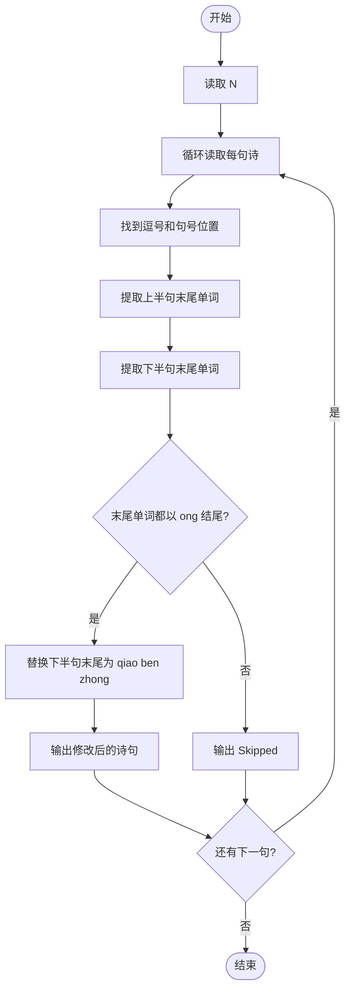
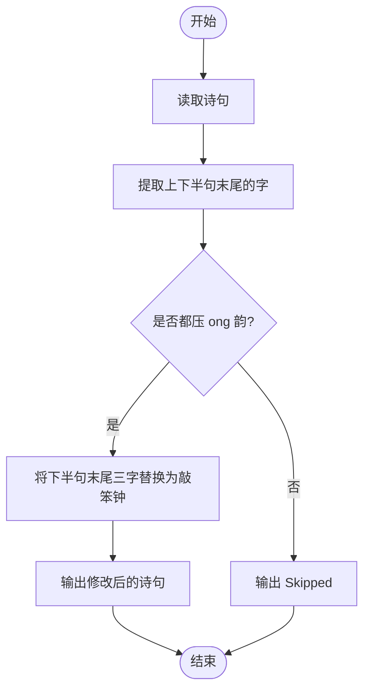

# L1-059 - 敲笨钟（20 分）

- **时间限制**: 400 ms
- **内存限制**: 65536 KB
- **代码长度限制**: 16 KB

---

## 题目描述

微博上有个自称“大笨钟V”的家伙，每天敲钟催促码农们爱惜身体早点睡觉。为了增加敲钟的趣味性，还会糟改几句古诗词。其糟改的方法为：去网上搜寻压“ong”韵的古诗词，把句尾的三个字换成“敲笨钟”。例如唐代诗人李贺有名句曰：“寻章摘句老雕虫，晓月当帘挂玉弓”，其中“虫”（chong）和“弓”（gong）都压了“ong”韵。于是这句诗就被糟改为“寻章摘句老雕虫，晓月当帘敲笨钟”。

现在给你一大堆古诗词句，要求你写个程序自动将压“ong”韵的句子糟改成“敲笨钟”。

### 输入格式:

输入首先在第一行给出一个不超过 20 的正整数 N。随后 N 行，每行用汉语拼音给出一句古诗词，分上下两半句，用逗号 `,` 分隔，句号 `.` 结尾。相邻两字的拼音之间用一个空格分隔。题目保证每个字的拼音不超过 6 个字符，每行字符的总长度不超过 100，并且下半句诗至少有 3 个字。

### 输出格式:

对每一行诗句，判断其是否压“ong”韵。即上下两句末尾的字都是“ong”结尾。如果是压此韵的，就按题面方法糟改之后输出，输出格式同输入；否则输出 `Skipped`，即跳过此句。

### 输入样例:

```in
5
xun zhang zhai ju lao diao chong, xiao yue dang lian gua yu gong.
tian sheng wo cai bi you yong, qian jin san jin huan fu lai.
xue zhui rou zhi leng wei rong, an xiao chen jing shu wei long.
zuo ye xing chen zuo ye feng, hua lou xi pan gui tang dong.
ren xian gui hua luo, ye jing chun shan kong.
```

### 输出样例:

```out
xun zhang zhai ju lao diao chong, xiao yue dang lian qiao ben zhong.
Skipped
xue zhui rou zhi leng wei rong, an xiao chen jing qiao ben zhong.
Skipped
Skipped
```

## 示例

### 示例 1

**输入:**
```
5
xun zhang zhai ju lao diao chong, xiao yue dang lian gua yu gong.
tian sheng wo cai bi you yong, qian jin san jin huan fu lai.
xue zhui rou zhi leng wei rong, an xiao chen jing shu wei long.
zuo ye xing chen zuo ye feng, hua lou xi pan gui tang dong.
ren xian gui hua luo, ye jing chun shan kong.
```

**输出:**
```
xun zhang zhai ju lao diao chong, xiao yue dang lian qiao ben zhong.
Skipped
xue zhui rou zhi leng wei rong, an xiao chen jing qiao ben zhong.
Skipped
Skipped
```

---

## 题目详解

### 一、解题思路

本题的 R 实现采用以下方法：按行或按字段解析输入，使用字符串或序列操作完成题目要求的变换，并按格式输出。

### 二、代码流程说明

1. 读取并解析标准输入，转换为题目所需的数据结构。
2. 按题意执行核心算法，维护中间状态并处理边界情况。
3. 整理计算结果，按照输出格式生成答案。

### 三、代码实现

```r
# 实现原理：按行或按字段解析输入，使用字符串或序列操作完成题目要求的变换，并按格式输出。
# 处理流程：读取输入 -> 建立状态 -> 执行算法 -> 按题目格式输出。
# 关键变量和循环均直接对应题目中的数据、约束或操作。

# 读取并解析标准输入。
x <- readLines("stdin", warn = FALSE)
n <- as.integer(x[1])
# 按题目约束遍历当前数据，更新中间状态。
for (i in seq_len(n)) {
    line <- x[i + 1]
    q <- strsplit(line, ",", fixed = TRUE)[[1]]
    u <- strsplit(trimws(q[1]), " ", fixed = TRUE)[[1]]
    v <- strsplit(trimws(q[2]), " ", fixed = TRUE)[[1]]
    lastu <- sub("\\.$", "", tail(u, 1))
    lastv <- sub("\\.$", "", tail(v, 1))
    if (grepl("ong$", lastu) && grepl("ong$", lastv)) {
        v <- c(v[seq_len(length(v) - 3)], "qiao", "ben", "zhong.")
# 严格按照题目规定的输出格式输出答案。
        cat(paste(u, collapse = " "), ", ", paste(v, collapse = " "),
            "\n", sep = "")
    }
    else cat("Skipped\n")
}
```

### 四、代码流程图



### 五、解题流程图



### 六、常见易错点

- 题目描述、输入格式、输出格式和输入输出样例必须保持原文不变。
- R 语言下标从 1 开始，注意编号转换和空输入边界。
- 输出时严格保留题目规定的空格、换行和小数位数。
