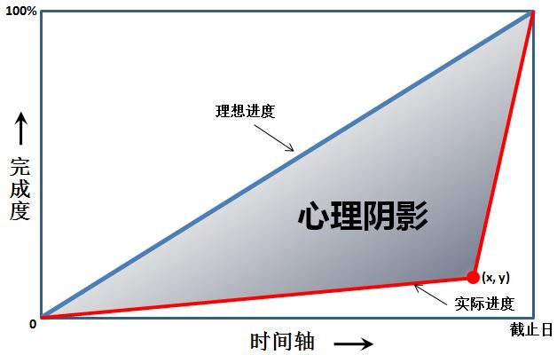
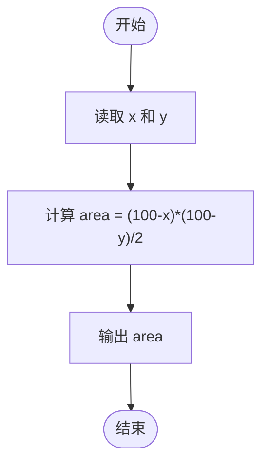
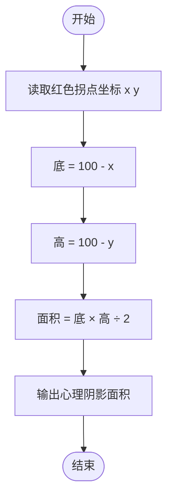

# L1-060 - 心理阴影面积（5 分）

- **时间限制**: 400 ms
- **内存限制**: 65536 KB
- **代码长度限制**: 16 KB

---

## 题目描述



这是一幅心理阴影面积图。我们都以为自己可以匀速前进（图中蓝色直线），而拖延症晚期的我们往往执行的是最后时刻的疯狂赶工（图中的红色折线）。由红、蓝线围出的面积，就是我们在做作业时的心理阴影面积。

现给出红色拐点的坐标 $$(x,y)$$，要求你算出这个心理阴影面积。

### 输入格式:

输入在一行中给出 2 个不超过 100 的正整数 $$x$$ 和 $$y$$，并且保证有 $$x>y$$。这里假设横、纵坐标的最大值（即截止日和最终完成度）都是 100。

### 输出格式:

在一行中输出心理阴影面积。

友情提醒：三角形的面积 = 底边长 x 高 / 2；矩形面积 = 底边长 x 高。嫑想得太复杂，这是一道 5 分考减法的题……

### 输入样例:

```in
90 10
```

### 输出样例:

```out
4000
```

## 示例

### 示例 1

**输入:**
```
90 10
```

**输出:**
```
4000
```

---

## 题目详解

### 一、解题思路

本题的 R 实现采用以下方法：读取标准输入后建立题目所需的数据结构，按约束执行核心计算并输出结果。

### 二、代码流程说明

1. 读取并解析标准输入，转换为题目所需的数据结构。
2. 按题意执行核心算法，维护中间状态并处理边界情况。
3. 整理计算结果，按照输出格式生成答案。

### 三、代码实现

```r
# 实现原理：读取标准输入后建立题目所需的数据结构，按约束执行核心计算并输出结果。
# 处理流程：读取输入 -> 建立状态 -> 执行算法 -> 按题目格式输出。
# 关键变量和循环均直接对应题目中的数据、约束或操作。

# 读取并解析标准输入。
x <- scan(file = "stdin", quiet = TRUE)
# 严格按照题目规定的输出格式输出答案。
cat(50 * (x[1] - x[2]), "\n", sep = "")
```

### 四、代码流程图



### 五、解题流程图



### 六、常见易错点

- 题目描述、输入格式、输出格式和输入输出样例必须保持原文不变。
- R 语言下标从 1 开始，注意编号转换和空输入边界。
- 输出时严格保留题目规定的空格、换行和小数位数。
