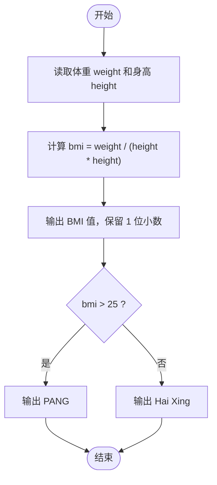
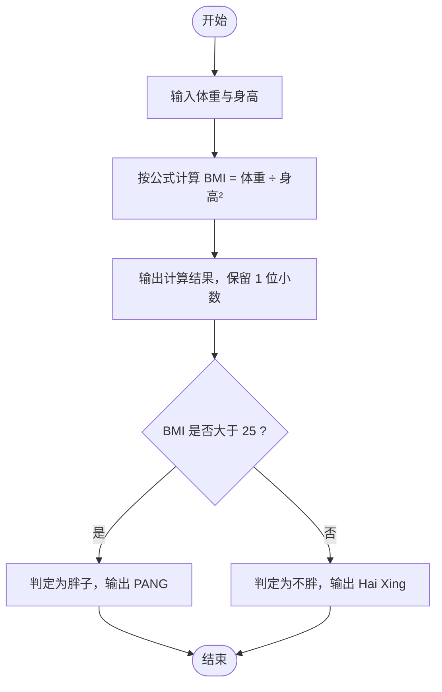

# L1-061 - 新胖子公式（10 分）

- **时间限制**: 400 ms
- **内存限制**: 65536 KB
- **代码长度限制**: 16 KB

---

## 题目描述

根据钱江晚报官方微博的报导，最新的肥胖计算方法为：体重(kg) / 身高(m) 的平方。如果超过 25，你就是胖子。于是本题就请你编写程序自动判断一个人到底算不算胖子。

### 输入格式:

输入在一行中给出两个正数，依次为一个人的体重（以 kg 为单位）和身高（以 m 为单位），其间以空格分隔。其中体重不超过 1000 kg，身高不超过 3.0 m。

### 输出格式:

首先输出将该人的体重和身高代入肥胖公式的计算结果，保留小数点后 1 位。如果这个数值大于 25，就在第二行输出 `PANG`，否则输出 `Hai Xing`。

### 输入样例 1:

```in
100.1 1.74
```

### 输出样例 1:

```out
33.1
PANG
```

### 输入样例 2:

```in
65 1.70
```

### 输出样例 2:

```out
22.5
Hai Xing
```

## 示例

### 示例 1

**输入:**
```
100.1 1.74
```

**输出:**
```
33.1
PANG
```

### 示例 2

**输入:**
```
65 1.70
```

**输出:**
```
22.5
Hai Xing
```

---

## 题目详解

### 一、解题思路

本题的 R 实现采用以下方法：读取标准输入后建立题目所需的数据结构，按约束执行核心计算并输出结果。

### 二、代码流程说明

1. 读取并解析标准输入，转换为题目所需的数据结构。
2. 按题意执行核心算法，维护中间状态并处理边界情况。
3. 整理计算结果，按照输出格式生成答案。

### 三、代码实现

```r
# 实现原理：读取标准输入后建立题目所需的数据结构，按约束执行核心计算并输出结果。
# 处理流程：读取输入 -> 建立状态 -> 执行算法 -> 按题目格式输出。
# 关键变量和循环均直接对应题目中的数据、约束或操作。

# 读取并解析标准输入。
v <- scan(file = "stdin", quiet = TRUE)
bmi <- v[1]/v[2]^2
# 严格按照题目规定的输出格式输出答案。
cat(sprintf("%.1f\n%s\n", bmi, if (bmi > 25) "PANG" else "Hai Xing"))
```

### 四、代码流程图



### 五、解题流程图



### 六、常见易错点

- 题目描述、输入格式、输出格式和输入输出样例必须保持原文不变。
- R 语言下标从 1 开始，注意编号转换和空输入边界。
- 输出时严格保留题目规定的空格、换行和小数位数。
