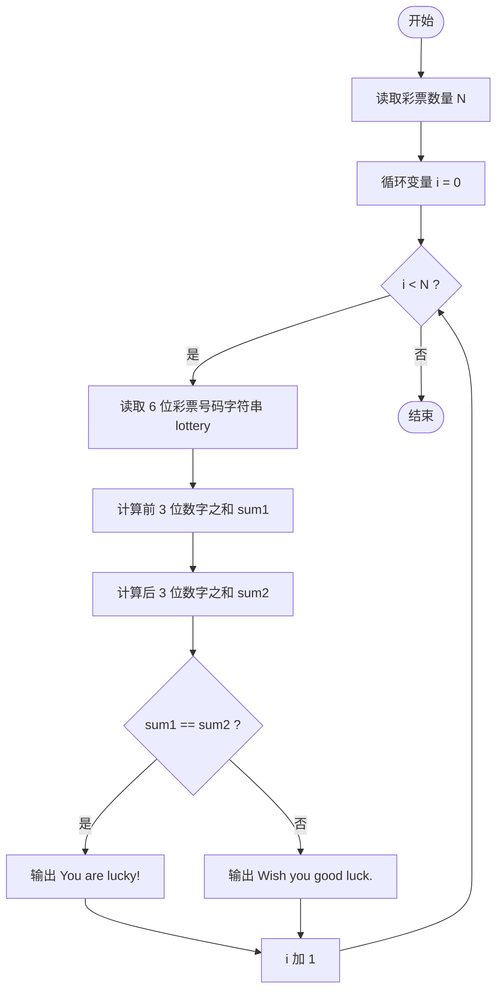
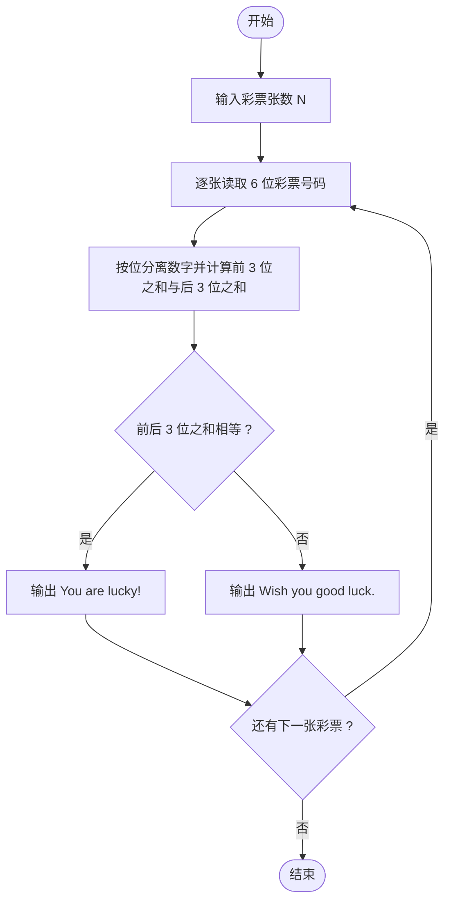

# L1-062 - 幸运彩票（15 分）

- **时间限制**: 400 ms
- **内存限制**: 65536 KB
- **代码长度限制**: 16 KB

---

## 题目描述

彩票的号码有 6 位数字，若一张彩票的前 3 位上的数之和等于后 3 位上的数之和，则称这张彩票是幸运的。本题就请你判断给定的彩票是不是幸运的。

### 输入格式:

输入在第一行中给出一个正整数 N（$$\le$$ 100）。随后 N 行，每行给出一张彩票的 6 位数字。

### 输出格式:

对每张彩票，如果它是幸运的，就在一行中输出 `You are lucky!`；否则输出 `Wish you good luck.`。

### 输入样例:

```in
2
233008
123456
```

### 输出样例:

```out
You are lucky!
Wish you good luck.
```

## 示例

### 示例 1

**输入:**
```
2
233008
123456
```

**输出:**
```
You are lucky!
Wish you good luck.
```

---

## 题目详解

### 一、解题思路

本题的 R 实现采用以下方法：按行或按字段解析输入，使用字符串或序列操作完成题目要求的变换，并按格式输出。

### 二、代码流程说明

1. 读取并解析标准输入，转换为题目所需的数据结构。
2. 按题意执行核心算法，维护中间状态并处理边界情况。
3. 整理计算结果，按照输出格式生成答案。

### 三、代码实现

```r
# 实现原理：按行或按字段解析输入，使用字符串或序列操作完成题目要求的变换，并按格式输出。
# 处理流程：读取输入 -> 建立状态 -> 执行算法 -> 按题目格式输出。
# 关键变量和循环均直接对应题目中的数据、约束或操作。

# 读取并解析标准输入。
x <- readLines("stdin", warn = FALSE)
n <- as.integer(x[1])
# 按题目约束遍历当前数据，更新中间状态。
for (s in x[2:(n + 1)]) {
    z <- strsplit(trimws(s), "", fixed = TRUE)[[1]]
# 严格按照题目规定的输出格式输出答案。
    cat(if (sum(as.integer(z[1:3])) == sum(as.integer(z[4:6])))
        "You are lucky!\n"
    else "Wish you good luck.\n")
}
```

### 四、代码流程图



### 五、解题流程图



### 六、常见易错点

- 题目描述、输入格式、输出格式和输入输出样例必须保持原文不变。
- R 语言下标从 1 开始，注意编号转换和空输入边界。
- 输出时严格保留题目规定的空格、换行和小数位数。
