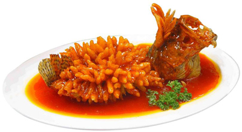
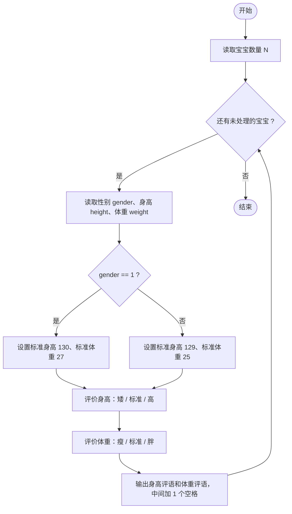
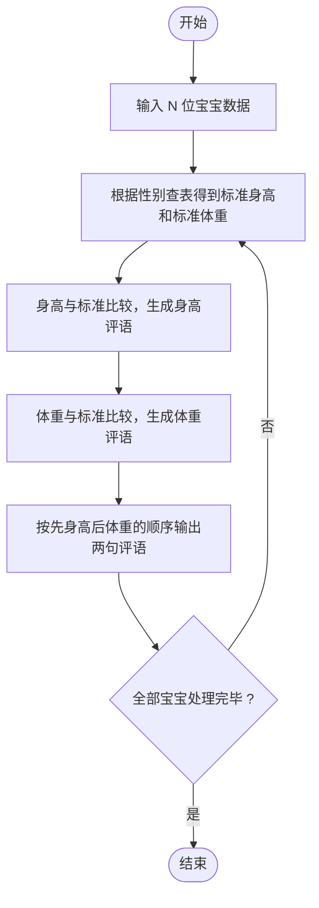

# L1-063 - 吃鱼还是吃肉（10 分）

- **时间限制**: 400 ms
- **内存限制**: 65536 KB
- **代码长度限制**: 16 KB

---

## 题目描述


  

国家给出了 8 岁男宝宝的标准身高为 130 厘米、标准体重为 27 公斤；8 岁女宝宝的标准身高为 129 厘米、标准体重为 25 公斤。

现在你要根据小宝宝的身高体重，给出补充营养的建议。

### 输入格式:

输入在第一行给出一个不超过 10 的正整数 $$N$$，随后 $$N$$ 行，每行给出一位宝宝的身体数据：
```
性别 身高 体重
```
其中`性别`是 1 表示男生，0 表示女生。`身高`和`体重`都是不超过 200 的正整数。

### 输出格式:

对于每一位宝宝，在一行中给出你的建议：

- 如果太矮了，输出：`duo chi yu!`（多吃鱼）；
- 如果太瘦了，输出：`duo chi rou!`（多吃肉）；
- 如果正标准，输出：`wan mei!`（完美）；
- 如果太高了，输出：`ni li hai!`（你厉害）；
- 如果太胖了，输出：`shao chi rou!`（少吃肉）。

先评价身高，再评价体重。两句话之间要有 1 个空格。

### 输入样例:

```in
4
0 130 23
1 129 27
1 130 30
0 128 27
```

### 输出样例:

```out
ni li hai! duo chi rou!
duo chi yu! wan mei!
wan mei! shao chi rou!
duo chi yu! shao chi rou!
```

## 示例

### 示例 1

**输入:**
```
4
0 130 23
1 129 27
1 130 30
0 128 27
```

**输出:**
```
ni li hai! duo chi rou!
duo chi yu! wan mei!
wan mei! shao chi rou!
duo chi yu! shao chi rou!
```

---

## 题目详解

### 一、解题思路

本题的 R 实现采用以下方法：读取标准输入后建立题目所需的数据结构，按约束执行核心计算并输出结果。

### 二、代码流程说明

1. 读取并解析标准输入，转换为题目所需的数据结构。
2. 按题意执行核心算法，维护中间状态并处理边界情况。
3. 整理计算结果，按照输出格式生成答案。

### 三、代码实现

```r
# 实现原理：读取标准输入后建立题目所需的数据结构，按约束执行核心计算并输出结果。
# 处理流程：读取输入 -> 建立状态 -> 执行算法 -> 按题目格式输出。
# 关键变量和循环均直接对应题目中的数据、约束或操作。

# 读取并解析标准输入。
v <- scan(file = "stdin", quiet = TRUE)
n <- v[1]
p <- 2
# 按题目约束遍历当前数据，更新中间状态。
for (i in seq_len(n)) {
    g <- v[p]
    h <- v[p + 1]
    w <- v[p + 2]
    p <- p + 3
    sh <- if (g == 1)
        130
    else 129
    sw <- if (g == 1)
        27
    else 25
    hs <- if (h < sh)
        "duo chi yu!"
    else if (h > sh)
        "ni li hai!"
    else "wan mei!"
    ws <- if (w < sw)
        "duo chi rou!"
    else if (w > sw)
        "shao chi rou!"
    else "wan mei!"
# 严格按照题目规定的输出格式输出答案。
    cat(paste(hs, ws), "\n", sep = "")
}
```

### 四、代码流程图



### 五、解题流程图



### 六、常见易错点

- 题目描述、输入格式、输出格式和输入输出样例必须保持原文不变。
- R 语言下标从 1 开始，注意编号转换和空输入边界。
- 输出时严格保留题目规定的空格、换行和小数位数。
