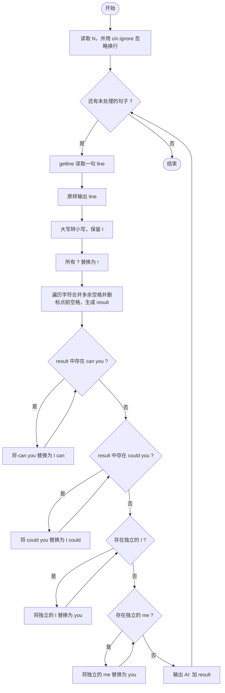
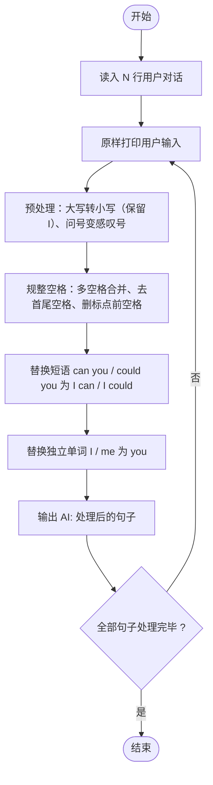

# L1-064 - 估值一亿的AI核心代码（20 分）

- **时间限制**: 400 ms
- **内存限制**: 65536 KB
- **代码长度限制**: 16 KB

---

## 题目描述


以上图片来自新浪微博。

本题要求你实现一个稍微更值钱一点的 AI 英文问答程序，规则是：

- 无论用户说什么，首先把对方说的话在一行中原样打印出来；
- 消除原文中多余空格：把相邻单词间的多个空格换成 1 个空格，把行首尾的空格全部删掉，把标点符号前面的空格删掉；
- 把原文中所有大写英文字母变成小写，除了 `I`；
- 把原文中所有独立的 `can you`、`could you` 对应地换成 `I can`、`I could`—— 这里“独立”是指被空格或标点符号分隔开的单词；
- 把原文中所有独立的 `I` 和 `me` 换成 `you`；
- 把原文中所有的问号 `?` 换成惊叹号 `!`；
- 在一行中输出替换后的句子作为 AI 的回答。

### 输入格式:

输入首先在第一行给出不超过 10 的正整数 N，随后 N 行，每行给出一句不超过 1000 个字符的、以回车结尾的用户的对话，对话为非空字符串，仅包括字母、数字、空格、可见的半角标点符号。

### 输出格式:

按题面要求输出，每个 AI 的回答前要加上 `AI:` 和一个空格。

### 输入样例:

```in
6
Hello ?
 Good to chat   with you
can   you speak Chinese?
Really?
Could you show me 5
What Is this prime? I,don 't know
```

### 输出样例:

```out
Hello ?
AI: hello!
 Good to chat   with you
AI: good to chat with you
can   you speak Chinese?
AI: I can speak chinese!
Really?
AI: really!
Could you show me 5
AI: I could show you 5
What Is this prime? I,don 't know
AI: what Is this prime! you,don't know
```

## 示例

### 示例 1

**输入:**
```
6
Hello ?
 Good to chat   with you
can   you speak Chinese?
Really?
Could you show me 5
What Is this prime? I,don 't know
```

**输出:**
```
Hello ?
AI: hello!
 Good to chat   with you
AI: good to chat with you
can   you speak Chinese?
AI: I can speak chinese!
Really?
AI: really!
Could you show me 5
AI: I could show you 5
What Is this prime? I,don 't know
AI: what Is this prime! you,don't know
```

---

## 题目详解

### 一、解题思路

本题的 R 实现采用以下方法：按行或按字段解析输入，使用字符串或序列操作完成题目要求的变换，并按格式输出。

### 二、代码流程说明

1. 读取并解析标准输入，转换为题目所需的数据结构。
2. 按题意执行核心算法，维护中间状态并处理边界情况。
3. 整理计算结果，按照输出格式生成答案。

### 三、代码实现

```r
# 实现原理：按行或按字段解析输入，使用字符串或序列操作完成题目要求的变换，并按格式输出。
# 处理流程：读取输入 -> 建立状态 -> 执行算法 -> 按题目格式输出。
# 关键变量和循环均直接对应题目中的数据、约束或操作。

# 读取并解析标准输入。
lines <- readLines("stdin", warn = FALSE)
n <- as.integer(lines[1])
# 按题目约束遍历当前数据，更新中间状态。
for (s in lines[2:(n + 1)]) {
# 严格按照题目规定的输出格式输出答案。
    cat(s, "\n", sep = "")
    s <- trimws(gsub(" +", " ", s))
    s <- gsub(" +([,.!?])", "\\1", s, perl = TRUE)
    z <- strsplit(s, "", fixed = TRUE)[[1]]
    s <- paste(ifelse(z == "I", "I", tolower(z)), collapse = "")
    s <- gsub("(?<![A-Za-z0-9])can you(?![A-Za-z0-9])", "__CAN__",
        s, perl = TRUE)
    s <- gsub("(?<![A-Za-z0-9])could you(?![A-Za-z0-9])", "__COULD__",
        s, perl = TRUE)
    s <- gsub("(?<![A-Za-z0-9])I(?![A-Za-z0-9])", "you", s, perl = TRUE)
    s <- gsub("(?<![A-Za-z0-9])me(?![A-Za-z0-9])", "you", s,
        perl = TRUE)
    s <- gsub("__CAN__", "I can", s, fixed = TRUE)
    s <- gsub("__COULD__", "I could", s, fixed = TRUE)
    s <- gsub("\\?", "!", s)
    s <- gsub("\\s*'\\s*", "'", s, perl = TRUE)
    cat("AI: ", s, "\n", sep = "")
}
```

### 四、代码流程图



### 五、解题流程图



### 六、常见易错点

- 题目描述、输入格式、输出格式和输入输出样例必须保持原文不变。
- R 语言下标从 1 开始，注意编号转换和空输入边界。
- 输出时严格保留题目规定的空格、换行和小数位数。
