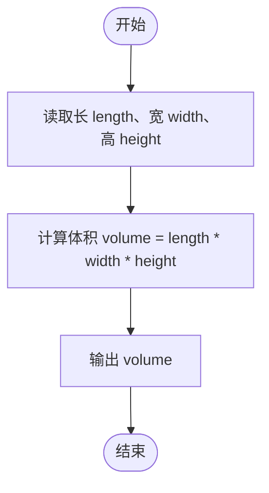
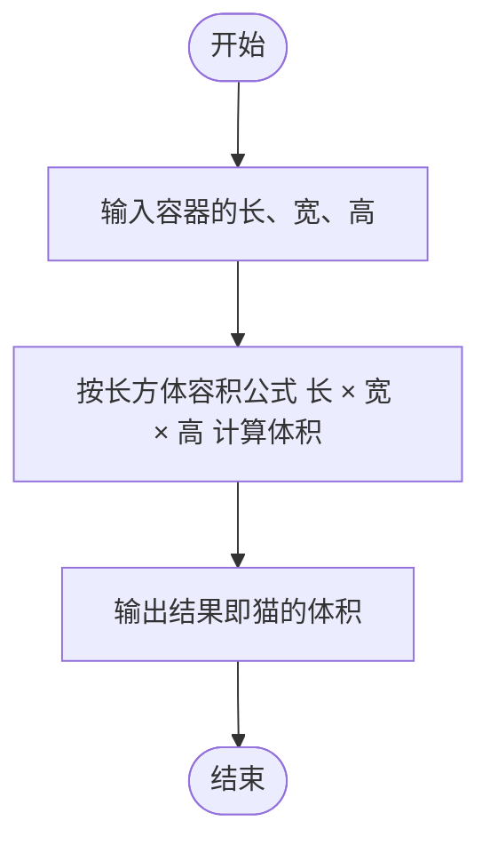

# L1-066 - 猫是液体（5 分）

- **时间限制**: 400 ms
- **内存限制**: 65536 KB
- **代码长度限制**: 16 KB

---

## 题目描述


测量一个人的体积是很难的，但猫就不一样了。因为猫是液体，所以可以很容易地通过测量一个长方体容器的容积来得到容器里猫的体积。本题就请你完成这个计算。

### 输入格式:

输入在第一行中给出 3 个不超过 100 的正整数，分别对应容器的长、宽、高。

### 输出格式:

在一行中输出猫的体积。

### 输入样例:

```in
23 15 20
```

### 输出样例:

```out
6900
```

## 示例

### 示例 1

**输入:**
```
23 15 20
```

**输出:**
```
6900
```

---

## 题目详解

### 一、解题思路

本题的 R 实现采用以下方法：读取标准输入后建立题目所需的数据结构，按约束执行核心计算并输出结果。

### 二、代码流程说明

1. 读取并解析标准输入，转换为题目所需的数据结构。
2. 按题意执行核心算法，维护中间状态并处理边界情况。
3. 整理计算结果，按照输出格式生成答案。

### 三、代码实现

```r
# 实现原理：读取标准输入后建立题目所需的数据结构，按约束执行核心计算并输出结果。
# 处理流程：读取输入 -> 建立状态 -> 执行算法 -> 按题目格式输出。
# 关键变量和循环均直接对应题目中的数据、约束或操作。

# 读取并解析标准输入。
v <- scan(file = "stdin", quiet = TRUE)
# 严格按照题目规定的输出格式输出答案。
cat(prod(v[1:3]), "\n", sep = "")
```

### 四、代码流程图



### 五、解题流程图



### 六、常见易错点

- 题目描述、输入格式、输出格式和输入输出样例必须保持原文不变。
- R 语言下标从 1 开始，注意编号转换和空输入边界。
- 输出时严格保留题目规定的空格、换行和小数位数。
