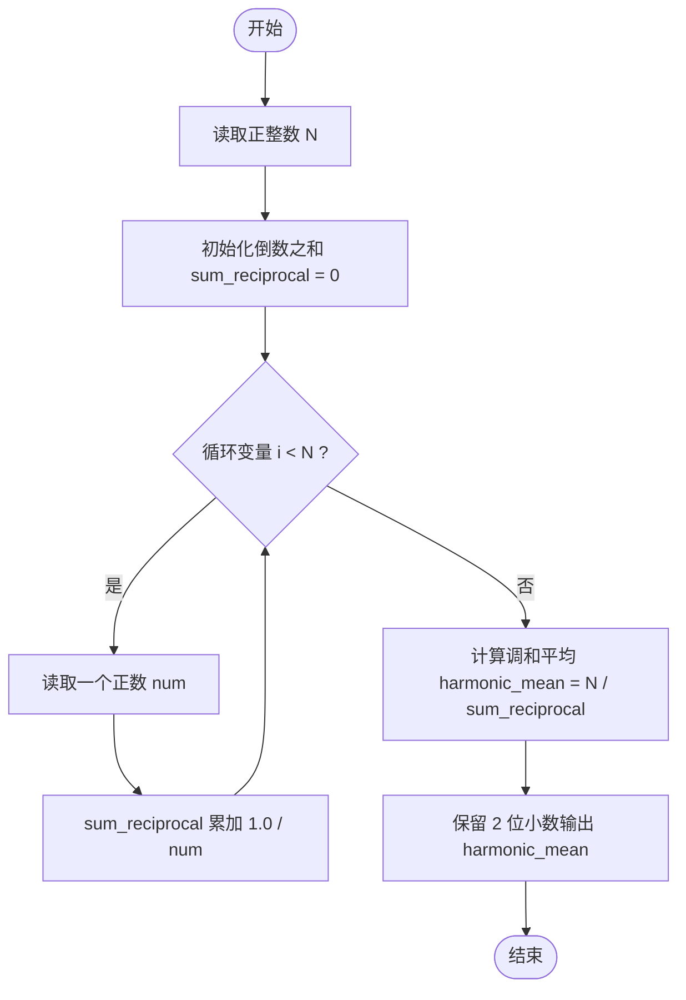
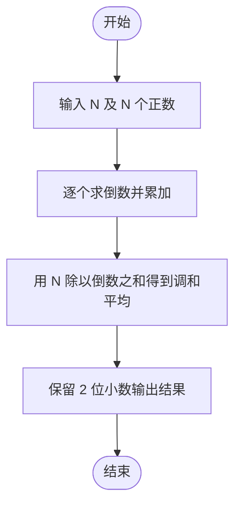

# L1-068 - 调和平均（10 分）

- **时间限制**: 400 ms
- **内存限制**: 65536 KB
- **代码长度限制**: 16 KB

---

## 题目描述

$$N$$ 个正数的**算数平均**是这些数的和除以 $$N$$，它们的**调和平均**是它们倒数的算数平均的倒数。本题就请你计算给定的一系列正数的调和平均值。

### 输入格式:

每个输入包含 1 个测试用例。每个测试用例第 1 行给出正整数 $$N$$ ($$\le 1000$$)；第 2 行给出 $$N$$ 个正数，都在区间 $$[0.1, 100]$$ 内。

### 输出格式:

在一行中输出给定数列的调和平均值，输出小数点后2位。

### 输入样例:

```in
8
10 15 12.7 0.3 4 13 1 15.6
```

### 输出样例:

```out
1.61
```

## 示例

### 示例 1

**输入:**
```
8
10 15 12.7 0.3 4 13 1 15.6
```

**输出:**
```
1.61
```

---

## 题目详解

### 一、解题思路

本题的 R 实现采用以下方法：读取标准输入后建立题目所需的数据结构，按约束执行核心计算并输出结果。

### 二、代码流程说明

1. 读取并解析标准输入，转换为题目所需的数据结构。
2. 按题意执行核心算法，维护中间状态并处理边界情况。
3. 整理计算结果，按照输出格式生成答案。

### 三、代码实现

```r
# 实现原理：读取标准输入后建立题目所需的数据结构，按约束执行核心计算并输出结果。
# 处理流程：读取输入 -> 建立状态 -> 执行算法 -> 按题目格式输出。
# 关键变量和循环均直接对应题目中的数据、约束或操作。

# 读取并解析标准输入。
v <- scan(file = "stdin", quiet = TRUE)
n <- v[1]
# 严格按照题目规定的输出格式输出答案。
cat(sprintf("%.2f\n", n/sum(1/v[2:(n + 1)])))
```

### 四、代码流程图



### 五、解题流程图



### 六、常见易错点

- 题目描述、输入格式、输出格式和输入输出样例必须保持原文不变。
- R 语言下标从 1 开始，注意编号转换和空输入边界。
- 输出时严格保留题目规定的空格、换行和小数位数。
