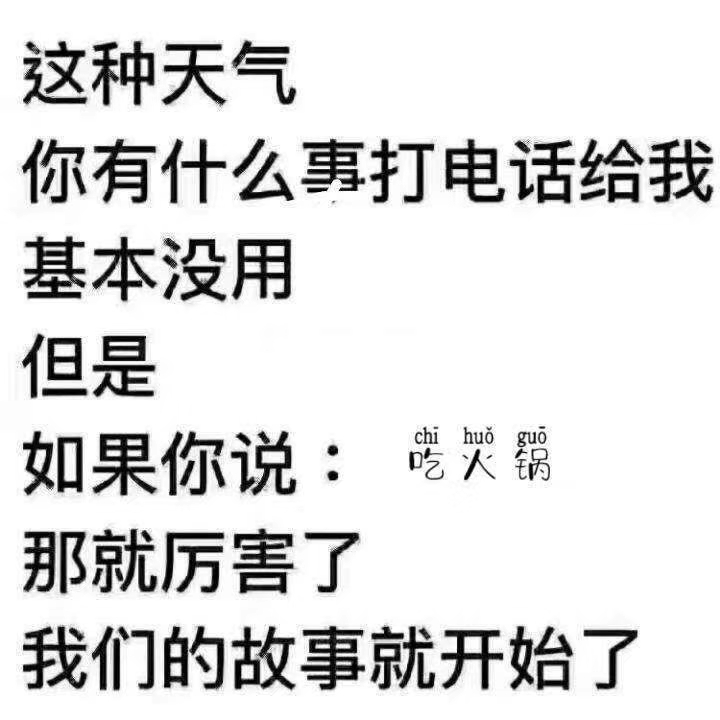
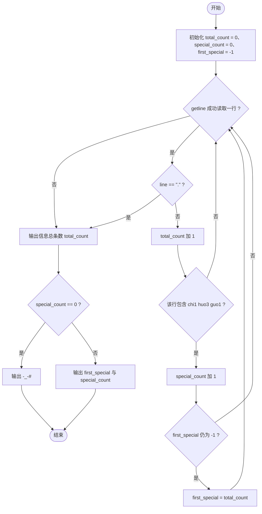
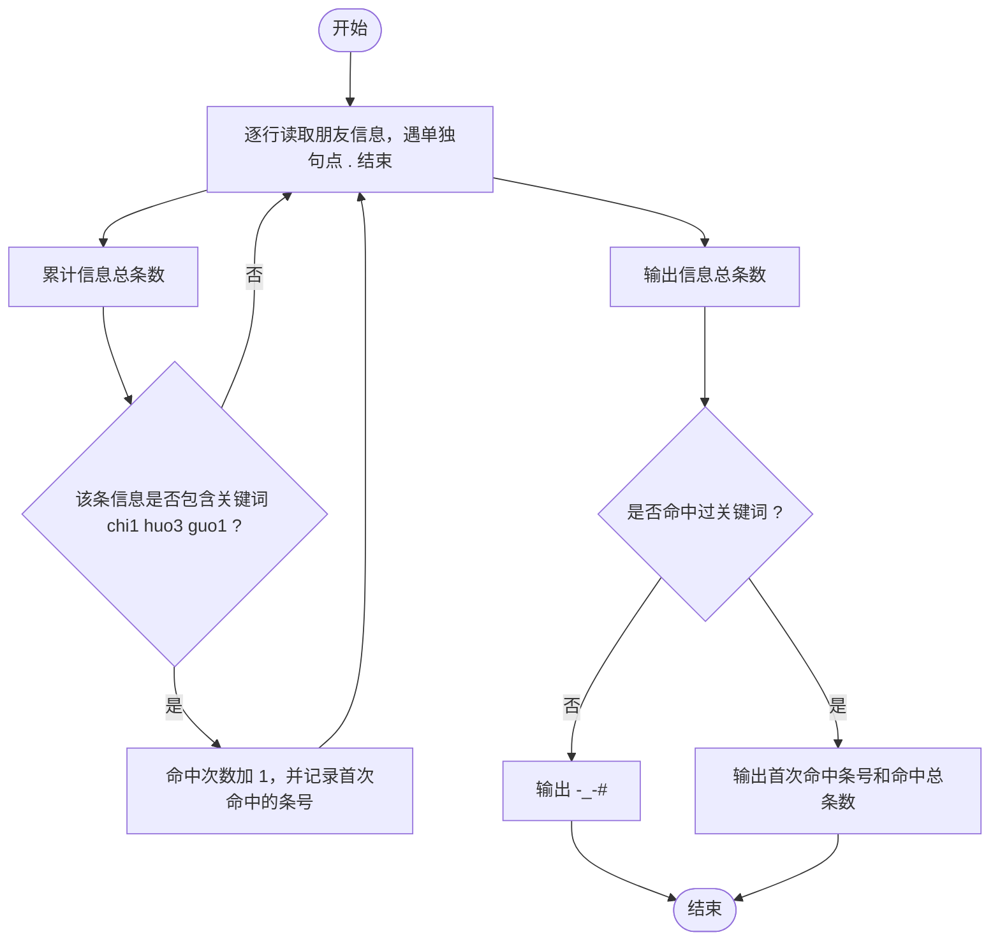

# L1-070 - 吃火锅（15 分）

- **时间限制**: 400 ms
- **内存限制**: 65536 KB
- **代码长度限制**: 16 KB

---

## 题目描述



以上图片来自微信朋友圈：这种天气你有什么破事打电话给我基本没用。但是如果你说“吃火锅”，那就厉害了，我们的故事就开始了。

本题要求你实现一个程序，自动检查你朋友给你发来的信息里有没有 `chi1 huo3 guo1`。

### 输入格式:

输入每行给出一句不超过 80 个字符的、以回车结尾的朋友信息，信息为非空字符串，仅包括字母、数字、空格、可见的半角标点符号。当读到某一行只有一个英文句点 `.` 时，输入结束，此行不算在朋友信息里。

### 输出格式:

首先在一行中输出朋友信息的总条数。然后对朋友的每一行信息，检查其中是否包含 `chi1 huo3 guo1`，并且统计这样厉害的信息有多少条。在第二行中首先输出第一次出现 `chi1 huo3 guo1` 的信息是第几条（从 1 开始计数），然后输出这类信息的总条数，其间以一个空格分隔。题目保证输出的所有数字不超过 100。

如果朋友从头到尾都没提 `chi1 huo3 guo1` 这个关键词，则在第二行输出一个表情 `-_-#`。

### 输入样例 1:

```in
Hello!
are you there?
wantta chi1 huo3 guo1?
that's so li hai le
our story begins from chi1 huo3 guo1 le
.

```

### 输出样例 1:

```out
5
3 2
```

### 输入样例 2:

```in
Hello!
are you there?
wantta qi huo3 guo1 chi1huo3guo1?
that's so li hai le
our story begins from ci1 huo4 guo2 le
.

```

### 输出样例 2:

```out
5
-_-#
```

**题目引用自团体程序设计天梯赛真题（2020年）。**

## 示例

### 示例 1

**输入:**
```
Hello!
are you there?
wantta chi1 huo3 guo1?
that's so li hai le
our story begins from chi1 huo3 guo1 le
.

```

**输出:**
```
5
3 2
```

### 示例 2

**输入:**
```
Hello!
are you there?
wantta qi huo3 guo1 chi1huo3guo1?
that's so li hai le
our story begins from ci1 huo4 guo2 le
.

```

**输出:**
```
5
-_-#
```

---

## 题目详解

### 一、解题思路

本题的 R 实现采用以下方法：按行或按字段解析输入，使用字符串或序列操作完成题目要求的变换，并按格式输出。

### 二、代码流程说明

1. 读取并解析标准输入，转换为题目所需的数据结构。
2. 按题意执行核心算法，维护中间状态并处理边界情况。
3. 整理计算结果，按照输出格式生成答案。

### 三、代码实现

```r
# 实现原理：按行或按字段解析输入，使用字符串或序列操作完成题目要求的变换，并按格式输出。
# 处理流程：读取输入 -> 建立状态 -> 执行算法 -> 按题目格式输出。
# 关键变量和循环均直接对应题目中的数据、约束或操作。

# 读取并解析标准输入。
x <- readLines("stdin", warn = FALSE)
dot <- which(x == ".")[1]
if (!is.na(dot)) x <- x[seq_len(dot - 1L)]
hit <- which(grepl("chi1 huo3 guo1", x, fixed = TRUE))
# 严格按照题目规定的输出格式输出答案。
cat(length(x), "\n", sep = "")
if (length(hit)) cat(paste(hit[1], length(hit)), "\n", sep = "") else cat("-_-#\n")
```

### 四、代码流程图



### 五、解题流程图



### 六、常见易错点

- 题目描述、输入格式、输出格式和输入输出样例必须保持原文不变。
- R 语言下标从 1 开始，注意编号转换和空输入边界。
- 输出时严格保留题目规定的空格、换行和小数位数。
