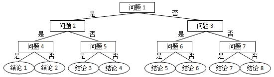
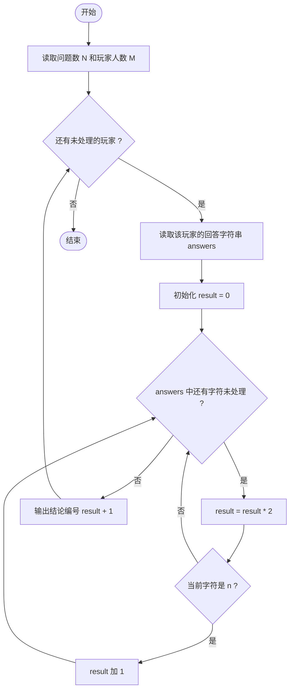
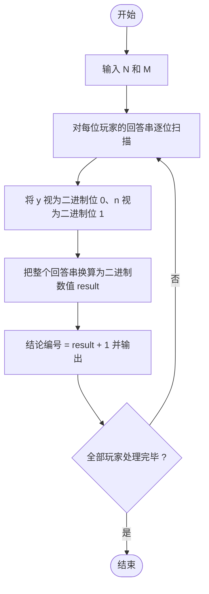

# L1-071 - 前世档案（20 分）

- **时间限制**: 400 ms
- **内存限制**: 65536 KB
- **代码长度限制**: 16 KB

---

## 题目描述


网络世界中时常会遇到这类滑稽的算命小程序，实现原理很简单，随便设计几个问题，根据玩家对每个问题的回答选择一条判断树中的路径（如下图所示），结论就是路径终点对应的那个结点。



现在我们把结论从左到右顺序编号，编号从 1 开始。这里假设回答都是简单的“是”或“否”，又假设回答“是”对应向左的路径，回答“否”对应向右的路径。给定玩家的一系列回答，请你返回其得到的结论的编号。

### 输入格式:

输入第一行给出两个正整数：$$N$$（$$\le 30$$）为玩家做一次测试要回答的问题数量；$$M$$（$$\le 100$$）为玩家人数。

随后 $$M$$ 行，每行顺次给出玩家的 $$N$$ 个回答。这里用 `y` 代表“是”，用 `n` 代表“否”。

### 输出格式:

对每个玩家，在一行中输出其对应的结论的编号。

### 输入样例:

```in
3 4
yny
nyy
nyn
yyn
```

### 输出样例:

```out
3
5
6
2
```

## 示例

### 示例 1

**输入:**
```
3 4
yny
nyy
nyn
yyn
```

**输出:**
```
3
5
6
2
```

---

## 题目详解

### 一、解题思路

本题的 R 实现采用以下方法：按行或按字段解析输入，使用字符串或序列操作完成题目要求的变换，并按格式输出。

### 二、代码流程说明

1. 读取并解析标准输入，转换为题目所需的数据结构。
2. 按题意执行核心算法，维护中间状态并处理边界情况。
3. 整理计算结果，按照输出格式生成答案。

### 三、代码实现

```r
# 实现原理：按行或按字段解析输入，使用字符串或序列操作完成题目要求的变换，并按格式输出。
# 处理流程：读取输入 -> 建立状态 -> 执行算法 -> 按题目格式输出。
# 关键变量和循环均直接对应题目中的数据、约束或操作。

# 读取并解析标准输入。
v <- readLines("stdin", warn = FALSE)
q <- strsplit(trimws(v[1]), " ", fixed = TRUE)[[1]]
n <- as.integer(q[1])
m <- as.integer(q[2])
# 按题目约束遍历当前数据，更新中间状态。
for (s in v[2:(m + 1)]) {
    z <- strsplit(trimws(s), "", fixed = TRUE)[[1]]
    ans <- sum((z == "n") * 2^((n - 1):0)) + 1
# 严格按照题目规定的输出格式输出答案。
    cat(ans, "\n", sep = "")
}
```

### 四、代码流程图



### 五、解题流程图



### 六、常见易错点

- 题目描述、输入格式、输出格式和输入输出样例必须保持原文不变。
- R 语言下标从 1 开始，注意编号转换和空输入边界。
- 输出时严格保留题目规定的空格、换行和小数位数。
