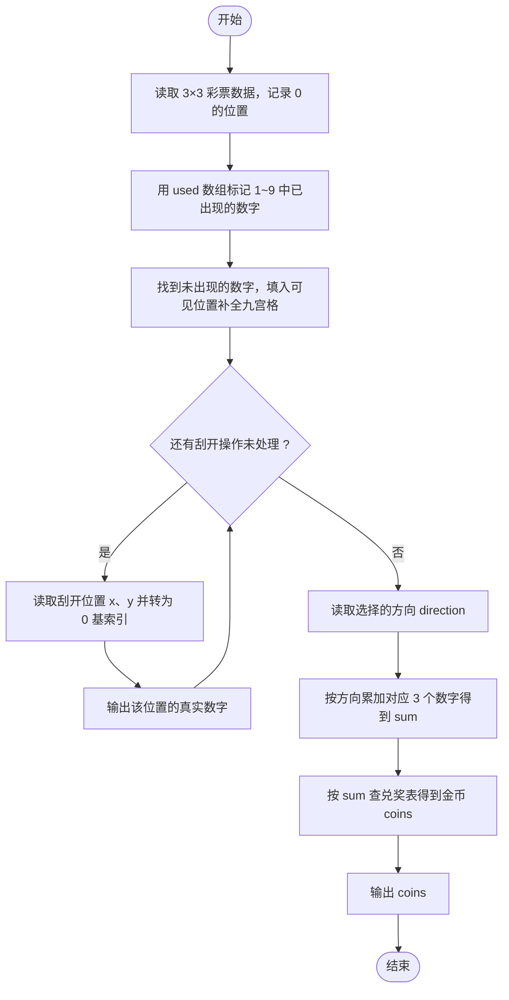
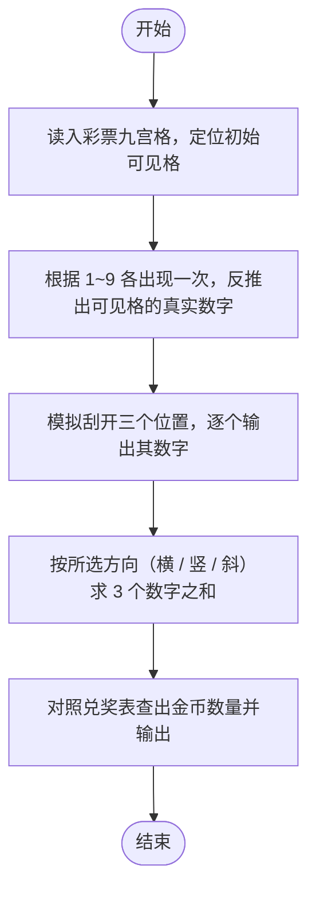

# L1-072 - 刮刮彩票（20 分）

- **时间限制**: 400 ms
- **内存限制**: 65536 KB
- **代码长度限制**: 16 KB

---

## 题目描述

“刮刮彩票”是一款网络游戏里面的一个小游戏。如图所示：


每次游戏玩家会拿到一张彩票，上面会有 9 个数字，分别为数字 1 到数字 9，数字各不重复，并以 $$3\times3$$ 的“九宫格”形式排布在彩票上。

在游戏开始时能看见一个位置上的数字，其他位置上的数字均不可见。你可以选择三个位置的数字刮开，这样玩家就能看见四个位置上的数字了。最后玩家再从 3 横、3 竖、2 斜共 8 个方向中挑选一个方向，方向上三个数字的和可根据下列表格进行兑奖，获得对应数额的金币。

| 数字合计 | 获得金币 | 数字合计 | 获得金币 |
| -------- | -------- | -------- | -------- |
| 6     | 10,000     | 16     | 72     |
| 7     | 36     | 17     | 180     |
| 8     | 720     | 18     | 119     |
| 9     | 360     | 19     | 36     |
| 10     | 80     | 20     | 306     |
| 11    | 252     | 21     | 1,080     |
| 12    | 108     | 22    | 144     |
| 13    | 72     | 23    | 1,800     |
| 14    | 54     | 24    | 3,600     |
| 15    | 180     |      ||      |

现在请你写出一个模拟程序，模拟玩家的游戏过程。

### 输入格式:

输入第一部分给出一张合法的彩票，即用 3 行 3 列给出 0 至 9 的数字。**0 表示的是这个位置上的数字初始时就能看见了**，而不是彩票上的数字为 0。

第二部给出玩家刮开的三个位置，分为三行，每行按格式 `x y` 给出玩家刮开的位置的行号和列号（题目中定义左上角的位置为第 1 行、第 1 列。）。数据保证玩家不会重复刮开已刮开的数字。

最后一部分给出玩家选择的方向，即一个整数： 1 至 3 表示选择横向的第一行、第二行、第三行，4 至 6 表示纵向的第一列、第二列、第三列，7、8分别表示左上到右下的主对角线和右上到左下的副对角线。

### 输出格式:

对于每一个刮开的操作，在一行中输出玩家能看到的数字。最后对于选择的方向，在一行中输出玩家获得的金币数量。

### 输入样例:

```in
1 2 3
4 5 6
7 8 0
1 1
2 2
2 3
7
```

### 输出样例:

```out
1
5
6
180
```

## 示例

### 示例 1

**输入:**
```
1 2 3
4 5 6
7 8 0
1 1
2 2
2 3
7
```

**输出:**
```
1
5
6
180
```

---

## 题目详解

### 一、解题思路

本题的 R 实现采用以下方法：将输入组织为矩阵或表格，按题目定义的行、列和状态关系完成计算。

### 二、代码流程说明

1. 读取并解析标准输入，转换为题目所需的数据结构。
2. 按题意执行核心算法，维护中间状态并处理边界情况。
3. 整理计算结果，按照输出格式生成答案。

### 三、代码实现

```r
# 实现原理：将输入组织为矩阵或表格，按题目定义的行、列和状态关系完成计算。
# 处理流程：读取输入 -> 建立状态 -> 执行算法 -> 按题目格式输出。
# 关键变量和循环均直接对应题目中的数据、约束或操作。

# 读取并解析标准输入。
v <- scan(file = "stdin", quiet = TRUE)
a <- matrix(v[1:9], 3, 3, byrow = TRUE)
missing <- setdiff(1:9, v[1:9])
a[a == 0] <- missing
# 按题目约束遍历当前数据，更新中间状态。
for (i in 1:3) cat(a[v[9 + 2 * i - 1], v[9 + 2 * i]], "\n", sep = "")
d <- v[16]
sm <- if (d <= 3) sum(a[d, ]) else if (d <= 6) sum(a[, d - 3]) else if (d ==
    7) sum(diag(a)) else sum(a[cbind(1:3, 3:1)])
pr <- c(0, 0, 0, 0, 0, 0, 10000, 36, 720, 360, 80, 252, 108,
    72, 54, 180, 72, 180, 119, 36, 306, 1080, 144, 1800, 3600)
# 严格按照题目规定的输出格式输出答案。
cat(pr[sm + 1], "\n", sep = "")
```

### 四、代码流程图



### 五、解题流程图



### 六、常见易错点

- 题目描述、输入格式、输出格式和输入输出样例必须保持原文不变。
- R 语言下标从 1 开始，注意编号转换和空输入边界。
- 输出时严格保留题目规定的空格、换行和小数位数。
