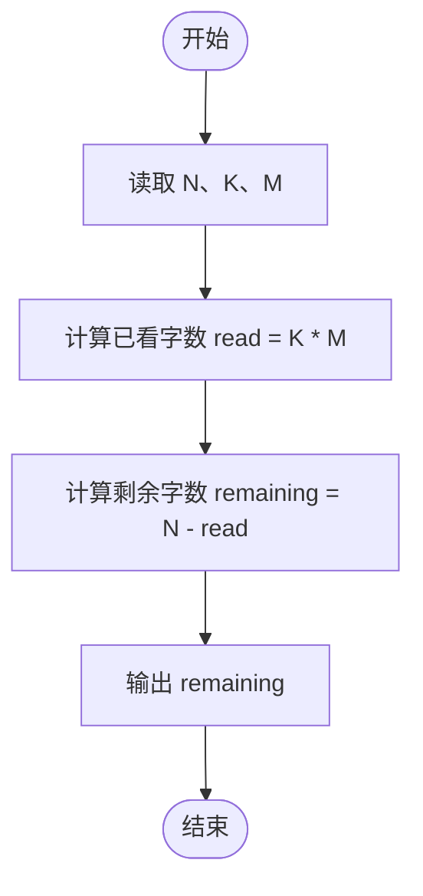
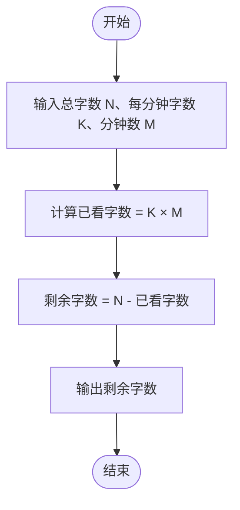

# L1-074 - 两小时学完C语言（5 分）

- **时间限制**: 400 ms
- **内存限制**: 65536 KB
- **代码长度限制**: 16 KB

---

## 题目描述


知乎上有个宝宝问：“两个小时内如何学完 C 语言？”当然，问的是“学完”并不是“学会”。

假设一本 C 语言教科书有 N 个字，这个宝宝每分钟能看 K 个字，看了 M 分钟。还剩多少字没有看？

### 输入格式:

输入在一行中给出 3 个正整数，分别是 N（不超过 400 000），教科书的总字数；K（不超过 3 000），是宝宝每分钟能看的字数；M（不超过 120），是宝宝看书的分钟数。

题目保证宝宝看完的字数不超过 N。

### 输出格式:

在一行中输出宝宝还没有看的字数。

### 输入样例:

```in
100000 1000 72
```

### 输出样例:

```out
28000
```

## 示例

### 示例 1

**输入:**
```
100000 1000 72
```

**输出:**
```
28000
```

---

## 题目详解

### 一、解题思路

本题的 R 实现采用以下方法：读取标准输入后建立题目所需的数据结构，按约束执行核心计算并输出结果。

### 二、代码流程说明

1. 读取并解析标准输入，转换为题目所需的数据结构。
2. 按题意执行核心算法，维护中间状态并处理边界情况。
3. 整理计算结果，按照输出格式生成答案。

### 三、代码实现

```r
# 实现原理：读取标准输入后建立题目所需的数据结构，按约束执行核心计算并输出结果。
# 处理流程：读取输入 -> 建立状态 -> 执行算法 -> 按题目格式输出。
# 关键变量和循环均直接对应题目中的数据、约束或操作。

# 读取并解析标准输入。
v <- scan(file = "stdin", quiet = TRUE)
# 严格按照题目规定的输出格式输出答案。
cat(v[1] - v[2] * v[3], "\n", sep = "")
```

### 四、代码流程图



### 五、解题流程图



### 六、常见易错点

- 题目描述、输入格式、输出格式和输入输出样例必须保持原文不变。
- R 语言下标从 1 开始，注意编号转换和空输入边界。
- 输出时严格保留题目规定的空格、换行和小数位数。
