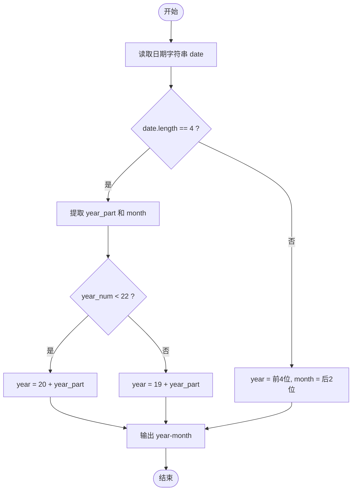
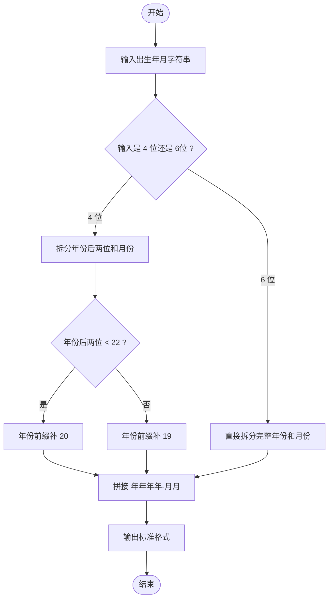

# L1-075 - 强迫症（10 分）

- **时间限制**: 400 ms
- **内存限制**: 65536 KB
- **代码长度限制**: 16 KB

---

## 题目描述

小强在统计一个小区里居民的出生年月，但是发现大家填写的生日格式不统一，例如有的人写 `199808`，有的人只写 `9808`。有强迫症的小强请你写个程序，把所有人的出生年月都整理成 `年年年年-月月` 格式。对于那些只写了年份后两位的信息，我们默认小于 `22` 都是 `20` 开头的，其他都是 `19` 开头的。

### 输入格式:

输入在一行中给出一个出生年月，为一个 6 位或者 4 位数，题目保证是 1000 年 1 月到 2021 年 12 月之间的合法年月。

### 输出格式:

在一行中按标准格式 `年年年年-月月` 将输入的信息整理输出。

### 输入样例 1:

```in
9808
```

### 输出样例 1:

```out
1998-08
```

### 输入样例 2:

```in
0510
```

### 输出样例 2:

```out
2005-10
```

### 输入样例 3:

```in
196711
```

### 输出样例 3:

```out
1967-11
```

## 示例

### 示例 1

**输入:**
```
9808
```

**输出:**
```
1998-08
```

### 示例 2

**输入:**
```
0510
```

**输出:**
```
2005-10
```

### 示例 3

**输入:**
```
196711
```

**输出:**
```
1967-11
```

---

## 题目详解

### 一、解题思路

本题的 R 实现采用以下方法：读取标准输入后建立题目所需的数据结构，按约束执行核心计算并输出结果。

### 二、代码流程说明

1. 读取并解析标准输入，转换为题目所需的数据结构。
2. 按题意执行核心算法，维护中间状态并处理边界情况。
3. 整理计算结果，按照输出格式生成答案。

### 三、代码实现

```r
# 实现原理：读取标准输入后建立题目所需的数据结构，按约束执行核心计算并输出结果。
# 处理流程：读取输入 -> 建立状态 -> 执行算法 -> 按题目格式输出。
# 关键变量和循环均直接对应题目中的数据、约束或操作。

# 读取并解析标准输入。
s <- scan(file = "stdin", what = "", quiet = TRUE)[1]
if (nchar(s) == 4) s <- paste0(if (as.integer(substr(s, 1, 2)) <
    22) "20" else "19", s)
# 严格按照题目规定的输出格式输出答案。
cat(substr(s, 1, 4), "-", substr(s, 5, 6), "\n", sep = "")
```

### 四、代码流程图



### 五、解题流程图



### 六、常见易错点

- 题目描述、输入格式、输出格式和输入输出样例必须保持原文不变。
- R 语言下标从 1 开始，注意编号转换和空输入边界。
- 输出时严格保留题目规定的空格、换行和小数位数。
