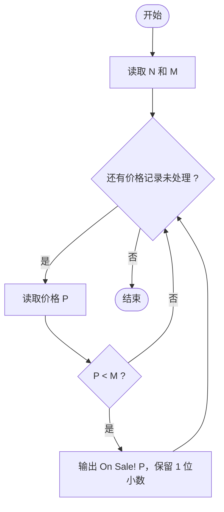
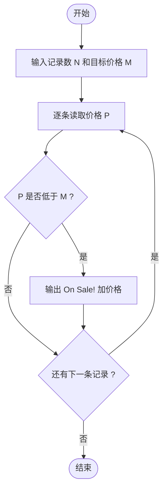

# L1-076 - 降价提醒机器人（10 分）

- **时间限制**: 400 ms
- **内存限制**: 65536 KB
- **代码长度限制**: 16 KB

---

## 题目描述

小 T 想买一个玩具很久了，但价格有些高，他打算等便宜些再买。但天天盯着购物网站很麻烦，请你帮小 T 写一个降价提醒机器人，当玩具的当前价格比他设定的价格便宜时发出提醒。

### 输入格式:

输入第一行是两个正整数 $$N$$ 和 $$M$$ ($$1 \le N \le 100, 0 \le M \le 1000$$)，表示有 $$N$$ 条价格记录，小 T 设置的价格为 $$M$$。

接下来 $$N$$ 行，每行有一个实数 $$P_i$$（$$-1000.0 < P_i < 1000.0$$），表示一条价格记录。

### 输出格式:

对每一条比设定价格 $$M$$ 便宜的价格记录 `P`，在一行中输出 `On Sale! P`，其中 `P` 输出到小数点后 1 位。

### 输入样例:

```in
4 99
98.0
97.0
100.2
98.9
```

### 输出样例:

```out
On Sale! 98.0
On Sale! 97.0
On Sale! 98.9
```

## 示例

### 示例 1

**输入:**
```
4 99
98.0
97.0
100.2
98.9
```

**输出:**
```
On Sale! 98.0
On Sale! 97.0
On Sale! 98.9
```

---

## 题目详解

### 一、解题思路

本题的 R 实现采用以下方法：读取标准输入后建立题目所需的数据结构，按约束执行核心计算并输出结果。

### 二、代码流程说明

1. 读取并解析标准输入，转换为题目所需的数据结构。
2. 按题意执行核心算法，维护中间状态并处理边界情况。
3. 整理计算结果，按照输出格式生成答案。

### 三、代码实现

```r
# 实现原理：读取标准输入后建立题目所需的数据结构，按约束执行核心计算并输出结果。
# 处理流程：读取输入 -> 建立状态 -> 执行算法 -> 按题目格式输出。
# 关键变量和循环均直接对应题目中的数据、约束或操作。

# 读取并解析标准输入。
v <- scan(file = "stdin", quiet = TRUE)
n <- v[1]
target <- v[2]
# 按题目约束遍历当前数据，更新中间状态。
for (x in v[3:(n + 2)]) if (x < target) cat(sprintf("On Sale! %.1f\n",
    x))
# 严格按照题目规定的输出格式输出答案。
```

### 四、代码流程图



### 五、解题流程图



### 六、常见易错点

- 题目描述、输入格式、输出格式和输入输出样例必须保持原文不变。
- R 语言下标从 1 开始，注意编号转换和空输入边界。
- 输出时严格保留题目规定的空格、换行和小数位数。
