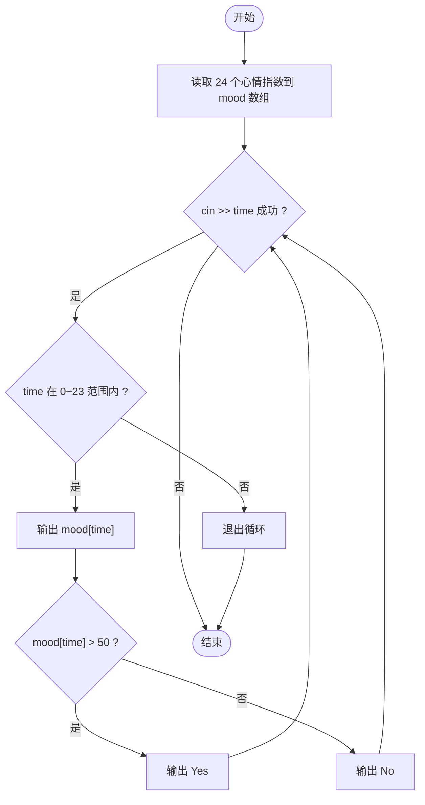
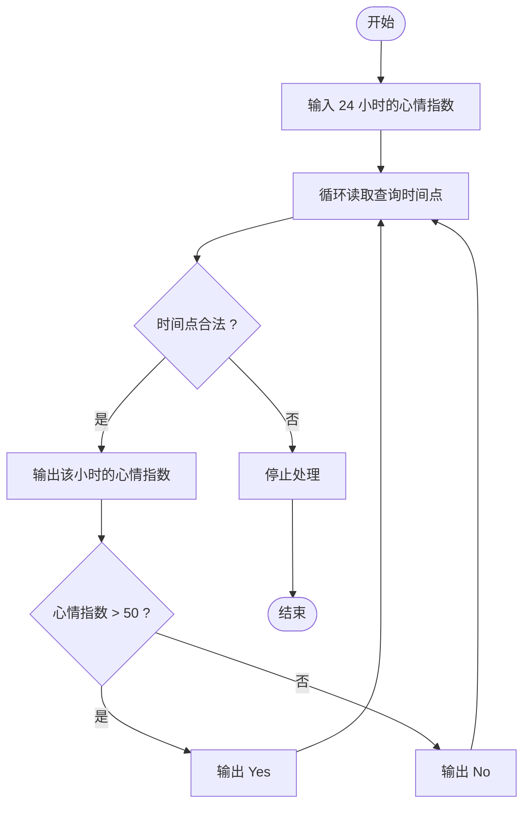

# L1-077 - 大笨钟的心情（15 分）

- **时间限制**: 400 ms
- **内存限制**: 65536 KB
- **代码长度限制**: 16 KB

---

## 题目描述


有网友问：未来还会有更多大笨钟题吗？笨钟回复说：看心情……

本题就请你替大笨钟写一个程序，根据心情自动输出回答。

### 输入格式:

输入在一行中给出 24 个 [0, 100] 区间内的整数，依次代表大笨钟在一天 24 小时中，每个小时的心情指数。

随后若干行，每行给出一个 [0, 23] 之间的整数，代表网友询问笨钟这个问题的时间点。当出现非法的时间点时，表示输入结束，这个非法输入不要处理。题目保证至少有 1 次询问。

### 输出格式:

对每一次提问，如果当时笨钟的心情指数大于 50，就在一行中输出 `心情指数 Yes`，否则输出 `心情指数 No`。

### 输入样例:

```in
80 75 60 50 20 20 20 20 55 62 66 51 42 33 47 58 67 52 41 20 35 49 50 63
17
7
3
15
-1
```

### 输出样例:

```out
52 Yes
20 No
50 No
58 Yes
```

## 示例

### 示例 1

**输入:**
```
80 75 60 50 20 20 20 20 55 62 66 51 42 33 47 58 67 52 41 20 35 49 50 63
17
7
3
15
-1
```

**输出:**
```
52 Yes
20 No
50 No
58 Yes
```

---

## 题目详解

### 一、解题思路

本题的 R 实现采用以下方法：读取标准输入后建立题目所需的数据结构，按约束执行核心计算并输出结果。

### 二、代码流程说明

1. 读取并解析标准输入，转换为题目所需的数据结构。
2. 按题意执行核心算法，维护中间状态并处理边界情况。
3. 整理计算结果，按照输出格式生成答案。

### 三、代码实现

```r
# 实现原理：读取标准输入后建立题目所需的数据结构，按约束执行核心计算并输出结果。
# 处理流程：读取输入 -> 建立状态 -> 执行算法 -> 按题目格式输出。
# 关键变量和循环均直接对应题目中的数据、约束或操作。

# 读取并解析标准输入。
v <- scan(file = "stdin", quiet = TRUE)
mood <- v[1:24]
# 按题目约束遍历当前数据，更新中间状态。
for (h in v[25:length(v)]) {
    if (h < 0 || h > 23)
        break
# 严格按照题目规定的输出格式输出答案。
    cat(paste(mood[h + 1], if (mood[h + 1] > 50)
        "Yes"
    else "No"), "\n", sep = "")
}
```

### 四、代码流程图



### 五、解题流程图



### 六、常见易错点

- 题目描述、输入格式、输出格式和输入输出样例必须保持原文不变。
- R 语言下标从 1 开始，注意编号转换和空输入边界。
- 输出时严格保留题目规定的空格、换行和小数位数。
